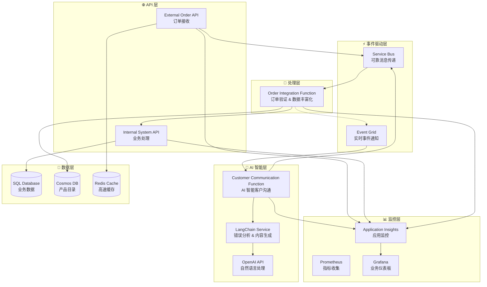

# BidOne Integration Platform - AI 智能客户沟通系统

## 🎯 项目概述

这是一个现代云原生架构演示项目，展示 **事件驱动微服务 + AI 智能客户沟通**的企业级订单处理系统。核心理念是 **"Never Lose an Order"** + **"AI-Powered Customer Experience"**。

## 🌟 核心亮点

### ✨ AI 智能沟通系统
- **自动错误检测**: 智能识别高价值订单错误
- **AI 分析**: LangChain + OpenAI 深度分析错误原因和影响
- **个性化沟通**: 基于客户等级生成定制化道歉和补偿方案
- **智能行动建议**: AI 生成可执行的运营建议和处理步骤

### 🏗️ 现代云原生架构
- **事件驱动**: Service Bus + Event Grid 完美协作
- **微服务设计**: .NET 8.0 + Azure Container Apps
- **智能函数**: Azure Functions 处理复杂业务逻辑
- **企业监控**: Prometheus + Grafana + Application Insights

## 📊 业务场景

**智能订单处理平台：从订单接收到AI客户服务的完整自动化流程**

### 主要角色
- **餐厅客户**: 通过系统下订单  
- **BidOne平台**: 智能集成平台
- **AI客服系统**: 自动处理错误和客户沟通
- **运营团队**: 接收AI生成的行动建议

### 智能处理流程
1. **订单接收**: External Order API 接收和验证订单
2. **智能处理**: Azure Functions 执行订单验证和数据丰富化
3. **错误检测**: 自动识别高价值订单处理错误
4. **AI 分析**: LangChain 分析错误原因和客户影响
5. **智能沟通**: 生成个性化客户道歉邮件和补偿方案
6. **行动建议**: AI 生成内部团队处理建议
7. **实时监控**: 全程监控确保服务质量

## 🏗️ 技术架构

### 核心组件

| 组件 | 技术栈 | 功能 |
|------|--------|------|
| **External Order API** | .NET 8.0, ASP.NET Core | 外部订单接收和验证 |
| **Internal System API** | .NET 8.0, Entity Framework | 内部系统集成和数据管理 |
| **Order Integration Function** | Azure Functions v4 | 订单验证和数据丰富化 |
| **Customer Communication Function** | Azure Functions v4, LangChain | 🤖 **AI 智能客户沟通** |
| **Message Bus** | Azure Service Bus | 可靠异步消息传递 |
| **Event Grid** | Azure Event Grid | 实时事件驱动通信 |
| **AI Services** | OpenAI API, LangChain | 智能分析和内容生成 |
| **监控套件** | Prometheus, Grafana, App Insights | 全栈监控和业务洞察 |

### 🧠 AI 驱动架构



## 🚀 快速开始

### 前置要求
- **.NET 8.0 SDK** - 开发环境
- **Docker Desktop** - 容器化运行
- **Azure CLI** (可选) - Azure 部署
- **Visual Studio 2022 或 VS Code** - 开发工具

### 📦 本地环境一键启动

```bash
# 1. 克隆项目
git clone <repository-url>
cd FoodOrderConnect

# 2. 启动完整开发环境 (包含 AI 智能沟通系统)
./docker-dev.sh start

# 3. 验证服务状态
./docker-dev.sh status

# 4. 访问服务
echo "External Order API: http://localhost:5001"
echo "Internal System API: http://localhost:5002"  
echo "Grafana Dashboard: http://localhost:3000 (admin/admin123)"
echo "Prometheus: http://localhost:9090"
```

### ☁️ Azure 部署 (可选)

```bash
# 登录 Azure
az login

# 一键部署基础设施 + AI 功能
az deployment group create \
  --resource-group bidone-demo-rg \
  --template-file infra/main.bicep \
  --parameters environmentName=demo \
               sqlAdminPassword="SecurePassword123!"

# 配置 OpenAI API Key (启用真实 AI 功能)
az keyvault secret set \
  --vault-name bidone-kv-demo \
  --name "OpenAI-ApiKey" \
  --value "your-openai-api-key"
```

### 🎯 快速演示

```bash
# 发送正常订单
curl -X POST http://localhost:5001/orders \
  -H "Content-Type: application/json" \
  -d '{
    "customerId": "customer-001",
    "items": [{"productId": "FOOD-001", "quantity": 5, "unitPrice": 25.00}],
    "deliveryDate": "2024-12-20T10:00:00Z"
  }'

# 触发 AI 智能错误处理 (高价值订单错误)
curl -X POST http://localhost:5001/orders \
  -H "Content-Type: application/json" \
  -d '{
    "customerId": "premium-customer-001",
    "items": [{"productId": "INVALID-PRODUCT", "quantity": 100, "unitPrice": 50.00}],
    "deliveryDate": "2024-12-20T10:00:00Z"
  }'

# 观察 AI 处理日志
./docker-dev.sh logs customer-communication-function
```

## 🛠️ 开发环境运行

### 方式一：完全容器化 (推荐新手)

```bash
# 一键启动完整系统
./docker-dev.sh start

# 检查服务状态  
./docker-dev.sh status

# 查看服务日志
./docker-dev.sh logs external-order-api
```

### 方式二：混合开发模式 (推荐开发者)

```bash
# 1. 启动基础设施服务 (数据库、缓存等)
./docker-dev.sh start

# 2. 在IDE中运行API项目或使用命令行
dotnet run --project src/ExternalOrderApi    # 终端1
dotnet run --project src/InternalSystemApi   # 终端2

# 3. 运行Azure Functions (需要安装Azure Functions Core Tools)
cd src/OrderIntegrationFunction && func start              # 终端3
cd src/CustomerCommunicationFunction && func start --port 7072  # 终端4
```

### 开发工具脚本

```bash
# 完整的开发环境管理
./docker-dev.sh start           # 启动所有服务
./docker-dev.sh stop            # 停止所有服务
./docker-dev.sh restart         # 重启所有服务
./docker-dev.sh status          # 查看服务状态和健康检查

# 代码开发和调试
./docker-dev.sh rebuild external-order-api  # 重建特定服务（修改代码后）
./docker-dev.sh rebuild-all     # 重建所有应用服务
./docker-dev.sh logs            # 查看所有服务日志
./docker-dev.sh logs external-order-api     # 查看特定服务日志

# 环境清理
./docker-dev.sh cleanup         # 完全清理环境

# 传统脚本 (仍然可用)
./scripts/health-check.sh       # 详细健康检查
./scripts/view-logs.sh redis -f # 查看特定服务日志
dotnet test                     # 运行测试
```

**详细开发指南**: 查看 [开发者运行指南](docs/developer-guide.md)

## 📁 项目结构

```
📦 FoodOrderConnect/
├── 📄 docker-compose.yml          # 本地开发环境
├── 📄 BidOne.sln                  # 解决方案文件
├── 🗂️ docs/                       # 📚 项目文档
│   ├── 📄 architecture.md          # 系统架构设计
│   ├── 📄 deployment-guide.md      # 部署指南
│   ├── 📄 demo-guide.md           # 演示指南
│   └── 📄 troubleshooting.md      # 故障排除
├── 🗂️ infra/                      # ☁️ Azure 基础设施
│   ├── 📄 main.bicep              # 主部署模板
│   ├── 📄 apim-config.bicep       # API Management 配置
│   └── 📄 parameters.*.json       # 环境参数
├── 🗂️ src/                        # 💻 源代码
│   ├── 🗂️ ExternalOrderApi/        # 外部订单接收 API
│   ├── 🗂️ InternalSystemApi/       # 内部系统集成 API  
│   ├── 🗂️ OrderIntegrationFunction/ # 订单处理和验证函数
│   ├── 🗂️ CustomerCommunicationFunction/ # 🤖 AI 智能客户沟通
│   └── 🗂️ Shared/                 # 📦 共享组件、事件和业务模型
├── 🗂️ tests/                      # 🧪 测试代码
├── 🗂️ scripts/                    # 🔧 开发和部署脚本
└── 🗂️ config/                     # ⚙️ 配置文件
    ├── 🗂️ grafana/                # Grafana 仪表板
    └── 📄 prometheus.yml          # Prometheus 配置
```

## 🌟 核心特性

### 🤖 AI 智能特性
- **智能错误分析**: LangChain 深度分析错误根因和影响
- **个性化沟通**: 基于客户等级生成定制化道歉内容
- **智能补偿策略**: AI 推荐合适的补偿方案和优惠
- **自动行动建议**: 生成可执行的运营处理步骤
- **优雅降级**: OpenAI 不可用时的智能模拟响应

### 🔒 企业级可靠性
- **消息持久化**: Service Bus 确保消息零丢失
- **自动重试**: 指数退避重试机制
- **死信处理**: 异常消息智能路由
- **事务一致性**: 分布式事务保证数据完整性
- **故障隔离**: 微服务间故障隔离

### 📊 全栈可观测性
- **业务监控**: Grafana 实时业务指标仪表板
- **应用监控**: Application Insights 深度性能分析
- **基础设施监控**: Prometheus 系统资源监控
- **分布式追踪**: 端到端请求链路追踪
- **智能告警**: 异常自动检测和通知

### ⚡ 现代云原生
- **事件驱动**: Service Bus + Event Grid 完美协作
- **微服务架构**: 松耦合、独立部署
- **容器化**: Docker + Azure Container Apps
- **自动扩缩容**: 基于负载的智能扩展
- **基础设施即代码**: Bicep 模板化部署

### 🔐 安全最佳实践
- **零信任架构**: 端到端安全验证
- **密钥管理**: Azure Key Vault 集中管理
- **网络隔离**: VNet 和安全组保护
- **API 安全**: OAuth 2.0 + JWT 认证
- **数据加密**: 传输和存储双重加密

## 📊 监控仪表板

### 🔍 实时监控端点
| 服务 | 健康检查 | 监控仪表板 |
|------|----------|------------|
| **External Order API** | `http://localhost:5001/health` | Grafana Business Metrics |
| **Internal System API** | `http://localhost:5002/health` | Application Insights |
| **AI Communication Function** | Azure Functions Portal | Service Bus Metrics |
| **系统总览** | `./docker-dev.sh status` | `http://localhost:3000` |

### 📈 关键性能指标 (KPIs)
| 指标 | 目标值 | 当前实现 |
|------|--------|----------|
| **订单处理成功率** | > 99.9% | ✅ 事务保证 + 重试机制 |
| **AI 响应时间** | < 5秒 | ✅ 异步处理 + 智能缓存 |
| **端到端延迟** | < 2秒 | ✅ 事件驱动架构 |
| **系统可用性** | > 99.95% | ✅ 微服务 + 自动扩缩容 |
| **错误恢复时间** | < 1分钟 | ✅ 智能故障检测 |

## 📚 文档导航

| 文档 | 描述 | 适用人群 |
|------|------|----------|
| 📄 [架构设计](docs/architecture.md) | 系统架构和设计原则 | 架构师、开发者 |
| 🚀 [部署指南](docs/deployment-guide.md) | 本地和云端部署说明 | DevOps、运维 |
| 🎯 [演示指南](docs/demo-guide.md) | 完整演示脚本和场景 | 产品经理、销售 |
| 🔧 [故障排除](docs/troubleshooting.md) | 常见问题解决方案 | 开发者、运维 |

## 💡 技术亮点展示

### 🌟 这个项目适合展示什么能力？

#### 云架构师 (Cloud Architect)
- ✅ **事件驱动架构设计**: Service Bus + Event Grid 深度集成
- ✅ **微服务模式实践**: 松耦合设计和独立部署
- ✅ **Azure PaaS 服务整合**: Functions, Container Apps, API Management
- ✅ **可观测性设计**: 端到端监控和业务洞察

#### 高级后端工程师 (Senior Backend Engineer)  
- ✅ **.NET 8.0 最佳实践**: 现代 C# 和性能优化
- ✅ **异步编程模式**: Task、async/await 高级应用
- ✅ **消息驱动架构**: 可靠消息传递和错误处理
- ✅ **数据库设计**: Entity Framework Core + 多数据源

#### DevOps 工程师 (DevOps Engineer)
- ✅ **基础设施即代码**: Bicep 模板和参数化部署
- ✅ **容器化最佳实践**: Docker 多阶段构建和优化
- ✅ **监控体系建设**: Prometheus + Grafana + Application Insights
- ✅ **CI/CD 流水线**: GitHub Actions 自动化部署

#### AI/ML 集成专家 (AI Integration Specialist)
- ✅ **LangChain 集成**: 智能对话和内容生成
- ✅ **OpenAI API 应用**: 自然语言处理和分析
- ✅ **智能系统设计**: AI 驱动的业务流程自动化
- ✅ **优雅降级策略**: AI 服务不可用时的智能备选方案

## 👥 联系方式

- **项目维护者**: Ricky Yang
- **技术交流**: guangliang.yang@hotmail.com
- **文档反馈**: 欢迎提交 Issue 和 Pull Request
- **技术博客**: 更多技术分享和实践经验

---

## 🎯 结语

这个项目展示了现代企业级应用开发的最佳实践，结合了**云原生架构**、**AI 智能集成**、**事件驱动设计**和**全栈监控**。不仅仅是一个技术演示，更是展示如何将先进技术转化为实际业务价值的完整案例。

**欢迎 Star ⭐ 和 Fork 🍴 这个项目！**