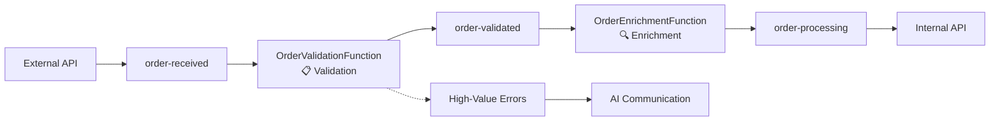
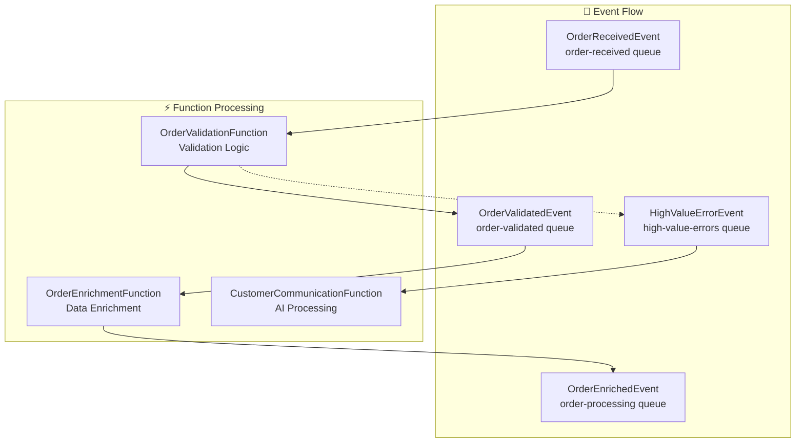
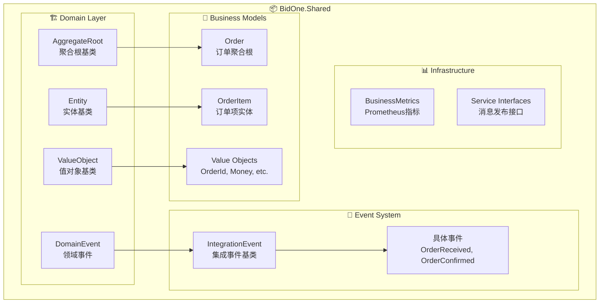
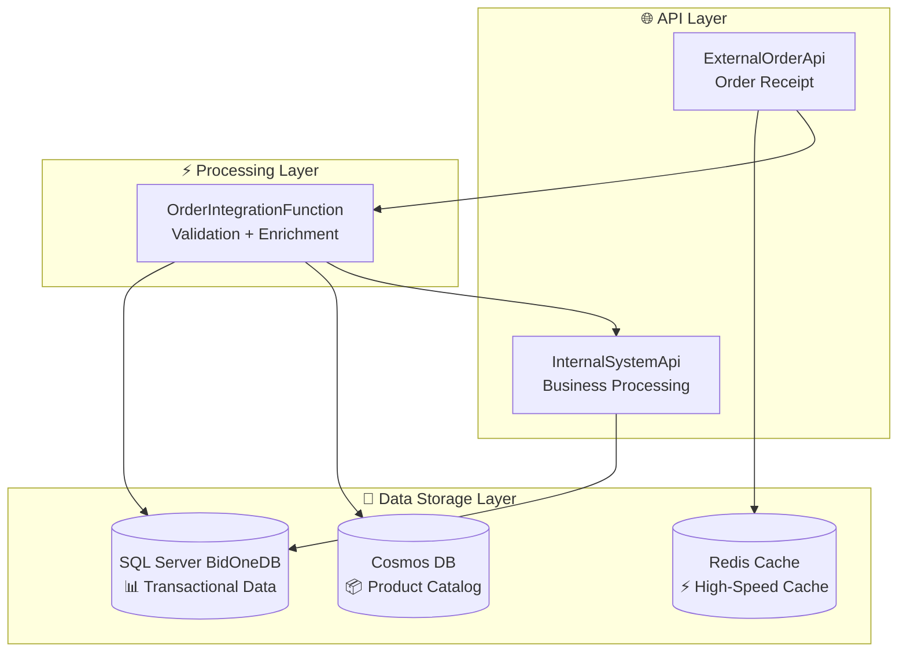
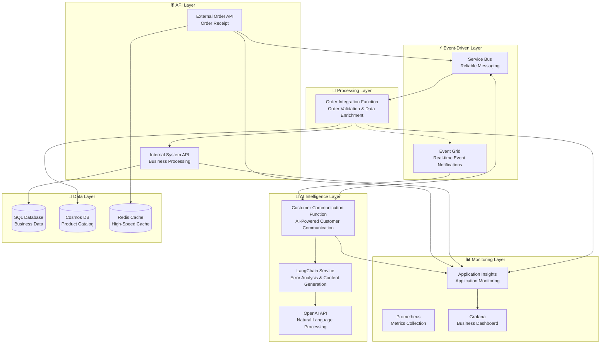

# BidOne Integration Platform - AI-Powered Customer Communication System

## 🎯 Project Overview

This is a modern cloud-native architecture demonstration project showcasing an enterprise-grade order processing system with **Event-Driven Microservices + AI-Powered Customer Communication**. The core philosophy is **"Never Lose an Order"** + **"AI-Powered Customer Experience"**.

## 🌟 Core Highlights

### ✨ AI-Powered Communication System
- **Automatic Error Detection**: Intelligent identification of high-value order errors
- **AI Analysis**: LangChain + OpenAI deep analysis of error causes and impacts
- **Personalized Communication**: Generate customized apologies and compensation plans based on customer tier
- **Intelligent Action Recommendations**: AI-generated actionable operational suggestions and processing steps

### 🏗️ Modern Cloud-Native Architecture
- **Event-Driven**: Perfect collaboration between Service Bus + Event Grid
- **Microservices Design**: .NET 8.0 + Azure Container Apps
- **Intelligent Functions**: Azure Functions handling complex business logic
- **Enterprise Monitoring**: Prometheus + Grafana + Application Insights

## 📊 Business Scenario

**Intelligent Order Processing Platform: Complete automation from order receipt to AI customer service**

### Key Roles
- **Restaurant Customers**: Place orders through the system
- **BidOne Platform**: Intelligent integration platform
- **AI Customer Service**: Automatically handle errors and customer communication
- **Operations Team**: Receive AI-generated action recommendations

### Intelligent Processing Flow
1. **Order Receipt**: External Order API receives and validates orders
2. **Intelligent Processing**: Azure Functions execute order validation and data enrichment
3. **Error Detection**: Automatically identify high-value order processing errors
4. **AI Analysis**: LangChain analyzes error causes and customer impact
5. **Intelligent Communication**: Generate personalized customer apology emails and compensation plans
6. **Action Recommendations**: AI generates internal team processing suggestions
7. **Real-time Monitoring**: End-to-end monitoring ensures service quality

## 🏗️ Technical Architecture

### Core Components

| Component | Technology Stack | Function |
|-----------|------------------|----------|
| **External Order API** | .NET 8.0, ASP.NET Core | External order receipt and validation |
| **Internal System API** | .NET 8.0, Entity Framework | Internal system integration and data management |
| **Order Integration Function** | Azure Functions v4 | 🔄 **Order processing middleware: validation, enrichment, and orchestration** |
| **Customer Communication Function** | Azure Functions v4, LangChain | 🤖 **AI-Powered Customer Communication** |
| **BidOne.Shared** | .NET 8.0 Class Library | 📦 **Shared infrastructure: DDD, Events, Metrics** |
| **Azure Logic Apps** | Logic Apps Standard | Enterprise workflow orchestration (optional) |
| **Message Bus** | Azure Service Bus | Reliable asynchronous messaging |
| **Event Grid** | Azure Event Grid | Real-time event-driven communication |
| **AI Services** | OpenAI API, LangChain | Intelligent analysis and content generation |
| **Monitoring Suite** | Prometheus, Grafana, App Insights | Full-stack monitoring and business insights |

### 🔄 Dual Processing Architecture

This project demonstrates **two parallel processing paths** for educational and technology showcase purposes:

#### Path 1: Azure Functions Chain (Recommended for Development)
```
order-received → [OrderIntegrationFunction] → order-processing → InternalSystemApi
                      ↓                    ↓
              OrderValidationFunction → OrderEnrichmentFunction
              (业务验证+错误检测)      (数据丰富化+供应商分配)
```

#### Path 2: Logic Apps Workflow (Optional for Production)
```
order-received → Logic App → HTTP calls to Functions → InternalSystemApi → order-confirmed
```

**Design Intent**: Both paths process the same `order-received` queue to demonstrate different Azure integration patterns. This dual approach showcases:
- **Functions Path**: Fast, lightweight serverless processing
- **Logic Apps Path**: Visual workflow management and enterprise integration

**Developer Guidance**:
- **Local Development**: Use Functions path (simpler, faster debugging)
- **Production**: Choose based on team preference and enterprise requirements
- **Monitoring**: Both paths are fully monitored and traced

### 🔄 OrderIntegrationFunction - The Processing Engine

**OrderIntegrationFunction** serves as the **intelligent middleware** between order receipt and final processing, handling critical business logic:

#### Core Components

| Function | Trigger | Purpose | Output |
|----------|---------|---------|--------|
| **OrderValidationFunction** | `order-received` queue | Business rule validation + error detection | `order-validated` queue |
| **OrderEnrichmentFunction** | `order-validated` queue | Data enrichment + supplier assignment | `order-processing` queue |
| **DashboardMetricsProcessor** | Event Grid events | Real-time business metrics | Dashboard updates |

#### Processing Pipeline


#### Key Features
- **🛡️ Multi-layer Validation**: Customer, product, pricing, and business rule validation
- **📈 Data Enrichment**: Product details, pricing calculation, supplier assignment
- **🚨 Intelligent Error Detection**: Automatic high-value error identification and AI-powered communication
- **📊 Real-time Metrics**: Live dashboard updates via Event Grid triggers
- **⚡ High Performance**: Serverless scaling and parallel processing
- **🔄 Fault Tolerance**: Automatic retry, dead letter queues, and graceful degradation

#### 🔄 Integration Events Processing Flow

**OrderIntegrationFunction** is the core of the **event-driven architecture**, orchestrating the complete order processing workflow through Service Bus messaging:



**Event Processing Logic**:
1. **OrderReceivedEvent** → Triggers validation with business rules
2. **High-Value Error Detection** → Orders >$1000 or critical errors trigger AI communication
3. **OrderValidatedEvent** → Successful validation proceeds to enrichment
4. **OrderEnrichedEvent** → Complete order ready for final processing

**Technical Implementation**:
```csharp
// Service Bus Trigger automatically processes events
[ServiceBusTrigger("order-received", Connection = "ServiceBusConnection")]
public async Task<string> ValidateOrderFromServiceBus(string orderMessage)
{
    var order = JsonSerializer.Deserialize<Order>(orderMessage);
    var validationResult = await _validationService.ValidateOrderAsync(order);
    
    // High-value error detection and AI communication
    if (!validationResult.IsValid && IsHighValueError(order, validationResult))
    {
        await PublishHighValueErrorEvent(order, validationResult);
    }
    
    return CreateValidationResponse(order, validationResult);
}
```

**AI Communication Trigger**:
```csharp
// CustomerCommunicationFunction processes high-value errors
[ServiceBusTrigger("high-value-errors", Connection = "ServiceBusConnection")]
public async Task ProcessHighValueErrorFromServiceBus(string errorMessage)
{
    var errorEvent = JsonSerializer.Deserialize<HighValueErrorEvent>(errorMessage);
    
    // LangChain + OpenAI analysis and customer communication
    await _communicationService.ProcessHighValueErrorAsync(errorEvent);
}
```

### 📦 Shared Infrastructure - The Foundation

**BidOne.Shared** serves as the **foundational layer** that provides unified business models, domain-driven design infrastructure, and cross-cutting concerns for all services.

#### Core Infrastructure Components

| Component | Purpose | Key Features |
|-----------|---------|--------------|
| **Domain Layer** | DDD Infrastructure | AggregateRoot, Entity, ValueObjects, Domain Events |
| **Business Models** | Unified Data Models | Order aggregates, validation results, DTOs |
| **Event System** | Integration Events | Event-driven communication contracts |
| **Metrics System** | Business Monitoring | Prometheus metrics collection |
| **Service Abstractions** | Interface Contracts | Message publishing, event handling |

#### Domain-Driven Design (DDD) Implementation



#### Key Design Patterns

**1. Domain-Driven Design (DDD)**
- **Aggregate Root**: Order manages business invariants and publishes domain events
- **Value Objects**: Strong-typed identifiers (OrderId, CustomerId, Money)
- **Domain Events**: Automatic event publishing for business state changes
- **Rich Business Logic**: Methods like `Order.Validate()`, `Order.Confirm()`, `Order.Cancel()`

**2. Event-Driven Architecture**
- **Integration Events**: Cross-service communication contracts
- **Event Publishing**: Unified `IMessagePublisher` interface
- **Event Handling**: Standard event handler patterns

**3. Monitoring & Observability**
- **Business Metrics**: Prometheus counters, histograms, gauges
- **Performance Tracking**: Request duration, processing time metrics
- **Health Monitoring**: System status and component health indicators

#### Order Aggregate Example
```csharp
// Rich domain model with business logic
public class Order : AggregateRoot
{
    public void Validate()
    {
        if (Status != OrderStatus.Received)
            throw new InvalidOperationException($"Cannot validate order in status {Status}");
        
        Status = OrderStatus.Validating;
        AddDomainEvent(new OrderValidationStartedEvent(Id));  // Auto-publish domain event
    }
    
    public void Confirm(string supplierId)
    {
        if (Status != OrderStatus.Processing)
            throw new InvalidOperationException($"Cannot confirm order from status {Status}");
        
        SupplierId = supplierId;
        Status = OrderStatus.Confirmed;
        AddDomainEvent(new OrderConfirmedEvent(Id, SupplierId, TotalAmount));
    }
}
```

### 💾 Data Architecture

The platform uses a **multi-database architecture** optimized for different data characteristics and access patterns:

#### Database Systems Overview

| Database | Type | Services | Purpose |
|----------|------|----------|---------|
| **SQL Server (BidOneDB)** | Relational | InternalSystemApi + OrderIntegrationFunction | Business data + validation |
| **Azure Cosmos DB** | NoSQL Document | OrderIntegrationFunction | Product catalog + enrichment data |
| **Redis Cache** | In-Memory | ExternalOrderApi | High-speed caching + sessions |

#### Data Flow Architecture


#### Service-Database Mapping

**InternalSystemApi → SQL Server**
- **DbContext**: `BidOneDbContext`
- **Connection**: `DefaultConnection`
- **Tables**: Orders, Customers, Suppliers, Inventory, Audit logs
- **Purpose**: ACID transactions, complex relationships, business logic

**OrderIntegrationFunction → SQL Server**  
- **DbContext**: `OrderValidationDbContext`
- **Connection**: `SqlConnectionString`
- **Tables**: Customer (validation), Product (validation)
- **Purpose**: Fast validation queries, lightweight data models

**OrderIntegrationFunction → Cosmos DB**
- **DbContext**: `ProductEnrichmentDbContext`  
- **Connection**: `CosmosDbConnectionString`
- **Collections**: ProductEnrichmentData, CustomerEnrichmentData, SupplierData
- **Purpose**: Global distribution, flexible schema, product enrichment

**ExternalOrderApi → Redis**
- **Connection**: `Redis`
- **Data Types**: Order cache, business metrics, session data
- **Purpose**: Sub-millisecond response, automatic expiration, high throughput

### 🧠 AI-Driven Architecture



## 🚀 Quick Start

### Prerequisites
- **.NET 8.0 SDK** - Development environment
- **Docker Desktop** - Containerized runtime
- **Azure CLI** (Optional) - Azure deployment
- **Visual Studio 2022 or VS Code** - Development tools

### 📦 One-Click Local Environment Setup

```bash
# 1. Clone the project
git clone <repository-url>
cd FoodOrderConnect

# 2. Start complete development environment (including AI communication system)
./docker-dev.sh start

# 3. 🚨 First-time setup: Initialize database (Important!)
cd src/InternalSystemApi
dotnet ef migrations add InitialCreate    # Create migration files (first run)
dotnet ef database update               # Create database schema

# 4. Verify service status
./docker-dev.sh status

# 5. Access services
echo "External Order API: http://localhost:5001"
echo "Internal System API: http://localhost:5002"  
echo "Grafana Dashboard: http://localhost:3000 (admin/admin123)"
echo "Prometheus: http://localhost:9090"
```

> **⚠️ Important Note: First-time setup must execute step 3 database initialization, otherwise APIs won't start properly!**

### ☁️ Azure Deployment (Optional)

```bash
# Login to Azure
az login

# One-click infrastructure + AI features deployment
az deployment group create \
  --resource-group bidone-demo-rg \
  --template-file infra/main.bicep \
  --parameters environmentName=demo \
               sqlAdminPassword="SecurePassword123!"

# Configure OpenAI API Key (enable real AI features)
az keyvault secret set \
  --vault-name bidone-kv-demo \
  --name "OpenAI-ApiKey" \
  --value "your-openai-api-key"
```

### 🎯 Quick Demo

```bash
# Send normal order
curl -X POST http://localhost:5001/orders \
  -H "Content-Type: application/json" \
  -d '{
    "customerId": "customer-001",
    "items": [{"productId": "FOOD-001", "quantity": 5, "unitPrice": 25.00}],
    "deliveryDate": "2024-12-20T10:00:00Z"
  }'

# Trigger AI intelligent error handling (high-value order error)
curl -X POST http://localhost:5001/orders \
  -H "Content-Type: application/json" \
  -d '{
    "customerId": "premium-customer-001",
    "items": [{"productId": "INVALID-PRODUCT", "quantity": 100, "unitPrice": 50.00}],
    "deliveryDate": "2024-12-20T10:00:00Z"
  }'

# Monitor AI processing logs
./docker-dev.sh logs customer-communication-function
```

## 🛠️ Development Environment

### Option 1: Fully Containerized (Recommended for beginners)

```bash
# One-click start complete system
./docker-dev.sh start

# Check service status  
./docker-dev.sh status

# View service logs
./docker-dev.sh logs external-order-api
```

### Option 2: Hybrid Development Mode (Recommended for developers)

```bash
# 1. Start infrastructure services (database, cache, etc., without API containers)
./docker-dev.sh infra

# 2. Run API projects in IDE or using command line
dotnet run --project src/ExternalOrderApi    # Terminal 1 → http://localhost:5001
dotnet run --project src/InternalSystemApi   # Terminal 2 → http://localhost:5002

# 3. Run Azure Functions (requires Azure Functions Core Tools)
cd src/OrderIntegrationFunction && func start              # Terminal 3 → http://localhost:7071
cd src/CustomerCommunicationFunction && func start --port 7072  # Terminal 4 → http://localhost:7072
```

### Development Tools Scripts

```bash
# 🚀 Two development modes
./docker-dev.sh infra           # Infrastructure mode: only start database services (recommended for daily development)
./docker-dev.sh start           # Complete mode: start all services including API containers (recommended for demos)

# 📋 Environment management
./docker-dev.sh stop            # Stop all services
./docker-dev.sh restart         # Restart all services
./docker-dev.sh status          # View service status and health checks

# 🔧 Code development and debugging
./docker-dev.sh rebuild external-order-api  # Rebuild specific service (after code changes)
./docker-dev.sh rebuild-all     # Rebuild all application services
./docker-dev.sh logs            # View all service logs
./docker-dev.sh logs external-order-api     # View specific service logs

# 🧹 Environment cleanup
./docker-dev.sh reset           # Quick reset (keep all images)
./docker-dev.sh cleanup         # Smart cleanup (delete app images, keep infrastructure images)
./docker-dev.sh cleanup --force # Complete cleanup (delete all images, requires confirmation)

# 📖 Help information
./docker-dev.sh help            # View all available commands and usage scenarios

# Traditional scripts (still available)
./scripts/health-check.sh       # Detailed health check
./scripts/view-logs.sh redis -f # View specific service logs
dotnet test                     # Run tests
```

**Detailed Development Guide**: See [Developer Guide](docs/developer-guide.md)

## 📁 Project Structure

```
📦 FoodOrderConnect/
├── 📄 docker-compose.yml          # Local development environment
├── 📄 BidOne.sln                  # Solution file
├── 🗂️ docs/                       # 📚 Project documentation
│   ├── 📄 architecture.md          # System architecture design
│   ├── 📄 deployment-guide.md      # Deployment guide
│   ├── 📄 demo-guide.md           # Demo guide
│   └── 📄 troubleshooting.md      # Troubleshooting
├── 🗂️ infra/                      # ☁️ Azure infrastructure
│   ├── 📄 main.bicep              # Main deployment template
│   ├── 📄 apim-config.bicep       # API Management configuration
│   └── 📄 parameters.*.json       # Environment parameters
├── 🗂️ src/                        # 💻 Source code
│   ├── 🗂️ ExternalOrderApi/        # External order receipt API
│   ├── 🗂️ InternalSystemApi/       # Internal system integration API  
│   ├── 🗂️ OrderIntegrationFunction/ # Order processing and validation function
│   ├── 🗂️ CustomerCommunicationFunction/ # 🤖 AI-powered customer communication
│   └── 🗂️ Shared/                 # 📦 Shared components, events and business models
├── 🗂️ tests/                      # 🧪 Test code
├── 🗂️ scripts/                    # 🔧 Development and deployment scripts
└── 🗂️ config/                     # ⚙️ Configuration files
    ├── 🗂️ grafana/                # Grafana dashboards
    └── 📄 prometheus.yml          # Prometheus configuration
```

## 🌟 Core Features

### 🤖 AI Intelligence Features
- **Intelligent Error Analysis**: LangChain deep analysis of error root causes and impacts
- **Personalized Communication**: Generate customized apology content based on customer tier
- **Intelligent Compensation Strategy**: AI recommends appropriate compensation plans and discounts
- **Automatic Action Recommendations**: Generate executable operational processing steps
- **Graceful Degradation**: Intelligent simulation responses when OpenAI is unavailable

### 🔒 Enterprise-Grade Reliability
- **Message Persistence**: Service Bus ensures zero message loss
- **Multi-Layer Retry**: Exponential backoff at API Gateway (2s→4s→6s), Database (200ms→400ms→800ms), and Service Bus (0.8s→1.6s→3.2s)
- **Circuit Breaker**: API Management circuit breaker (5 failures → 60s cooldown)
- **Dead Letter Processing**: Intelligent routing of exception messages with Event Grid retry policies
- **Transaction Consistency**: Distributed transactions ensure data integrity
- **Fault Isolation**: Isolation between microservices faults

### 📊 Full-Stack Observability
- **Business Monitoring**: Grafana real-time business metrics dashboard
- **Application Monitoring**: Application Insights deep performance analysis
- **Infrastructure Monitoring**: Prometheus system resource monitoring
- **Distributed Tracing**: End-to-end request trace tracking
- **Intelligent Alerts**: Automatic exception detection and notification

### ⚡ Modern Cloud-Native
- **Event-Driven**: Perfect collaboration between Service Bus + Event Grid
- **Microservices Architecture**: Loose coupling, independent deployment
- **Containerization**: Docker + Azure Container Apps
- **Auto-Scaling**: Intelligent scaling based on load
- **Infrastructure as Code**: Bicep template deployment

### 🔐 Security Best Practices
- **Zero Trust Architecture**: End-to-end security verification
- **Key Management**: Azure Key Vault centralized management
- **Network Isolation**: VNet and security group protection
- **API Security**: OAuth 2.0 + JWT authentication
- **Data Encryption**: Dual encryption for transmission and storage

## 📊 Monitoring Dashboard

### 🔍 Real-time Monitoring Endpoints
| Service | Health Check | Monitoring Dashboard |
|---------|--------------|---------------------|
| **External Order API** | `http://localhost:5001/health` | Grafana Business Metrics |
| **Internal System API** | `http://localhost:5002/health` | Application Insights |
| **AI Communication Function** | Azure Functions Portal | Service Bus Metrics |
| **System Overview** | `./docker-dev.sh status` | `http://localhost:3000` |

### 📈 Key Performance Indicators (KPIs)
| Metric | Target Value | Current Implementation |
|--------|--------------|----------------------|
| **Order Processing Success Rate** | > 99.9% | ✅ Transaction guarantee + retry mechanism |
| **AI Response Time** | < 5s | ✅ Asynchronous processing + intelligent caching |
| **End-to-End Latency** | < 2s | ✅ Event-driven architecture |
| **System Availability** | > 99.95% | ✅ Microservices + auto-scaling |
| **Error Recovery Time** | < 1 minute | ✅ Intelligent fault detection |

## 📚 Documentation Navigation

| Document | Description | Target Audience |
|----------|-------------|-----------------|
| 📄 [Architecture Design](docs/architecture.md) | System architecture and design principles | Architects, Developers |
| 🚀 [Deployment Guide](docs/deployment-guide.md) | Local and cloud deployment instructions | DevOps, Operations |
| 🎯 [Demo Guide](docs/demo-guide.md) | Complete demo scripts and scenarios | Product Managers, Sales |
| 🔄 [Processing Modes Guide](docs/processing-modes-guide.md) | How to choose between Functions and Logic Apps | Developers, Architects |
| ⚙️ [OrderIntegrationFunction Guide](docs/order-integration-function.md) | Detailed middleware component documentation | Developers, System Architects |
| 💾 [Database Architecture](docs/database-architecture.md) | Multi-database design and data modeling | Database Architects, Developers |
| 🔧 [Troubleshooting](docs/troubleshooting.md) | Common problem solutions | Developers, Operations |

## 💡 Technical Highlights Showcase

### 🌟 What capabilities does this project demonstrate?

#### Cloud Architect
- ✅ **Event-Driven Architecture Design**: Deep integration of Service Bus + Event Grid
- ✅ **Microservices Pattern Practice**: Loose coupling design and independent deployment
- ✅ **Azure PaaS Service Integration**: Functions, Container Apps, API Management
- ✅ **Observability Design**: End-to-end monitoring and business insights

#### Senior Backend Engineer  
- ✅ **.NET 8.0 Best Practices**: Modern C# and performance optimization
- ✅ **Asynchronous Programming Patterns**: Advanced application of Task, async/await
- ✅ **Message-Driven Architecture**: Reliable messaging and error handling
- ✅ **Database Design**: Entity Framework Core + multi-data sources

#### DevOps Engineer
- ✅ **Infrastructure as Code**: Bicep templates and parameterized deployment
- ✅ **Containerization Best Practices**: Docker multi-stage builds and optimization
- ✅ **Monitoring System Construction**: Prometheus + Grafana + Application Insights
- ✅ **CI/CD Pipeline**: GitHub Actions automated deployment

#### AI/ML Integration Specialist
- ✅ **LangChain Integration**: Intelligent conversation and content generation
- ✅ **OpenAI API Application**: Natural language processing and analysis
- ✅ **Intelligent System Design**: AI-driven business process automation
- ✅ **Graceful Degradation Strategy**: Intelligent fallback when AI services are unavailable

## 👥 Contact Information

- **Project Maintainer**: Ricky Yang
- **Technical Discussion**: guangliang.yang@hotmail.com
- **Documentation Feedback**: Welcome to submit Issues and Pull Requests
- **Technical Blog**: More technical sharing and practical experience

---

## 🎯 Conclusion

This project demonstrates best practices for modern enterprise application development, combining **cloud-native architecture**, **AI intelligent integration**, **event-driven design**, and **full-stack monitoring**. It's not just a technical demonstration, but a complete case study showing how to transform advanced technology into actual business value.

**Welcome to Star ⭐ and Fork 🍴 this project!**