# BidOne Integration Platform - Architecture Design Document

## Table of Contents
1. [System Overview](#1-system-overview)
2. [Technical Architecture](#2-technical-architecture)
3. [Event-Driven Architecture](#3-event-driven-architecture)
4. [Service Design](#4-service-design)
5. [BidOne.Shared - Shared Infrastructure](#5-bidone-shared---shared-infrastructure)
6. [Integration Events (IntegrationEvents) Complete Flow Analysis](#6-integration-events-integrationevents-complete-flow-analysis)
7. [Project Development Guide](#7-project-development-guide)
8. [Data Architecture Design](#8-data-architecture-design)
9. [Performance Metrics](#9-performance-metrics)
10. [Disaster Recovery and High Availability](#10-disaster-recovery-and-high-availability)
11. [Performance Optimization](#11-performance-optimization)
12. [Deployment Architecture](#12-deployment-architecture)
13. [Cost Optimization](#13-cost-optimization)

---

## 1. System Overview

### Business Background

The **BidOne Integration Platform** is an enterprise-grade order processing system built on modern cloud-native architecture, demonstrating **Event-Driven Microservices + AI-Powered Customer Communication**. The core philosophy is **"Never Lose an Order"** + **"AI-Powered Customer Experience"**.

### Key Features

- **🤖 AI-Powered Communication**: Intelligent error analysis and personalized customer communication using LangChain + OpenAI
- **⚡ Event-Driven Architecture**: Perfect collaboration between Service Bus + Event Grid for high throughput
- **🔒 Enterprise-Grade Reliability**: Multi-layer retry mechanisms and fault tolerance
- **📊 Full-Stack Observability**: Real-time monitoring with Prometheus + Grafana + Application Insights
- **🏗️ Modern Cloud-Native**: .NET 8.0 + Azure Container Apps with auto-scaling

### Business Scenario

**Intelligent Order Processing Platform: Complete automation from order receipt to AI customer service**

#### Key Stakeholders
- **Restaurant Customers**: Place orders through the system
- **BidOne Platform**: Intelligent integration platform
- **AI Customer Service**: Automatically handle errors and customer communication
- **Operations Team**: Receive AI-generated action recommendations

#### Intelligent Processing Flow
1. **Order Receipt**: External Order API receives and validates orders
2. **Intelligent Processing**: Azure Functions execute order validation and data enrichment
3. **Error Detection**: Automatically identify high-value order processing errors
4. **AI Analysis**: LangChain analyzes error causes and customer impact
5. **Intelligent Communication**: Generate personalized customer apology emails and compensation plans
6. **Action Recommendations**: AI generates internal team processing suggestions
7. **Real-time Monitoring**: End-to-end monitoring ensures service quality

---

## 2. Technical Architecture

### 2.1 Overall Architecture Diagram

The system adopts a **microservices + event-driven** architecture, with complete separation between API layer, processing layer, and data layer:

```mermaid
graph TB
    subgraph "🌐 API Layer"
        ExtAPI[External Order API<br/>Order Receipt]
        IntAPI[Internal System API<br/>Business Processing]
    end
    
    subgraph "📨 Event-Driven Layer"
        SB[Service Bus<br/>Reliable Messaging]
        EG[Event Grid<br/>Real-time Event Notifications]
    end
    
    subgraph "⚡ Processing Layer"
        OrderFunc[Order Integration Function<br/>Order Validation & Data Enrichment]
        AIFunc[Customer Communication Function<br/>AI-Powered Customer Communication]
    end
    
    subgraph "💾 Data Layer"
        SQL[(SQL Database<br/>Business Data)]
        Cosmos[(Cosmos DB<br/>Product Catalog)]
        Redis[(Redis Cache<br/>High-Speed Cache)]
    end
    
    subgraph "📊 Monitoring Layer"
        Prometheus[Prometheus<br/>Metrics Collection]
        Grafana[Grafana<br/>Business Dashboard]
        AppInsights[Application Insights<br/>Application Monitoring]
    end
    
    ExtAPI --> SB
    SB --> OrderFunc
    OrderFunc --> IntAPI
    OrderFunc -.-> EG
    EG --> AIFunc
    AIFunc --> SB
    
    IntAPI --> SQL
    OrderFunc --> Cosmos
    ExtAPI --> Redis
    
    ExtAPI --> AppInsights
    IntAPI --> AppInsights
    OrderFunc --> AppInsights
    AIFunc --> AppInsights
    AppInsights --> Grafana
```



### 2.2 Core Technology Stack

| Component | Technology | Version | Purpose |
|-----------|------------|---------|---------|
| **Runtime Platform** | .NET | 8.0 | High-performance runtime environment |
| **API Framework** | ASP.NET Core | 8.0 | RESTful API development |
| **Serverless Computing** | Azure Functions | v4 | Event-driven processing |
| **Database** | Entity Framework Core | 8.0 | ORM and data access |
| **Message Queue** | Azure Service Bus | Latest | Reliable asynchronous messaging |
| **Event System** | Azure Event Grid | Latest | Real-time event distribution |
| **AI Integration** | LangChain + OpenAI | Latest | Intelligent analysis and communication |
| **Monitoring** | Prometheus + Grafana | Latest | Metrics collection and visualization |
| **Containerization** | Docker | Latest | Application packaging and deployment |
| **Orchestration** | Azure Container Apps | Latest | Microservices orchestration |

---

## 3. Event-Driven Architecture

### 3.1 Event Flow Design

The system uses **dual event streams** to achieve high reliability and real-time processing:


### 3.2 Event Categories

#### 3.2.1 Business Events
- **OrderReceivedEvent**: Order successfully submitted
- **OrderValidatedEvent**: Order validation completed
- **OrderEnrichedEvent**: Data enrichment completed
- **OrderConfirmedEvent**: Order processing successful

#### 3.2.2 Error Handling Events
- **OrderFailedEvent**: Order processing failed
- **HighValueErrorEvent**: High-value order error (triggers AI processing)
- **SystemHealthEvent**: System status change

#### 3.2.3 Monitoring Events
- **BusinessMetricsEvent**: Business metrics update
- **PerformanceMetricsEvent**: System performance metrics
- **AlertEvent**: System alert notifications

---

## 4. Service Design

### 4.1 External Order API

**Responsibilities**: Receive external orders, perform basic validation, publish to event system

#### Key Features
- **High Throughput**: Support for concurrent order processing
- **Input Validation**: FluentValidation request validation
- **Rate Limiting**: Per-client rate limiting protection
- **Event Publishing**: Reliable message publishing to Service Bus

#### API Endpoints
```http
POST /api/orders              # Create new order
GET  /api/orders/{id}/status   # Get order status
DELETE /api/orders/{id}        # Cancel order
GET  /health                   # Health check
```

#### Core Implementation
```csharp
[HttpPost]
[ProducesResponseType(typeof(OrderResponse), StatusCodes.Status202Accepted)]
public async Task<ActionResult<OrderResponse>> CreateOrder(
    [FromBody] CreateOrderRequest request,
    CancellationToken cancellationToken = default)
{
    var response = await _orderService.CreateOrderAsync(request, cancellationToken);
    return Accepted(response);  // 202 Accepted - Asynchronous processing
}
```

### 4.2 Internal System API

**Responsibilities**: Internal business processing, final order confirmation, inventory management

#### Key Features
- **Transaction Management**: Distributed transaction handling
- **Inventory Integration**: Real-time inventory verification and reservation
- **Supplier Assignment**: Intelligent supplier allocation
- **Order Lifecycle Management**: Complete order status tracking

#### Core Services
- **OrderProcessingService**: Core order processing logic
- **InventoryService**: Inventory management and reservation
- **SupplierNotificationService**: Supplier communication

### 4.3 Order Integration Function

**Responsibilities**: Intelligent middleware for order validation, data enrichment, and error detection

#### Function Components

| Function | Trigger | Input | Output | Purpose |
|----------|---------|-------|--------|---------|
| **OrderValidationFunction** | `order-received` | Order data | Validation result | Multi-layer business validation |
| **OrderEnrichmentFunction** | `order-validated` | Validated order | Enriched order | Product data enhancement |
| **DashboardMetricsProcessor** | Event Grid | System events | Metrics update | Real-time dashboard updates |

#### High-Value Error Detection
```csharp
private static bool IsHighValueError(Order order, ValidationResult validationResult)
{
    var orderValue = order.Items.Sum(i => i.TotalPrice);
    var isHighValueOrder = orderValue > 1000m;  // Orders > $1000
    
    var criticalErrors = new[] { "CUSTOMER_NOT_FOUND", "PRODUCT_NOT_FOUND", "PRICE_MISMATCH" };
    var hasCriticalError = validationResult.Errors.Any(e => criticalErrors.Contains(e.Code));
    
    return isHighValueOrder || hasCriticalError;
}
```

### 4.4 Customer Communication Function

**Responsibilities**: AI-powered customer communication and intelligent error handling

#### AI Integration Flow
1. **Error Analysis**: LangChain + OpenAI deep analysis of error causes and impacts
2. **Personalized Messages**: Generate customized apology content based on customer tier
3. **Compensation Strategy**: AI recommends appropriate compensation plans
4. **Action Recommendations**: Generate actionable operational suggestions

#### Graceful Degradation
```csharp
public async Task<string> AnalyzeErrorAsync(HighValueErrorEvent errorEvent)
{
    try
    {
        return await CallOpenAIAsync(errorEvent);  // Primary: OpenAI API
    }
    catch (Exception ex)
    {
        return GenerateIntelligentAnalysis(errorEvent);  // Fallback: Rule-based analysis
    }
}
```

---

## 5. BidOne.Shared - Shared Infrastructure

**Responsibility**: Provide unified business models, domain-driven design infrastructure, and cross-cutting concerns for the entire platform

### 5.1 Domain-Driven Design (DDD) Infrastructure

#### Core Components

```
BidOne.Shared/
├── 📁 Domain/                    # DDD Domain Layer Infrastructure
│   ├── AggregateRoot.cs          # Aggregate root base class
│   ├── Entity.cs                 # Entity base class
│   ├── ValueObject.cs            # Value object base class
│   └── 📁 ValueObjects/          # Strongly-typed value objects
│       ├── OrderId.cs            # Order ID
│       ├── CustomerId.cs         # Customer ID
│       ├── Money.cs              # Monetary amount
│       └── ProductInfo.cs        # Product information
├── 📁 Events/                    # Integration events
│   └── IntegrationEvent.cs       # All integration event definitions
├── 📁 Models/                    # Business models
│   └── Order.cs                  # Order aggregate root
└── 📁 Services/                  # Service abstractions
    └── IMessagePublisher.cs      # Message publishing interface
```

#### DDD Implementation Features

**Aggregate Root Management**:
```csharp
public abstract class AggregateRoot : Entity
{
    private readonly List<IDomainEvent> _domainEvents = new();
    
    [NotMapped]
    public IReadOnlyCollection<IDomainEvent> DomainEvents => _domainEvents.AsReadOnly();
    
    protected void AddDomainEvent(IDomainEvent domainEvent)
    {
        _domainEvents.Add(domainEvent);
    }
}
```

**Strongly-typed Value Objects**:
```csharp
public class OrderId : ValueObject
{
    public string Value { get; }
    
    public static OrderId CreateNew()
    {
        return new OrderId($"ORD-{DateTime.UtcNow:yyyyMMdd}-{Guid.NewGuid().ToString("N")[..8].ToUpper()}");
    }
    
    // Implicit conversion support
    public static implicit operator string(OrderId orderId) => orderId.Value;
    public static implicit operator OrderId(string value) => Create(value);
}
```

**Rich Business Logic**:
```csharp
public class Order : AggregateRoot
{
    public void Validate()
    {
        if (Status != OrderStatus.Received)
            throw new InvalidOperationException($"Cannot validate order in status {Status}");
        
        Status = OrderStatus.Validating;
        AddDomainEvent(new OrderValidationStartedEvent(Id));  // Auto-publish domain event
    }
    
    public void Confirm(string supplierId)
    {
        if (Status != OrderStatus.Processing)
            throw new InvalidOperationException($"Cannot confirm order from status {Status}");
        
        SupplierId = supplierId;
        Status = OrderStatus.Confirmed;
        AddDomainEvent(new OrderConfirmedEvent(Id, SupplierId, TotalAmount));
    }
}
```

### 5.2 Business Monitoring Integration

**Prometheus Metrics**:
```csharp
public static class BusinessMetrics
{
    public static readonly Counter OrdersProcessed = Prometheus.Metrics
        .CreateCounter("bidone_orders_processed_total", "Total orders processed",
            new[] { "status", "service" });

    public static readonly Histogram OrderProcessingTime = Prometheus.Metrics
        .CreateHistogram("bidone_order_processing_seconds", "Order processing time in seconds",
            new HistogramConfiguration
            {
                Buckets = Histogram.LinearBuckets(0.01, 0.05, 20),
                LabelNames = new[] { "service", "operation" }
            });
}
```

### 5.3 Backward Compatibility Design

To maintain compatibility with existing code, we implemented the following strategies:

1. **Public Constructors**: Retain parameterless constructors for serialization and existing code
2. **Property Accessors**: Provide backward compatible property getters/setters
3. **Implicit Conversions**: Value objects support implicit conversion to/from primitive types
4. **Adapter Properties**: OrderItem provides convenient access to ProductId, ProductName, etc.

```csharp
// OrderItem backward compatibility properties
public string ProductId 
{ 
    get => ProductInfo.ProductId;
    set => ProductInfo = ProductInfo.Create(value, ProductInfo.ProductName, ProductInfo.Category);
}
public decimal TotalPrice => GetTotalPrice().Amount;
```

---

## 6. Integration Events (IntegrationEvents) Complete Flow Analysis

### 6.1 Event Architecture Overview

Integration events are the core of the platform's **event-driven architecture**, enabling loose coupling between services. Here's the complete event flow architecture:


### 6.2 Event Lifecycle Details

#### Phase 1: Event Publishing

**Location**: `src/ExternalOrderApi/Services/OrderService.cs:82`
```csharp
// Publish OrderReceivedEvent integration event
await _messagePublisher.PublishEventAsync(orderReceivedEvent, cancellationToken);
```

**Technical Implementation**: `ServiceBusMessagePublisher.cs`
```csharp
public async Task PublishEventAsync<T>(T integrationEvent, CancellationToken cancellationToken = default) 
    where T : IntegrationEvent
{
    var queueName = GetEventQueueName(typeof(T));  // Auto-route to corresponding queue
    await PublishAsync(integrationEvent, queueName, cancellationToken);
}
```

**Key Features**:
- **Automatic Queue Routing**: Automatically determine target queue based on event type
- **Message Persistence**: Service Bus ensures no message loss
- **Batch Support**: Support batch event publishing for performance
- **Retry Mechanism**: Built-in exponential backoff retry strategy

#### Phase 2: Event Consumption

**Service Bus Trigger Auto-activation**:
```csharp
[Function("ValidateOrderFromServiceBus")]
[ServiceBusOutput("order-validated", Connection = "ServiceBusConnection")]
public async Task<string> ValidateOrderFromServiceBus(
    [ServiceBusTrigger("order-received", Connection = "ServiceBusConnection")] string orderMessage)
```

**Processing Flow**:
1. **Auto-deserialization**: JSON → Strongly-typed object
2. **Business Logic Processing**: Order validation, data enrichment
3. **Conditional Event Publishing**: Decide downstream events based on business rules
4. **Output Binding**: Auto-send results to downstream queue

#### Phase 3: High-Value Error Intelligent Processing

**Error Detection Logic** (`OrderValidationFunction.cs:152`):
```csharp
private static bool IsHighValueError(Order order, ValidationResult validationResult)
{
    // High-value orders: amount > $1000
    var orderValue = order.Items.Sum(i => i.TotalPrice);
    var isHighValueOrder = orderValue > 1000m;
    
    // Critical error types
    var criticalErrors = new[] { 
        "CUSTOMER_NOT_FOUND", "PRODUCT_NOT_FOUND", 
        "PRICE_MISMATCH", "ORDER_VALUE_EXCEEDED" 
    };
    var hasCriticalError = validationResult.Errors.Any(e => criticalErrors.Contains(e.Code));
    
    return isHighValueOrder || hasCriticalError;
}
```

**AI Processing Flow** (`CustomerCommunicationFunction`):
```csharp
[ServiceBusTrigger("high-value-errors", Connection = "ServiceBusConnection")]
public async Task ProcessHighValueErrorFromServiceBus(string errorMessage)
{
    var errorEvent = JsonSerializer.Deserialize<HighValueErrorEvent>(errorMessage);
    await _communicationService.ProcessHighValueErrorAsync(errorEvent);
}
```

### 6.3 Event Type and Queue Mapping

| Integration Event | Queue Name | Producer | Consumer | Trigger Condition | Business Meaning |
|-------------------|------------|----------|----------|-------------------|------------------|
| `OrderReceivedEvent` | `order-received` | ExternalOrderApi | OrderValidationFunction | Order submitted successfully | Start order processing flow |
| `OrderValidatedEvent` | `order-validated` | OrderValidationFunction | OrderEnrichmentFunction | Validation passed | Enter data enrichment phase |
| `OrderEnrichedEvent` | `order-enriched` | OrderEnrichmentFunction | InternalSystemApi | Enrichment completed | Enter final processing phase |
| `HighValueErrorEvent` | `high-value-errors` | OrderValidationFunction | CustomerCommunicationFunction | High-value error | Trigger AI customer service |
| `OrderConfirmedEvent` | `order-confirmed` | InternalSystemApi | - | Order confirmed | Notify external systems |
| `OrderFailedEvent` | `order-failed` | InternalSystemApi | - | Processing failed | Error notification and compensation |

### 6.4 Technical Implementation Details

#### Message Publishing Mechanism

**Automatic Queue Management**:
```csharp
private async Task EnsureQueueExistsAsync(string queueName)
{
    // Development environment: Use pre-configured queues
    if (IsEmulatorEnvironment())
    {
        _logger.LogDebug("Service Bus Emulator: Using pre-configured queue '{QueueName}'", queueName);
        return;
    }
    
    // Production environment: Dynamically create queues
    if (!await _adminClient.QueueExistsAsync(queueName))
    {
        await _adminClient.CreateQueueAsync(queueName);
        _logger.LogInformation("✅ Successfully created Service Bus queue: {QueueName}", queueName);
    }
}
```

**Enhanced Message Properties**:
```csharp
var serviceBusMessage = new ServiceBusMessage(messageBody)
{
    ContentType = "application/json",
    MessageId = Guid.NewGuid().ToString(),
    CorrelationId = ExtractCorrelationId(message),  // End-to-end tracking
    TimeToLive = TimeSpan.FromHours(24)             // Message expiration time
};

// Custom properties for routing and filtering
serviceBusMessage.ApplicationProperties.Add("MessageType", typeof(T).Name);
serviceBusMessage.ApplicationProperties.Add("CreatedAt", DateTime.UtcNow);
serviceBusMessage.ApplicationProperties.Add("Source", "ExternalOrderApi");
```

#### Error Handling and Retry Strategy

**Dead Letter Queue (DLQ)**:
- Failed messages automatically enter dead letter queue
- Support manual review and reprocessing
- Prevent bad messages from blocking the entire processing pipeline

**Exponential Backoff Retry**:
```csharp
// Azure Functions auto-retry configuration
{
  "version": "2.0",
  "extensions": {
    "serviceBus": {
      "messageHandlerOptions": {
        "maxConcurrentCalls": 32,
        "maxAutoRenewDuration": "00:05:00"
      }
    }
  }
}
```

### 6.5 AI Intelligent Processing Flow Deep Analysis

#### High-Value Error Event Structure

```csharp
public class HighValueErrorEvent : IntegrationEvent
{
    public string OrderId { get; set; } = string.Empty;
    public string CustomerId { get; set; } = string.Empty;
    public string CustomerEmail { get; set; } = string.Empty;
    public string ErrorCategory { get; set; } = string.Empty;      // Customer/Product/Pricing/Delivery
    public string ErrorMessage { get; set; } = string.Empty;
    public decimal OrderValue { get; set; }
    public string CustomerTier { get; set; } = string.Empty;       // Premium/Gold/Silver/Standard
    public string ProcessingStage { get; set; } = string.Empty;    // Validation/Enrichment/Processing
    public Dictionary<string, object> ContextData { get; set; } = new();
}
```

#### LangChain + OpenAI Intelligent Analysis

**Error Root Cause Analysis**:
```csharp
public async Task<string> AnalyzeErrorAsync(HighValueErrorEvent errorEvent, CancellationToken cancellationToken = default)
{
    var prompt = $@"
As a senior customer service expert, please analyze the following order error:
- Order ID: {errorEvent.OrderId}
- Customer Tier: {errorEvent.CustomerTier}
- Order Amount: ${errorEvent.OrderValue:N2}
- Error Category: {errorEvent.ErrorCategory}
- Error Details: {errorEvent.ErrorMessage}
- Processing Stage: {errorEvent.ProcessingStage}

Please provide:
1. Root cause analysis of the error
2. Assessment of business impact on customer (High/Medium/Low)
3. Recommended remedial measures (specific, actionable)
4. Long-term strategies to prevent similar issues

Please respond in professional but easy-to-understand language, avoiding technical jargon.";

    return await _openAIService.GenerateCompletionAsync(prompt, cancellationToken);
}
```

**Personalized Customer Message Generation**:
```csharp
public async Task<string> GenerateCustomerMessageAsync(HighValueErrorEvent errorEvent, string analysis, CancellationToken cancellationToken = default)
{
    var compensationLevel = errorEvent.CustomerTier switch
    {
        "Premium" => "20% discount + free shipping upgrade + dedicated customer support",
        "Gold" => "15% discount + free shipping",
        "Silver" => "10% discount",
        _ => "Coupon compensation"
    };

    var prompt = $@"
As a professional customer communication expert, generate a personalized apology and compensation email for the following customer:

Customer Information:
- Tier: {errorEvent.CustomerTier}
- Order Amount: ${errorEvent.OrderValue:N2}
- Suggested Compensation: {compensationLevel}

Error Analysis:
{analysis}

Please generate a formal but friendly email, including:
1. Sincere apology
2. Problem explanation (in non-technical language)
3. Specific compensation plan
4. Follow-up commitment
";

    return await _openAIService.GenerateCompletionAsync(prompt, cancellationToken);
}
```

#### Intelligent Operation Recommendations

**Generate Processing Suggestions for Internal Teams**:
```csharp
public async Task<List<string>> GenerateSuggestedActionsAsync(HighValueErrorEvent errorEvent, string analysis, CancellationToken cancellationToken = default)
{
    // AI-generated intelligent suggestions example:
    return new List<string>
    {
        $"🔥 Immediate action: Contact customer {errorEvent.CustomerEmail} (VIP customer)",
        $"💰 Authorize compensation: 15% discount on order amount ${errorEvent.OrderValue:N2}",
        $"📞 Escalate handling: Assign senior customer service representative for follow-up",
        $"🔍 Root cause analysis: Check {errorEvent.ErrorCategory} related business processes",
        $"📊 Monitoring setup: Set real-time monitoring alerts for similar errors",
        $"🔄 Process optimization: Add additional validation in {errorEvent.ProcessingStage} stage"
    };
}
```

### 6.6 Monitoring and Observability

#### Business Metrics Collection

```csharp
// Order processing success rate
BusinessMetrics.OrdersProcessed
    .WithLabels(order.Status.ToString(), "OrderValidationFunction")
    .Inc();

// High-value error rate
BusinessMetrics.OrdersProcessed
    .WithLabels("HighValueError", errorEvent.ErrorCategory)
    .Inc();

// AI processing time
using (BusinessMetrics.OrderProcessingTime
    .WithLabels("CustomerCommunication", "AIAnalysis")
    .NewTimer())
{
    await _langChainService.AnalyzeErrorAsync(errorEvent);
}
```

#### End-to-End Tracking

**CorrelationId Propagation**:
```csharp
// Set CorrelationId when publishing events
var orderReceivedEvent = new OrderReceivedEvent
{
    OrderId = order.Id,
    CorrelationId = correlationId,  // Throughout the entire processing flow
    Source = "ExternalOrderApi"
};

// All subsequent events inherit the same CorrelationId
var errorEvent = new HighValueErrorEvent
{
    CorrelationId = order.Metadata.GetValueOrDefault("CorrelationId", string.Empty).ToString(),
    // ... other properties
};
```

**Structured Logging**:
```csharp
_logger.LogInformation("🚨 High-value error event published for order {OrderId}, " +
                      "value ${OrderValue:N2}, customer {CustomerTier}, " +
                      "correlation {CorrelationId}",
    order.Id, errorEvent.OrderValue, errorEvent.CustomerTier, errorEvent.CorrelationId);
```

### 6.7 Dual Processing Path Architecture Design

#### Design Philosophy

The project implements **two parallel processing paths** to showcase different Azure integration patterns:


#### Path Characteristics Comparison

| Feature | Functions Path | Logic Apps Path |
|---------|----------------|-----------------|
| **Trigger Method** | Service Bus Trigger | HTTP Polling |
| **Development Experience** | Code-first | Visual designer |
| **Performance** | Millisecond startup | Second startup |
| **Scaling** | Auto-scaling | Manual configuration |
| **Monitoring** | Application Insights | Logic Apps monitoring |
| **Cost** | Pay-per-execution | Pay-per-action |
| **Use Cases** | High-frequency, low-latency | Complex workflows |

#### Technology Selection Guidance

**Choose Functions Path When**:
- High performance requirements (millisecond response)
- Complex business logic
- Need fine-grained control
- Development team familiar with code development

**Choose Logic Apps Path When**:
- Complex workflow orchestration
- Need visual design
- Integrating multiple SaaS services
- Business users participate in design

### 6.8 Production Environment Best Practices

#### Message Processing Optimization

**Concurrency Control**:
```csharp
// host.json configuration
{
  "extensions": {
    "serviceBus": {
      "messageHandlerOptions": {
        "maxConcurrentCalls": 32,        // Concurrent processing count
        "maxAutoRenewDuration": "00:05:00"  // Message lock renewal time
      }
    }
  }
}
```

**Batch Processing**:
```csharp
// Batch publishing improves throughput
await _messagePublisher.PublishBatchAsync(events, "order-events", cancellationToken);
```

#### Error Handling Strategy

**Graceful Degradation**:
```csharp
public async Task<string> AnalyzeErrorAsync(HighValueErrorEvent errorEvent, CancellationToken cancellationToken = default)
{
    try
    {
        // Primary: Use OpenAI API
        return await CallOpenAIAsync(errorEvent, cancellationToken);
    }
    catch (Exception ex)
    {
        _logger.LogWarning(ex, "OpenAI API unavailable, falling back to intelligent simulation");
        // Fallback: Intelligent simulation analysis
        return GenerateIntelligentAnalysis(errorEvent);
    }
}
```

#### Exponential Backoff Retry Mechanism Details

The system implements comprehensive exponential backoff retry strategies at multiple layers to ensure high availability and fault tolerance:

**1. API Management Exponential Backoff Retry** (Primary Configuration)

**Location**: `infra/policies/external-api-policy.xml:74-76`
```xml
<!-- Exponential backoff retry policy -->
<retry condition="@(context.Response.StatusCode >= 500)" 
       count="3" 
       interval="2" 
       max-interval="10" 
       delta="2">
    <forward-request buffer-request-body="true" />
</retry>
```

**Parameter Details**:
- `count="3"` - Maximum retry attempts: 3 times
- `interval="2"` - Initial retry interval: 2 seconds  
- `max-interval="10"` - Maximum retry interval: 10 seconds
- `delta="2"` - Exponential backoff increment: increase by 2 seconds per retry

**Retry Time Series**:
- Initial request fails → Immediate error return
- 1st retry: Execute after 2 seconds
- 2nd retry: Execute after 4 seconds (2 + 2)  
- 3rd retry: Execute after 6 seconds (4 + 2)
- Final failure: Total time approximately 12 seconds

**2. Entity Framework Core Database Retry**

**Location**: `src/InternalSystemApi/Program.cs:81`
```csharp
// SQL Server connection retry configuration
options.UseSqlServer(connectionString, sqlOptions =>
{
    sqlOptions.EnableRetryOnFailure(
        maxRetryCount: 3,                    // Maximum retry count
        maxRetryDelay: TimeSpan.FromSeconds(10),  // Maximum delay time
        errorNumbersToAdd: null              // Additional error codes
    );
    sqlOptions.CommandTimeout(30);          // Command timeout 30 seconds
});
```

**EF Core Built-in Backoff Strategy**:
- Uses exponential backoff algorithm: `Math.Min(maxRetryDelay, TimeSpan.FromMilliseconds(Math.Pow(2, attemptCount) * 100))`
- 1st retry: ~200ms
- 2nd retry: ~400ms  
- 3rd retry: ~800ms
- Includes random jitter to avoid thundering herd effect

**3. Azure Functions Retry Configuration**

**Event Grid Retry** (`src/CustomerCommunicationFunction/host.json:27-31`):
```json
{
  "extensions": {
    "eventGrid": {
      "maxEventsPerBatch": 1,
      "preferredBatchSizeInKilobytes": 64,
      "maxDeliveryRetryAttempts": 3        // Maximum retry attempts
    }
  }
}
```

**Service Bus Message Processing** (`src/CustomerCommunicationFunction/host.json:13-19`):
```json
{
  "extensions": {
    "serviceBus": {
      "prefetchCount": 100,
      "messageHandlerOptions": {
        "autoComplete": false,
        "maxConcurrentCalls": 32,           // Maximum concurrent processing
        "maxAutoRenewDuration": "00:30:00"  // Message lock renewal time
      }
    }
  }
}
```

**4. Event Grid Infrastructure Retry**

**Location**: `infra/main.bicep:581-584`
```bicep
// Event Grid subscription retry policy
resource eventGridSubscription 'Microsoft.EventGrid/eventSubscriptions@2022-06-15' = {
  properties: {
    retryPolicy: {
      maxDeliveryAttempts: 3              // Maximum delivery retry attempts
      eventTimeToLiveInMinutes: 60        // Event time-to-live 60 minutes
    }
    deadLetterDestination: {              // Dead letter queue configuration
      endpointType: 'StorageBlob'
      properties: {
        resourceId: storageAccount.id
        blobContainerName: 'event-deadletter'
      }
    }
  }
}
```

**5. Cosmos DB Client Retry**

**Location**: Data access layer configuration example
```csharp
// Cosmos DB client retry policy
var cosmosClientOptions = new CosmosClientOptions
{
    ConsistencyLevel = ConsistencyLevel.Session,
    MaxRetryAttemptsOnRateLimitedRequests = 3,        // Rate limiting retry count
    MaxRetryWaitTimeOnRateLimitedRequests = TimeSpan.FromSeconds(30),  // Maximum wait time
    
    // Request timeout configuration
    RequestTimeout = TimeSpan.FromSeconds(60),
    OpenTcpConnectionTimeout = TimeSpan.FromSeconds(10),
    
    // Enable automatic backup
    EnableContentResponseOnWrite = false,  // Reduce network traffic
    AllowBulkExecution = true             // Enable bulk execution optimization
};
```

**Cosmos DB Built-in Retry Policy**:
- 429 (Request rate too large): Automatic exponential backoff
- 503 (Service unavailable): Immediate retry
- Network errors: Exponential backoff retry

**6. Service Bus Built-in Retry Mechanism**

Azure Service Bus SDK has built-in exponential backoff retry:

```csharp
// Service Bus client auto-retry configuration
var serviceBusClientOptions = new ServiceBusClientOptions
{
    RetryOptions = new ServiceBusRetryOptions
    {
        Mode = ServiceBusRetryMode.Exponential,    // Exponential backoff mode
        MaxRetries = 3,                            // Maximum retry count
        Delay = TimeSpan.FromSeconds(0.8),         // Base delay
        MaxDelay = TimeSpan.FromSeconds(60),       // Maximum delay
        TryTimeout = TimeSpan.FromSeconds(120)     // Single operation timeout
    }
};
```

**Service Bus Retry Time Series**:
- 1st retry: ~0.8 seconds
- 2nd retry: ~1.6 seconds  
- 3rd retry: ~3.2 seconds
- Includes ±20% random jitter

**7. Circuit Breaker + Retry Combination Pattern**

**Location**: `infra/policies/external-api-policy.xml:58-70`
```xml
<!-- Circuit Breaker implementation -->
<cache-lookup-value key="external-api-circuit-breaker" variable-name="circuitBreakerState" />
<choose>
    <when condition="@(context.Variables.GetValueOrDefault("circuitBreakerState", "closed") == "open")">
        <return-response>
            <set-status code="503" reason="Service Temporarily Unavailable" />
            <set-header name="Retry-After" exists-action="override">
                <value>60</value>  <!-- Suggest retry after 60 seconds when circuit breaker is open -->
            </set-header>
            <set-body>{"error": {"code": "ServiceUnavailable", "message": "Service is temporarily unavailable. Please try again later."}}</set-body>
        </return-response>
    </when>
</choose>
```

**Circuit Breaker State Management** (`infra/policies/external-api-policy.xml:82-101`):
```xml
<!-- Error counting and circuit breaker state management -->
<choose>
    <when condition="@(context.Response.StatusCode >= 500)">
        <!-- Accumulate failure count -->
        <cache-lookup-value key="external-api-failures" variable-name="failureCount" />
        <set-variable name="newFailureCount" value="@(int.Parse(context.Variables.GetValueOrDefault("failureCount", "0").ToString()) + 1)" />
        <cache-store-value key="external-api-failures" value="@(context.Variables["newFailureCount"])" duration="300" />
        
        <!-- Open circuit breaker when failure count reaches threshold -->
        <choose>
            <when condition="@(int.Parse(context.Variables["newFailureCount"].ToString()) >= 5)">
                <cache-store-value key="external-api-circuit-breaker" value="open" duration="60" />
            </when>
        </choose>
    </when>
    <otherwise>
        <!-- Reset counter on success -->
        <cache-remove-value key="external-api-failures" />
        <cache-remove-value key="external-api-circuit-breaker" />
    </otherwise>
</choose>
```

**8. Multi-Layer Retry Strategy Overview**

```mermaid
graph TB
    subgraph "📱 Client Layer"
        CLIENT[Client Application]
        CLIENT_RETRY[Client Retry Logic<br/>Custom Implementation]
    end
    
    subgraph "🌐 API Gateway Layer"
        APIM[API Management<br/>3 exponential backoff retries<br/>2s → 4s → 6s]
        CB[Circuit Breaker<br/>Opens after 5 failures for 60s]
    end
    
    subgraph "⚡ Application Service Layer"
        API[Order APIs<br/>Application layer retry]
        FUNC[Azure Functions<br/>Platform retry mechanism]
    end
    
    subgraph "💾 Data Layer"
        SQL[SQL Server<br/>EF Core 3 retries<br/>200ms → 400ms → 800ms]
        COSMOS[Cosmos DB<br/>3 rate limiting retries<br/>Max 30s wait]
        SB[Service Bus<br/>3 exponential backoff retries<br/>0.8s → 1.6s → 3.2s]
    end
    
    CLIENT --> CLIENT_RETRY
    CLIENT_RETRY --> APIM
    APIM --> CB
    CB --> API
    API --> FUNC
    FUNC --> SQL
    FUNC --> COSMOS
    API --> SB
    
    APIM -.-> |5 failures| CB
    CB -.-> |After 60s| APIM
```



**9. Retry Mechanism Best Practice Recommendations**

**Configuration Principles**:
```csharp
// Recommended retry configuration template
public static class RetryPolicyConfig
{
    // API Gateway layer: Fast retry
    public static readonly RetryConfig ApiGateway = new()
    {
        MaxAttempts = 3,
        BaseDelay = TimeSpan.FromSeconds(2),
        MaxDelay = TimeSpan.FromSeconds(10),
        Multiplier = 1.5,
        Jitter = true  // Add random jitter
    };
    
    // Database layer: Medium retry interval
    public static readonly RetryConfig Database = new()
    {
        MaxAttempts = 3,
        BaseDelay = TimeSpan.FromMilliseconds(200),
        MaxDelay = TimeSpan.FromSeconds(10),
        Multiplier = 2.0,
        Jitter = true
    };
    
    // External service layer: Longer retry interval
    public static readonly RetryConfig ExternalService = new()
    {
        MaxAttempts = 5,
        BaseDelay = TimeSpan.FromSeconds(1),
        MaxDelay = TimeSpan.FromSeconds(60),
        Multiplier = 2.0,
        Jitter = true
    };
}
```

**Monitoring Metrics**:
```csharp
// Retry success rate monitoring
BusinessMetrics.RetryAttempts
    .WithLabels("external-api", "success")
    .Inc();

// Retry failure rate monitoring  
BusinessMetrics.RetryAttempts
    .WithLabels("external-api", "exhausted")
    .Inc();

// Average retry count
BusinessMetrics.AverageRetryCount
    .WithLabels("database", "sql-server")
    .Observe(retryCount);
```

### 10. Circuit Breaker Implementation Analysis

#### 10.1 Actual Circuit Breaker Implementation in Use

**⚠️ Important Notice**: The project has two Circuit Breaker implementation approaches:

1. **Actual Production Use**: API Management infrastructure implementation (XML policies)
2. **Theoretical Reference Example**: Application-layer C# code implementation (for best practice demonstration only)

**The CircuitBreakerService class is not actually used in the project**, it serves only as a theoretical example in documentation to demonstrate how to implement Circuit Breaker pattern at the application layer. The real Circuit Breaker functionality is provided by API Management XML policies.

#### Actual Implementation Architecture

```mermaid
graph LR
    subgraph "📱 Client Layer"
        CLIENT[Client Application]
    end
    
    subgraph "🌐 API Gateway Layer (Actual Circuit Breaker Implementation)"
        APIM[API Management<br/>XML Policy Circuit Breaker]
        CACHE[APIM Cache<br/>circuit-breaker state]
    end
    
    subgraph "⚡ Application Service Layer"
        EXT[ExternalOrderApi]
        INT[InternalSystemApi]
    end
    
    CLIENT --> APIM
    APIM --> EXT
    APIM --> INT
    APIM -.-> CACHE
    
    APIM -.-> |5 failures| CACHE
    CACHE -.-> |Reset after 60s| APIM
```



#### Real Circuit Breaker Configuration

**1. API Management XML Policy Implementation** (`infra/policies/external-api-policy.xml:58-70`)
```xml
<!-- Actual Circuit Breaker implementation in use -->
<cache-lookup-value key="external-api-circuit-breaker" variable-name="circuitBreakerState" />
<choose>
    <when condition="@(context.Variables.GetValueOrDefault("circuitBreakerState", "closed") == "open")">
        <return-response>
            <set-status code="503" reason="Service Temporarily Unavailable" />
            <set-header name="Retry-After" exists-action="override">
                <value>60</value>  <!-- Suggest retry after 60 seconds -->
            </set-header>
            <set-body>{"error": {"code": "ServiceUnavailable", "message": "Service is temporarily unavailable. Please try again later."}}</set-body>
        </return-response>
    </when>
</choose>
```

**2. Failure Counting and State Management** (`infra/policies/external-api-policy.xml:82-101`)
```xml
<!-- Circuit Breaker automatic state management -->
<choose>
    <when condition="@(context.Response.StatusCode >= 500)">
        <!-- Accumulate failure count -->
        <cache-lookup-value key="external-api-failures" variable-name="failureCount" />
        <set-variable name="newFailureCount" value="@(int.Parse(context.Variables.GetValueOrDefault("failureCount", "0").ToString()) + 1)" />
        <cache-store-value key="external-api-failures" value="@(context.Variables["newFailureCount"])" duration="300" />
        
        <!-- Open circuit breaker after 5 failures -->
        <choose>
            <when condition="@(int.Parse(context.Variables["newFailureCount"].ToString()) >= 5)">
                <cache-store-value key="external-api-circuit-breaker" value="open" duration="60" />
            </when>
        </choose>
    </when>
    <otherwise>
        <!-- Reset all counters on success -->
        <cache-remove-value key="external-api-failures" />
        <cache-remove-value key="external-api-circuit-breaker" />
    </otherwise>
</choose>
```

**3. Bicep Infrastructure Configuration** (`infra/apim-config.bicep:36-51`)
```bicep
// API Management native Circuit Breaker configuration
circuitBreaker: {
  rules: [
    {
      conditions: {
        errorTypes: [
          'backend'      // Backend service errors
          'timeout'      // Timeout errors
        ]
      }
      name: 'external-api-circuit-breaker'
      tripDuration: 'PT60S'    // Circuit breaker open for 60 seconds
    }
  ]
}
```

#### Actual Circuit Breaker Workflow

1. **Normal State** (Closed): All requests forwarded normally to backend services
2. **Error Accumulation**: API Management counts HTTP 5xx errors
3. **Circuit Trip**: Automatically opens circuit breaker after 5 consecutive failures
4. **Circuit Open**: Returns 503 directly for 60 seconds without calling backend
5. **Auto Recovery**: Automatically attempts half-open state after 60 seconds
6. **State Reset**: Resets to closed state after successful requests

#### 10.2 Theoretical Reference: Application-Layer Circuit Breaker Implementation Example

**⚠️ Important Notice**: The following CircuitBreakerService class serves only as **architectural design reference** and **best practice example**, and is not actually used in the real project. The actual Circuit Breaker functionality is provided by the aforementioned API Management XML policies.

```csharp
// Application-layer Circuit Breaker implementation for theoretical example only
public class CircuitBreakerService
{
    private readonly ILogger<CircuitBreakerService> _logger;
    private readonly ConcurrentDictionary<string, CircuitBreakerState> _circuitBreakers;
    
    public async Task<T> ExecuteAsync<T>(string operationKey, Func<Task<T>> operation, CircuitBreakerOptions options)
    {
        var state = _circuitBreakers.GetOrAdd(operationKey, k => new CircuitBreakerState());
        
        // Check circuit breaker state
        if (state.State == CircuitState.Open)
        {
            if (DateTime.UtcNow - state.LastFailureTime < options.TimeoutDuration)
            {
                throw new CircuitBreakerOpenException($"Circuit breaker is open for operation: {operationKey}");
            }
            state.State = CircuitState.HalfOpen;
        }
        
        try
        {
            var result = await operation();
            state.OnSuccess();
            return result;
        }
        catch (Exception ex)
        {
            state.OnFailure(options.FailureThreshold);
            throw;
        }
    }
}
```

**Why choose API Management over application-layer implementation?**

| Implementation | API Management | Application Layer |
|---------------|---------------|------------------|
| **Performance Impact** | Gateway-level processing, no application impact | Every request requires C# logic execution |
| **State Management** | Infrastructure-grade caching, high availability | Requires additional storage and synchronization |
| **Configuration Management** | Infrastructure as Code, unified configuration | Scattered across individual services |
| **Monitoring Integration** | Native APIM monitoring and metrics | Requires custom monitoring implementation |
| **Maintenance Cost** | Azure platform managed, automatic updates | Requires continuous maintenance and testing |

#### 10.3 Implementation Approach Comparison Summary


**Best Practice Recommendations**:
1. **First Choice: Infrastructure Layer Implementation** (API Management/Load Balancer)
2. **Application Layer as Complement** (Special business logic or fine-grained control)
3. **Hybrid Strategy** (Different layers handle different types of failures)

#### 10.4 Circuit Breaker Configuration and Monitoring

**Configuration Parameters**:
```xml
<!-- API Management Circuit Breaker Core Configuration -->
Failure Threshold: 5 consecutive failures
Trip Duration: 60 seconds
Detection Condition: HTTP status code >= 500
State Storage: APIM built-in cache (5-minute TTL)
Reset Condition: Single successful request resets counter
```

**Monitoring and Alerting**:
```csharp
// Circuit Breaker state monitoring metrics
BusinessMetrics.CircuitBreakerState
    .WithLabels("external-api", "open")
    .Set(1);

// Circuit breaker trip count statistics
BusinessMetrics.CircuitBreakerTrips
    .WithLabels("external-api")
    .Inc();
```

**Actual Production Environment Circuit Breaker Effects**:
- **Fault Isolation**: When backend service fails, immediately trips after 5 failures, protecting the system
- **Fast Recovery**: Automatically attempts recovery after 60 seconds, no manual intervention required
- **Customer Experience**: Returns friendly 503 errors instead of timeouts or connection errors
- **System Protection**: Prevents cascading failures and resource exhaustion

**⚠️ The following code is a recommended application-layer implementation approach, not currently used in the project**:

```csharp
// Optional application-layer Circuit Breaker implementation (best practice example only)
public class CircuitBreakerService
{
    private int _failureCount = 0;
    private DateTime _lastFailureTime = DateTime.MinValue;
    private readonly int _threshold = 5;
    private readonly TimeSpan _timeout = TimeSpan.FromMinutes(1);

    public async Task<T> ExecuteAsync<T>(Func<Task<T>> operation)
    {
        if (_failureCount >= _threshold && 
            DateTime.UtcNow - _lastFailureTime < _timeout)
        {
            throw new CircuitBreakerOpenException();
        }
        
        try
        {
            var result = await operation();
            _failureCount = 0;  // Reset counter
            return result;
        }
        catch
        {
            _failureCount++;
            _lastFailureTime = DateTime.UtcNow;
            throw;
        }
    }
}
```

#### 10.3 Implementation Approach Comparison

| Feature | API Management Circuit Breaker | Application-Layer Circuit Breaker |
|---------|--------------------------------|-----------------------------------|
| **Implementation Layer** | Infrastructure layer (Gateway) | Application code layer |
| **Configuration Method** | XML Policy + Bicep | C# Code |
| **Performance Impact** | No application performance impact | Slight memory and CPU overhead |
| **Fault Isolation** | Complete backend service isolation | Internal service isolation |
| **Monitoring Visibility** | API Management monitoring | Application logs and metrics |
| **Configuration Flexibility** | Policy-driven, dynamically updatable | Code-driven, requires redeployment |
| **Use Cases** | External service call protection | Internal component call protection |
| **Current Project Status** | ✅ **In Use** | ❌ **Not Implemented** |

#### 10.4 Circuit Breaker Monitoring

**API Management Circuit Breaker Monitoring Metrics**:
```bash
# Circuit breaker state monitoring
az monitor metrics list \
  --resource "/subscriptions/{subscription}/resourceGroups/{rg}/providers/Microsoft.ApiManagement/service/{apim}" \
  --metric "Requests" \
  --filter "ResponseCode eq '503'"

# Failure rate monitoring  
az monitor metrics list \
  --resource "/subscriptions/{subscription}/resourceGroups/{rg}/providers/Microsoft.ApiManagement/service/{apim}" \
  --metric "FailedRequests"
```

**Business Metrics Integration**:
```csharp
// Circuit Breaker state metrics (if application-layer monitoring needed)
public static readonly Gauge CircuitBreakerState = Prometheus.Metrics
    .CreateGauge("bidone_circuit_breaker_state", "Circuit breaker state (0=closed, 1=open)",
        new[] { "service", "endpoint" });

// Circuit breaker trip events
public static readonly Counter CircuitBreakerTrips = Prometheus.Metrics
    .CreateCounter("bidone_circuit_breaker_trips_total", "Total circuit breaker trips",
        new[] { "service", "reason" });
```

#### 10.5 Best Practice Recommendations

**Current Architecture Advantages**:
- ✅ **Zero-Code Implementation**: No need to write circuit breaker logic in applications
- ✅ **Infrastructure Management**: Unified management through Bicep templates
- ✅ **Performance Optimization**: Direct interception at gateway layer, avoiding backend pressure
- ✅ **Centralized Configuration**: Unified management of circuit breaker policies for all APIs

**Suggested Supplementary Implementation**:
```csharp
// Can add application-layer monitoring to enhance observability
public class CircuitBreakerMetrics
{
    public static void RecordCircuitBreakerEvent(string service, string state)
    {
        CircuitBreakerState.WithLabels(service, "api-gateway").Set(state == "open" ? 1 : 0);
        
        if (state == "open")
        {
            CircuitBreakerTrips.WithLabels(service, "failure-threshold-exceeded").Inc();
        }
    }
}
```

**Usage Recommendations**:
1. **Continue using API Management Circuit Breaker** as the primary implementation
2. **Consider adding application-layer Circuit Breaker** for internal service call protection
3. **Enhance monitoring and alerting** to detect circuit breaker events promptly
4. **Regularly evaluate circuit breaker thresholds** to ensure optimal user experience

---

## 7. Project Development Guide

### 7.1 ExternalOrderApi - External Order Reception Service

**Technology Stack**: ASP.NET Core 8.0 Web API + Service Bus + Redis + Prometheus

#### Project Structure and Responsibilities

```
ExternalOrderApi/
├── 📁 Controllers/           # API controller layer
│   └── OrdersController.cs   # Order-related endpoints
├── 📁 Services/             # Business service layer
│   ├── IOrderService.cs     # Order service interface
│   ├── OrderService.cs      # Order business logic
│   ├── ServiceBusMessagePublisher.cs  # Service Bus message publishing
│   └── ConsoleMessagePublisher.cs     # Development environment console output
├── 📁 Validators/           # Request validators
│   └── CreateOrderRequestValidator.cs # Order creation validation
├── Program.cs               # Application startup and configuration
└── Dockerfile              # Containerization configuration
```

#### Core Functionality Implementation

**1. Order Reception and Validation**
```csharp
[HttpPost]
[ProducesResponseType(typeof(OrderResponse), StatusCodes.Status202Accepted)]
public async Task<ActionResult<OrderResponse>> CreateOrder(
    [FromBody] CreateOrderRequest request,
    CancellationToken cancellationToken = default)
{
    // 1. FluentValidation automatic request validation
    // 2. Business logic processing
    var response = await _orderService.CreateOrderAsync(request, cancellationToken);
    
    // 3. Return 202 Accepted (asynchronous processing)
    return Accepted(response);
}
```

**2. Event-Driven Message Publishing**
```csharp
public async Task<OrderResponse> CreateOrderAsync(CreateOrderRequest request, CancellationToken cancellationToken)
{
    // Create order aggregate root
    var order = Order.Create(OrderId.CreateNew(), CustomerId.Create(request.CustomerId));
    
    // Add order items
    foreach (var item in request.Items)
    {
        order.AddItem(ProductInfo.Create(item.ProductId, item.ProductName), 
                     Quantity.Create(item.Quantity), 
                     Money.Create(item.UnitPrice));
    }
    
    // 🚀 Dual-path architecture: Publish to both queue and event
    await _messagePublisher.PublishAsync(order, "order-received", cancellationToken);
    await _messagePublisher.PublishEventAsync(orderReceivedEvent, cancellationToken);
    
    return new OrderResponse { OrderId = order.Id, Status = "Received" };
}
```

**3. Service Bus Integration**
```csharp
public class ServiceBusMessagePublisher : IMessagePublisher
{
    // Automatic queue management
    private async Task EnsureQueueExistsAsync(string queueName)
    {
        if (IsEmulatorEnvironment()) return; // Skip in development environment
        
        if (!await _adminClient.QueueExistsAsync(queueName))
        {
            await _adminClient.CreateQueueAsync(queueName);
        }
    }
    
    // Enhanced message publishing
    public async Task PublishAsync<T>(T message, string queueName, CancellationToken cancellationToken)
    {
        var serviceBusMessage = new ServiceBusMessage(JsonSerializer.Serialize(message))
        {
            ContentType = "application/json",
            CorrelationId = ExtractCorrelationId(message),  // End-to-end tracking
            TimeToLive = TimeSpan.FromHours(24)
        };
        
        await sender.SendMessageAsync(serviceBusMessage, cancellationToken);
    }
}
```

#### Technical Features

**Dependency Injection Configuration**:
```csharp
// Program.cs key configuration
builder.Services.AddControllers()
    .AddFluentValidation(fv => fv.RegisterValidatorsFromAssemblyContaining<CreateOrderRequestValidator>());

// Service Bus environment adaptation
if (!string.IsNullOrEmpty(serviceBusConnectionString))
{
    builder.Services.AddSingleton<ServiceBusClient>(provider =>
        new ServiceBusClient(serviceBusConnectionString));
    builder.Services.AddScoped<IMessagePublisher, ServiceBusMessagePublisher>();
}
else
{
    builder.Services.AddScoped<IMessagePublisher, ConsoleMessagePublisher>(); // Development mode
}

// Redis cache (optional)
builder.Services.AddStackExchangeRedisCache(options =>
{
    options.Configuration = redisConnectionString;
});

// Prometheus monitoring
builder.Services.AddSingleton<MetricServer>();
```

**Health Checks**:
```csharp
builder.Services.AddHealthChecks()
    .AddAzureServiceBusQueue(serviceBusConnectionString, "order-received")
    .AddRedis(redisConnectionString);
```

### 7.2 InternalSystemApi - Internal Business Processing Service

**Technology Stack**: ASP.NET Core 8.0 + Entity Framework Core + SQL Server + AutoMapper

#### Project Structure and Features

```
InternalSystemApi/
├── 📁 Controllers/              # API controllers
│   ├── OrdersController.cs      # Order processing endpoints
│   └── InventoryController.cs   # Inventory management endpoints
├── 📁 Data/                     # Data access layer
│   ├── BidOneDbContext.cs       # EF Core context
│   └── 📁 Entities/             # Database entities
│       ├── OrderEntity.cs       # Order entity
│       ├── CustomerEntity.cs    # Customer entity
│       ├── ProductEntity.cs     # Product entity
│       └── InventoryEntity.cs   # Inventory entity
├── 📁 Services/                 # Business service layer
│   ├── OrderProcessingService.cs   # Order processing core logic
│   ├── InventoryService.cs         # Inventory management service
│   └── SupplierNotificationService.cs # Supplier notification
├── 📁 Mappings/                 # AutoMapper configuration
│   └── MappingProfile.cs        # Entity-model mapping
└── 📁 Migrations/               # EF Core migration files
```

#### Core Business Logic

**1. Order Processing Workflow**
```csharp
public class OrderProcessingService : IOrderProcessingService
{
    public async Task<OrderResponse> ProcessOrderAsync(Order order, CancellationToken cancellationToken)
    {
        using var transaction = await _dbContext.Database.BeginTransactionAsync(cancellationToken);
        
        try
        {
            // 1. Convert aggregate root to entity
            var orderEntity = _mapper.Map<OrderEntity>(order);
            
            // 2. Inventory verification and reservation
            var inventoryResult = await _inventoryService.ReserveInventoryAsync(
                order.Items.ToList(), cancellationToken);
            
            if (!inventoryResult.IsSuccessful)
            {
                await PublishHighValueProcessingError(orderEntity, "Inventory", 
                    "Insufficient inventory", cancellationToken);
                throw new InvalidOperationException("Inventory reservation failed");
            }
            
            // 3. Supplier assignment
            var supplierAssignment = await AssignSupplierAsync(orderEntity, cancellationToken);
            if (supplierAssignment.IsSuccessful)
            {
                orderEntity.SupplierId = supplierAssignment.SupplierId;
                orderEntity.Status = OrderStatus.Confirmed;
            }
            
            // 4. Database persistence
            await _dbContext.SaveChangesAsync(cancellationToken);
            await transaction.CommitAsync(cancellationToken);
            
            // 5. Publish success event
            await PublishOrderConfirmedEvent(orderEntity, cancellationToken);
            
            return _mapper.Map<OrderResponse>(orderEntity);
        }
        catch (Exception)
        {
            await transaction.RollbackAsync(cancellationToken);
            throw;
        }
    }
}
```

**2. High-Value Error Handling**
```csharp
private async Task PublishHighValueProcessingError(OrderEntity orderEntity, 
    string category, string errorMessage, CancellationToken cancellationToken)
{
    var errorEvent = new HighValueErrorEvent
    {
        OrderId = orderEntity.Id,
        CustomerId = orderEntity.CustomerId,
        CustomerEmail = orderEntity.CustomerEmail ?? "unknown@example.com",
        ErrorCategory = category,
        ErrorMessage = errorMessage,
        OrderValue = orderEntity.TotalAmount,
        CustomerTier = DetermineCustomerTier(orderEntity.TotalAmount),
        ProcessingStage = "Processing",
        Source = "InternalSystemApi"
    };
    
    await _messagePublisher.PublishAsync(errorEvent, "high-value-errors", cancellationToken);
}
```

**3. Entity Framework Configuration**
```csharp
public class BidOneDbContext : DbContext
{
    public DbSet<OrderEntity> Orders { get; set; }
    public DbSet<CustomerEntity> Customers { get; set; }
    public DbSet<ProductEntity> Products { get; set; }
    public DbSet<InventoryEntity> Inventory { get; set; }
    
    // Automatic audit logging
    public override async Task<int> SaveChangesAsync(CancellationToken cancellationToken = default)
    {
        await AddAuditLogs();
        return await base.SaveChangesAsync(cancellationToken);
    }
    
    protected override void OnModelCreating(ModelBuilder modelBuilder)
    {
        // Entity configuration
        modelBuilder.Entity<OrderEntity>(entity =>
        {
            entity.HasKey(e => e.Id);
            entity.Property(e => e.TotalAmount).HasColumnType("decimal(18,2)");
            entity.HasMany(e => e.Items).WithOne().HasForeignKey("OrderId");
        });
        
        // Seed data
        modelBuilder.Entity<CustomerEntity>().HasData(
            new CustomerEntity { Id = "customer-001", Name = "Test Customer", Email = "test@example.com" }
        );
    }
}
```

#### Technical Features

**AutoMapper Configuration**:
```csharp
public class MappingProfile : Profile
{
    public MappingProfile()
    {
        // Aggregate root -> Entity mapping
        CreateMap<Order, OrderEntity>()
            .ForMember(dest => dest.Id, opt => opt.MapFrom(src => src.Id.Value))
            .ForMember(dest => dest.CustomerId, opt => opt.MapFrom(src => src.CustomerId.Value))
            .ForMember(dest => dest.TotalAmount, opt => opt.MapFrom(src => src.GetTotalAmount().Amount));
            
        // Entity -> Response model mapping
        CreateMap<OrderEntity, OrderResponse>();
    }
}
```

### 7.3 OrderIntegrationFunction - Order Integration Processing Engine

**Technology Stack**: Azure Functions v4 + .NET 8.0 + Service Bus + SQL Server + Cosmos DB

#### Project Structure and Architecture

```
OrderIntegrationFunction/
├── 📁 Functions/                    # Azure Functions entry points
│   ├── OrderValidationFunction.cs   # Order validation processing
│   ├── OrderEnrichmentFunction.cs   # Data enrichment processing
│   └── DashboardMetricsProcessor.cs # Real-time metrics processing
├── 📁 Services/                     # Business service layer
│   ├── OrderValidationService.cs    # Validation logic implementation
│   ├── OrderEnrichmentService.cs    # Enrichment logic implementation
│   └── ExternalDataService.cs       # External data source integration
├── 📁 Data/                         # Data access layer
│   ├── OrderValidationDbContext.cs  # SQL Server validation context
│   └── ProductEnrichmentDbContext.cs # Cosmos DB enrichment context
└── host.json                        # Functions runtime configuration
```

#### Core Processing Functions

**1. Order Validation Function**
```csharp
[Function("ValidateOrderFromServiceBus")]
[ServiceBusOutput("order-validated", Connection = "ServiceBusConnection")]
public async Task<string> ValidateOrderFromServiceBus(
    [ServiceBusTrigger("order-received", Connection = "ServiceBusConnection")] string orderMessage)
{
    var order = JsonSerializer.Deserialize<Order>(orderMessage);
    
    // Multi-layer validation logic
    var validationResult = await _validationService.ValidateOrderAsync(order);
    
    // 🚨 High-value error intelligent detection
    if (!validationResult.IsValid && IsHighValueError(order, validationResult))
    {
        await PublishHighValueErrorEvent(order, validationResult);
    }
    
    // Create validation response
    var response = new OrderValidationResponse
    {
        Order = order,
        ValidationResult = validationResult,
        ProcessedAt = DateTime.UtcNow
    };
    
    return JsonSerializer.Serialize(response);
}
```

**2. Data Enrichment Function**
```csharp
[Function("EnrichOrderFromServiceBus")]
[ServiceBusOutput("order-processing", Connection = "ServiceBusConnection")]
public async Task<string> EnrichOrderFromServiceBus(
    [ServiceBusTrigger("order-validated", Connection = "ServiceBusConnection")] string validatedOrderMessage)
{
    var validationResponse = JsonSerializer.Deserialize<OrderValidationResponse>(validatedOrderMessage);
    
    if (!validationResponse.ValidationResult.IsValid)
    {
        throw new InvalidOperationException("Cannot enrich invalid order");
    }
    
    // Cosmos DB product data enrichment
    var enrichmentResult = await _enrichmentService.EnrichOrderDataAsync(
        validationResponse.Order, CancellationToken.None);
    
    var enrichedResponse = new OrderEnrichmentResponse
    {
        Order = validationResponse.Order,
        EnrichmentData = enrichmentResult.EnrichmentData,
        ProcessedAt = DateTime.UtcNow
    };
    
    return JsonSerializer.Serialize(enrichedResponse);
}
```

**3. Order Processing Bridge Function - New Bridge Mechanism** 🆕

To complete the integration from the `order-processing` queue to the `Internal System API`, we've added a crucial bridge function:

```csharp
[Function("ProcessOrderBridge")]
public async Task ProcessOrderBridge(
    [ServiceBusTrigger("order-processing", Connection = "ServiceBusConnection")] string orderMessage)
{
    var correlationId = Guid.NewGuid().ToString();
    _logger.LogInformation("🔗 Order processing bridge triggered. CorrelationId: {CorrelationId}", correlationId);

    try
    {
        // Deserialize ProcessOrderRequest message
        var processingRequest = JsonSerializer.Deserialize<ProcessOrderRequest>(orderMessage);
        
        if (processingRequest?.Order == null)
        {
            throw new InvalidOperationException("Invalid ProcessOrderRequest data in message");
        }

        var orderId = processingRequest.Order.Id;
        
        // 📊 Start monitoring processing time
        var stopwatch = Stopwatch.StartNew();

        // Health check Internal System API
        var isApiHealthy = await _internalApiClient.IsHealthyAsync();
        if (!isApiHealthy)
        {
            _logger.LogWarning("Internal System API health check failed for order {OrderId}", orderId);
        }

        // Forward order to Internal System API
        var orderResponse = await _internalApiClient.ProcessOrderAsync(processingRequest);

        // 📊 Record processing time and success metrics
        BusinessMetrics.OrderProcessingTime.WithLabels("OrderProcessingBridge", "ProcessOrder")
            .Observe(stopwatch.Elapsed.TotalSeconds);
        BusinessMetrics.OrdersProcessed.WithLabels("confirmed", "OrderProcessingBridge").Inc();

        // Publish completion event for monitoring and downstream systems
        await PublishOrderProcessedEvent(processingRequest.Order, orderResponse, correlationId);

        _logger.LogInformation("Order {OrderId} successfully processed via Internal System API with status {Status}",
            orderId, orderResponse.Status);

        // If order is confirmed, the entire processing pipeline is complete
        if (orderResponse.Status == OrderStatus.Confirmed)
        {
            _logger.LogInformation("🎉 Order {OrderId} processing pipeline completed successfully. Final status: {Status}",
                orderId, orderResponse.Status);
        }
    }
    catch (ArgumentException ex)
    {
        // Invalid data - don't retry, move to dead letter queue
        _logger.LogError(ex, "Invalid order data in processing request. Moving to dead letter queue.");
        BusinessMetrics.OrdersProcessed.WithLabels("failed_validation", "OrderProcessingBridge").Inc();
        throw;
    }
    catch (UnauthorizedAccessException ex)
    {
        // Authentication failure - might be transient, trigger retry
        _logger.LogError(ex, "Authentication failed for Internal System API. Will retry.");
        BusinessMetrics.OrdersProcessed.WithLabels("failed_auth", "OrderProcessingBridge").Inc();
        throw;
    }
    catch (TimeoutException ex)
    {
        // Timeout - likely transient, trigger retry
        _logger.LogError(ex, "Timeout calling Internal System API. Will retry.");
        BusinessMetrics.OrdersProcessed.WithLabels("failed_timeout", "OrderProcessingBridge").Inc();
        throw;
    }
    catch (HttpRequestException ex)
    {
        // HTTP error - might be transient, trigger retry
        _logger.LogError(ex, "HTTP error calling Internal System API. Will retry.");
        BusinessMetrics.OrdersProcessed.WithLabels("failed_http", "OrderProcessingBridge").Inc();
        throw;
    }
    catch (Exception ex)
    {
        // Unexpected error - trigger retry, eventually move to dead letter queue
        _logger.LogError(ex, "Unexpected error processing order via Internal System API bridge.");
        BusinessMetrics.OrdersProcessed.WithLabels("failed_unexpected", "OrderProcessingBridge").Inc();
        throw;
    }
}
```

**Bridge Mechanism Architecture Features**:

1. **Comprehensive Error Handling**: Differentiate between error types and apply appropriate retry strategies
2. **Observability Integration**: Complete logging, metrics collection, and event publishing
3. **Health Checking**: Check target API availability before processing
4. **Performance Monitoring**: Record processing time and various failure type metrics
5. **Correlation Tracking**: Generate unique CorrelationId for each processing flow

**HTTP Client Implementation**:

```csharp
public class InternalApiClient : IInternalApiClient
{
    private readonly HttpClient _httpClient;
    private readonly IConfiguration _configuration;
    private readonly ILogger<InternalApiClient> _logger;

    public async Task<OrderResponse> ProcessOrderAsync(ProcessOrderRequest request, CancellationToken cancellationToken = default)
    {
        try
        {
            var json = JsonSerializer.Serialize(request, _jsonOptions);
            var content = new StringContent(json, Encoding.UTF8, "application/json");

            // Add JWT authentication header (if available)
            await AddAuthenticationHeaderAsync();

            var response = await _httpClient.PostAsync("/api/orders", content, cancellationToken);

            if (response.IsSuccessStatusCode)
            {
                var responseContent = await response.Content.ReadAsStringAsync(cancellationToken);
                var orderResponse = JsonSerializer.Deserialize<OrderResponse>(responseContent, _jsonOptions);
                return orderResponse ?? throw new InvalidOperationException("Failed to deserialize order response");
            }

            // Handle different HTTP error codes
            var errorContent = await response.Content.ReadAsStringAsync(cancellationToken);
            throw response.StatusCode switch
            {
                HttpStatusCode.BadRequest => new ArgumentException($"Invalid order data: {errorContent}"),
                HttpStatusCode.Unauthorized => new UnauthorizedAccessException("Authentication failed"),
                HttpStatusCode.NotFound => new InvalidOperationException($"Order not found: {errorContent}"),
                HttpStatusCode.Conflict => new InvalidOperationException($"Order processing conflict: {errorContent}"),
                _ => new HttpRequestException($"Internal System API error ({response.StatusCode}): {errorContent}")
            };
        }
        catch (TaskCanceledException ex) when (ex.InnerException is TimeoutException)
        {
            throw new TimeoutException($"Timeout processing order {request.Order.Id} via Internal System API", ex);
        }
    }

    public async Task<bool> IsHealthyAsync(CancellationToken cancellationToken = default)
    {
        try
        {
            var response = await _httpClient.GetAsync("/health", cancellationToken);
            return response.IsSuccessStatusCode;
        }
        catch
        {
            return false;
        }
    }
}
```

**Dependency Injection Configuration**:

```csharp
// Register bridge services in Program.cs
services.AddHttpClient<IInternalApiClient, InternalApiClient>()
    .AddInternalApiRetryPolicy(); // Includes retry and circuit breaker policies

services.AddScoped<IInternalApiClient, InternalApiClient>();
services.AddScoped<IMessagePublisher, ServiceBusMessagePublisher>();
```

**Configuration File**:

```json
{
  "InternalApi": {
    "BaseUrl": "http://localhost:5002", // Development environment
    "JwtToken": ""                      // Development JWT Token (optional)
  }
}
```

**Complete Integration Flow Diagram**:


**4. Real-time Metrics Processing**
```csharp
[Function("ProcessDashboardMetrics")]
public async Task ProcessDashboardMetrics(
    [EventGridTrigger] EventGridEvent eventGridEvent)
{
    if (eventGridEvent.EventType == "Microsoft.ServiceBus.ActiveMessagesAvailableWithNoListeners")
    {
        var eventData = JsonSerializer.Deserialize<ServiceBusEventData>(eventGridEvent.Data.GetRawText());
        
        // Update Prometheus metrics
        BusinessMetrics.PendingOrders
            .WithLabels("OrderValidation")
            .Set(eventData?.MessageCount ?? 0);
            
        // Publish to real-time dashboard
        await _dashboardEventPublisher.PublishEventAsync("metrics/queue-depth", 
            "orders", new { QueueDepth = eventData?.MessageCount }, CancellationToken.None);
    }
}
```

#### Multi-Database Architecture Implementation

**SQL Server Validation Context**:
```csharp
public class OrderValidationDbContext : DbContext
{
    public DbSet<CustomerEntity> Customers { get; set; }
    public DbSet<ProductEntity> Products { get; set; }
    
    protected override void OnConfiguring(DbContextOptionsBuilder optionsBuilder)
    {
        optionsBuilder.UseSqlServer(_connectionString);
    }
}
```

**Cosmos DB Enrichment Context**:
```csharp
public class ProductEnrichmentDbContext : DbContext
{
    public DbSet<ProductEnrichmentData> ProductEnrichmentData { get; set; }
    public DbSet<CustomerEnrichmentData> CustomerEnrichmentData { get; set; }
    
    protected override void OnConfiguring(DbContextOptionsBuilder optionsBuilder)
    {
        optionsBuilder.UseCosmos(_connectionString, _databaseName);
    }
}
```

#### High-Value Error Intelligent Detection

```csharp
private static bool IsHighValueError(Order order, ValidationResult validationResult)
{
    // High-value order judgment: amount > $1000
    var orderValue = order.Items.Sum(i => i.TotalPrice);
    var isHighValueOrder = orderValue > 1000m;
    
    // Critical error type identification
    var criticalErrors = new[] { 
        "CUSTOMER_NOT_FOUND", "PRODUCT_NOT_FOUND", 
        "PRICE_MISMATCH", "ORDER_VALUE_EXCEEDED" 
    };
    var hasCriticalError = validationResult.Errors.Any(e => criticalErrors.Contains(e.Code));
    
    return isHighValueOrder || hasCriticalError;
}

private async Task PublishHighValueErrorEvent(Order order, ValidationResult validationResult)
{
    var errorEvent = new HighValueErrorEvent
    {
        OrderId = order.Id,
        CustomerId = order.CustomerId,
        CustomerEmail = order.CustomerEmail ?? "unknown@example.com",
        ErrorCategory = GetErrorCategory(validationResult.Errors),
        TechnicalDetails = JsonSerializer.Serialize(validationResult.Errors),
        OrderValue = order.Items.Sum(i => i.TotalPrice),
        CustomerTier = GetCustomerTier(order),
        ProcessingStage = "Validation",
        ContextData = new Dictionary<string, object>
        {
            ["OrderItemCount"] = order.Items.Count,
            ["ValidationErrorCount"] = validationResult.Errors.Count
        }
    };
    
    await _messagePublisher.PublishAsync(errorEvent, "high-value-errors", CancellationToken.None);
}
```

### 7.4 CustomerCommunicationFunction - AI Intelligent Customer Service System

**Technology Stack**: Azure Functions v4 + LangChain + OpenAI + Service Bus + Event Grid

#### Project Structure and AI Integration

```
CustomerCommunicationFunction/
├── 📁 Functions/                        # Azure Functions entry points
│   └── CustomerCommunicationProcessor.cs # Event processing entry
├── 📁 Services/                         # AI service layer
│   ├── ICustomerCommunicationService.cs # Customer communication interface
│   ├── CustomerCommunicationService.cs  # Business orchestration service
│   ├── ILangChainService.cs             # AI analysis interface
│   ├── LangChainService.cs              # LangChain + OpenAI implementation
│   └── NotificationService.cs           # Notification sending service
└── host.json                            # Functions configuration
```

#### AI Processing Core Flow

**1. High-Value Error Processing Orchestration**
```csharp
[Function("ProcessHighValueErrorFromServiceBus")]
public async Task ProcessHighValueErrorFromServiceBus(
    [ServiceBusTrigger("high-value-errors", Connection = "ServiceBusConnection")] string errorMessage)
{
    var errorEvent = JsonSerializer.Deserialize<HighValueErrorEvent>(errorMessage);
    
    await _communicationService.ProcessHighValueErrorAsync(errorEvent);
}

public async Task ProcessHighValueErrorAsync(HighValueErrorEvent errorEvent, CancellationToken cancellationToken = default)
{
    var stopwatch = System.Diagnostics.Stopwatch.StartNew();
    
    try
    {
        // 1. AI error analysis
        var analysis = await _langChainService.AnalyzeErrorAsync(errorEvent, cancellationToken);
        
        // 2. Personalized customer message generation
        var customerMessage = await _langChainService.GenerateCustomerMessageAsync(
            errorEvent, analysis, cancellationToken);
        
        // 3. Intelligent operation suggestions generation
        var suggestedActions = await _langChainService.GenerateSuggestedActionsAsync(
            errorEvent, analysis, cancellationToken);
        
        // 4. Send customer notification
        await _notificationService.SendCustomerNotificationAsync(
            errorEvent.CustomerEmail, customerMessage, cancellationToken);
        
        // 5. Send internal team notification
        await _notificationService.SendInternalNotificationAsync(
            suggestedActions, errorEvent, cancellationToken);
        
        LogProcessingMetrics(errorEvent, true, stopwatch.Elapsed);
    }
    catch (Exception ex)
    {
        _logger.LogError(ex, "Failed to process high-value error for order {OrderId}", errorEvent.OrderId);
        LogProcessingMetrics(errorEvent, false, stopwatch.Elapsed);
        throw;
    }
}
```

**2. LangChain + OpenAI Intelligent Analysis**
```csharp
public class LangChainService : ILangChainService
{
    private readonly IChatModel _chatModel;
    private readonly ILogger<LangChainService> _logger;
    
    public async Task<string> AnalyzeErrorAsync(HighValueErrorEvent errorEvent, CancellationToken cancellationToken = default)
    {
        try
        {
            var prompt = $@"
As a senior customer service expert, please analyze the following order error:

📋 Order Information:
- Order ID: {errorEvent.OrderId}
- Customer Tier: {errorEvent.CustomerTier}
- Order Amount: ${errorEvent.OrderValue:N2}
- Error Category: {errorEvent.ErrorCategory}
- Error Details: {errorEvent.ErrorMessage}
- Processing Stage: {errorEvent.ProcessingStage}

🎯 Analysis Requirements:
1. Root cause analysis of the error
2. Assessment of business impact on customer (High/Medium/Low)
3. Recommended remedial measures (specific, actionable)
4. Long-term strategies to prevent similar issues

Please respond in professional but easy-to-understand language, avoiding technical jargon.";

            var result = await _chatModel.GenerateAsync(prompt, cancellationToken: cancellationToken);
            return result.Messages.LastOrDefault()?.Content ?? "Analysis temporarily unavailable";
        }
        catch (Exception ex)
        {
            _logger.LogWarning(ex, "OpenAI API unavailable, using intelligent fallback");
            return GenerateIntelligentAnalysis(errorEvent);
        }
    }
    
    public async Task<string> GenerateCustomerMessageAsync(HighValueErrorEvent errorEvent, string analysis, CancellationToken cancellationToken = default)
    {
        var compensationLevel = errorEvent.CustomerTier switch
        {
            "Premium" => "20% discount + free shipping upgrade + dedicated customer support",
            "Gold" => "15% discount + free shipping",
            "Silver" => "10% discount",
            _ => "Coupon compensation"
        };

        var prompt = $@"
As a professional customer communication expert, generate a personalized apology and compensation email for the following customer:

👤 Customer Information:
- Tier: {errorEvent.CustomerTier}
- Order Amount: ${errorEvent.OrderValue:N2}
- Suggested Compensation: {compensationLevel}

🔍 Error Analysis:
{analysis}

✉️ Email Requirements:
- Tone: Formal but friendly, sincere
- Structure: Apology → Explanation → Compensation → Commitment
- Length: 150-200 words
- Avoid: Technical terms, blame deflection

Please generate complete email content, including subject line.";

        try
        {
            var result = await _chatModel.GenerateAsync(prompt, cancellationToken: cancellationToken);
            return result.Messages.LastOrDefault()?.Content ?? GenerateIntelligentCustomerMessage(errorEvent, analysis);
        }
        catch (Exception ex)
        {
            _logger.LogWarning(ex, "OpenAI API unavailable, using intelligent template");
            return GenerateIntelligentCustomerMessage(errorEvent, analysis);
        }
    }
}
```

**3. Intelligent Fallback Mechanism**
```csharp
private static string GenerateIntelligentAnalysis(HighValueErrorEvent errorEvent)
{
    var impactLevel = errorEvent.OrderValue switch
    {
        > 5000m => "High Impact",
        > 2000m => "Medium Impact", 
        _ => "Low Impact"
    };
    
    var urgencyLevel = errorEvent.CustomerTier switch
    {
        "Premium" => "Highest Priority",
        "Gold" => "High Priority",
        _ => "Standard Priority"
    };

    return $@"
🔍 Intelligent Analysis Results:

📊 Impact Assessment: {impactLevel}
- Order Value: ${errorEvent.OrderValue:N2} ({errorEvent.CustomerTier} customer)
- Urgency Level: {urgencyLevel}

⚠️ Error Analysis:
- Category: {errorEvent.ErrorCategory}
- Stage: {errorEvent.ProcessingStage}
- Recommendation: Immediate manual intervention, provide {errorEvent.CustomerTier}-level compensation

🎯 Recommended Actions:
1. Contact customer within 15 minutes
2. Provide 15% compensation on order amount
3. Escalate to senior customer service representative
4. Follow up within 48 hours for confirmation

Note: This is AI intelligent analysis (backup solution when OpenAI is temporarily unavailable)";
}
```

#### Event Grid Real-time Notification Integration

```csharp
[Function("CustomerCommunicationProcessor")]
public async Task ProcessEventGridNotification(
    [EventGridTrigger] EventGridEvent eventGridEvent)
{
    if (eventGridEvent.EventType == "Microsoft.ServiceBus.ActiveMessagesAvailableWithNoListeners")
    {
        var eventData = JsonSerializer.Deserialize<ServiceBusEventData>(eventGridEvent.Data.GetRawText());
        
        // Real-time dashboard updates
        _logger.LogInformation("📊 Service Bus event: Queue={QueueName}, MessageCount={MessageCount}",
            eventData?.EntityName, eventData?.MessageCount);
            
        // Can add additional real-time notification logic
        // For example: Teams notifications, Slack alerts, real-time dashboard updates, etc.
    }
}
```

### 7.5 BidOne.Shared - Shared Infrastructure Project

**Technology Stack**: .NET 8.0 Class Library + Prometheus + Azure Service Bus + Event Grid

#### Project Structure and Design Principles

```
Shared/
├── 📁 Domain/                    # DDD domain layer infrastructure
│   ├── AggregateRoot.cs          # Aggregate root base class
│   ├── Entity.cs                 # Entity base class
│   ├── ValueObject.cs            # Value object base class
│   ├── IDomainEvent.cs           # Domain event interface
│   ├── DomainEvent.cs            # Domain event base class
│   ├── 📁 Events/                # Concrete domain events
│   │   └── OrderDomainEvents.cs  # Order-related domain events
│   └── 📁 ValueObjects/          # Strongly-typed value objects
│       ├── OrderId.cs            # Order ID
│       ├── CustomerId.cs         # Customer ID
│       ├── Money.cs              # Monetary amount
│       ├── ProductInfo.cs        # Product information
│       └── Quantity.cs           # Quantity
├── 📁 Events/                    # Integration events
│   └── IntegrationEvent.cs       # All integration event definitions
├── 📁 Models/                    # Business models
│   ├── Order.cs                  # Order aggregate root
│   └── ValidationResult.cs       # Validation result model
├── 📁 Services/                  # Service abstractions
│   ├── IMessagePublisher.cs      # Message publishing interface
│   ├── IEventPublisher.cs        # Event publishing interface
│   └── IDashboardEventPublisher.cs # Dashboard event interface
└── 📁 Metrics/                   # Monitoring metrics
    └── BusinessMetrics.cs         # Prometheus business metrics
```

#### DDD Infrastructure Implementation

**Aggregate Root Base Class**:
```csharp
public abstract class AggregateRoot : Entity
{
    private readonly List<IDomainEvent> _domainEvents = new();
    
    [NotMapped]
    public IReadOnlyCollection<IDomainEvent> DomainEvents => _domainEvents.AsReadOnly();
    
    protected void AddDomainEvent(IDomainEvent domainEvent)
    {
        _domainEvents.Add(domainEvent);
    }
    
    public void MarkEventsAsCommitted()
    {
        _domainEvents.Clear();
    }
    
    public void ClearDomainEvents()
    {
        _domainEvents.Clear();
    }
}
```

**Strongly-typed Value Object Example**:
```csharp
public class OrderId : ValueObject
{
    public string Value { get; }
    
    private OrderId(string value)
    {
        if (string.IsNullOrWhiteSpace(value))
            throw new ArgumentException("OrderId cannot be null or empty", nameof(value));
        Value = value;
    }
    
    public static OrderId Create(string value) => new(value);
    
    public static OrderId CreateNew()
    {
        return new OrderId($"ORD-{DateTime.UtcNow:yyyyMMdd}-{Guid.NewGuid().ToString("N")[..8].ToUpper()}");
    }
    
    // Implicit conversion support
    public static implicit operator string(OrderId orderId) => orderId.Value;
    public static implicit operator OrderId(string value) => Create(value);
    
    protected override IEnumerable<object> GetEqualityComponents()
    {
        yield return Value;
    }
}
```

#### Business Monitoring Metrics

```csharp
public static class BusinessMetrics
{
    /// <summary>
    /// Total orders processed counter
    /// </summary>
    public static readonly Counter OrdersProcessed = Prometheus.Metrics
        .CreateCounter("bidone_orders_processed_total", "Total orders processed",
            new[] { "status", "service" });

    /// <summary>
    /// Order processing time histogram
    /// </summary>
    public static readonly Histogram OrderProcessingTime = Prometheus.Metrics
        .CreateHistogram("bidone_order_processing_seconds", "Order processing time in seconds",
            new HistogramConfiguration
            {
                Buckets = Histogram.LinearBuckets(0.01, 0.05, 20), // 10ms to 1s
                LabelNames = new[] { "service", "operation" }
            });

    /// <summary>
    /// Current pending orders gauge
    /// </summary>
    public static readonly Gauge PendingOrders = Prometheus.Metrics
        .CreateGauge("bidone_pending_orders_count", "Current pending orders count",
            new[] { "service" });

    /// <summary>
    /// API request response time histogram
    /// </summary>
    public static readonly Histogram ApiRequestDuration = Prometheus.Metrics
        .CreateHistogram("bidone_api_request_duration_seconds", "API request response time in seconds",
            new HistogramConfiguration
            {
                Buckets = Histogram.ExponentialBuckets(0.001, 2, 15), // 1ms to 16s
                LabelNames = new[] { "method", "endpoint", "status" }
            });
}
```

#### Integration Event System

```csharp
// Base integration event
public abstract class IntegrationEvent
{
    public string Id { get; } = Guid.NewGuid().ToString();
    public DateTime CreatedAt { get; } = DateTime.UtcNow;
    public string EventType { get; protected set; } = string.Empty;
    public string Source { get; set; } = string.Empty;
    public string CorrelationId { get; set; } = string.Empty;
    public Dictionary<string, object> Metadata { get; set; } = new();
}

// Concrete business event
public class HighValueErrorEvent : IntegrationEvent
{
    public HighValueErrorEvent()
    {
        EventType = nameof(HighValueErrorEvent);
    }

    public string OrderId { get; set; } = string.Empty;
    public string CustomerId { get; set; } = string.Empty;
    public string CustomerEmail { get; set; } = string.Empty;
    public string ErrorCategory { get; set; } = string.Empty;      // Customer/Product/Pricing/Delivery
    public decimal OrderValue { get; set; }
    public string CustomerTier { get; set; } = string.Empty;       // Premium/Gold/Silver/Standard
    public string ProcessingStage { get; set; } = string.Empty;    // Validation/Enrichment/Processing
    public Dictionary<string, object> ContextData { get; set; } = new();
}
```

### 7.6 Development Environment Configuration and Best Practices

#### Local Development Environment Setup

**1. Required Tools**:
- .NET 8.0 SDK
- Docker Desktop
- Azure Functions Core Tools v4
- SQL Server (LocalDB or Docker)
- Azure Storage Emulator or Azurite

**2. Configuration Management**:
```json
// appsettings.Development.json unified configuration pattern
{
  "ConnectionStrings": {
    "DefaultConnection": "Server=(localdb)\\mssqllocaldb;Database=BidOneDB;Trusted_Connection=true;",
    "ServiceBus": "Endpoint=sb://localhost:5672;SharedAccessKeyName=RootManageSharedAccessKey;SharedAccessKey=...",
    "Redis": "localhost:6379",
    "CosmosDb": "AccountEndpoint=https://localhost:8081/;AccountKey=..."
  },
  "Serilog": {
    "MinimumLevel": "Debug",
    "WriteTo": [
      { "Name": "Console" },
      { "Name": "ApplicationInsights" }
    ]
  }
}
```

**3. Docker Development Environment**:
```bash
# Start complete development environment
./docker-dev.sh start

# Start infrastructure only (recommended development mode)
./docker-dev.sh infra

# Run APIs and Functions locally
dotnet run --project src/ExternalOrderApi
dotnet run --project src/InternalSystemApi
cd src/OrderIntegrationFunction && func start
cd src/CustomerCommunicationFunction && func start --port 7072
```

#### Debugging and Testing Strategy

**1. Integration Testing**:
```csharp
[TestClass]
public class OrderProcessingIntegrationTests
{
    [TestMethod]
    public async Task CompleteOrderFlow_ShouldProcessSuccessfully()
    {
        // 1. Send order to ExternalOrderApi
        var orderRequest = new CreateOrderRequest { /* ... */ };
        var response = await _httpClient.PostAsJsonAsync("/api/orders", orderRequest);
        
        // 2. Verify Service Bus message
        await VerifyServiceBusMessage("order-received");
        
        // 3. Wait for Functions processing
        await WaitForProcessingCompletion();
        
        // 4. Verify final state
        var orderStatus = await GetOrderStatus(response.OrderId);
        Assert.AreEqual("Confirmed", orderStatus.Status);
    }
}
```

**2. Performance Testing**:
```csharp
// Use NBomber for load testing
var scenario = Scenario.Create("order_creation", async context =>
{
    var order = GenerateRandomOrder();
    var response = await httpClient.PostAsJsonAsync("/api/orders", order);
    return response.IsSuccessStatusCode ? Response.Ok() : Response.Fail();
})
.WithLoadSimulations(
    Simulation.InjectPerSec(rate: 100, during: TimeSpan.FromMinutes(5))
);
```

---

## 8. Data Architecture Design

### Multi-Database Architecture Overview

This project adopts a **multi-database architecture** optimized for different data characteristics and access patterns:

#### Database System Distribution

```mermaid
graph TB
    subgraph "🏢 Business Service Layer"
        EXT[ExternalOrderApi<br/>Order Receipt]
        INT[InternalSystemApi<br/>Business Processing]
        FUNC[OrderIntegrationFunction<br/>Validation & Enrichment]
    end
    
    subgraph "💾 Data Storage Layer"
        SQL[(SQL Server<br/>BidOneDB<br/>🗄️ Relational Data)]
        COSMOS[(Cosmos DB<br/>BidOneDB/OrderEnrichment<br/>📦 Document Data)]
        REDIS[(Redis Cache<br/>⚡ In-Memory Cache)]
    end
    
    EXT --> REDIS
    INT --> SQL
    FUNC --> SQL
    FUNC --> COSMOS
```



#### Database Usage Mapping

| Service | Database | DbContext | Connection String | Primary Purpose |
|---------|----------|-----------|-------------------|-----------------|
| **InternalSystemApi** | SQL Server | BidOneDbContext | DefaultConnection | Business transactions, complex queries |
| **OrderIntegrationFunction** | SQL Server | OrderValidationDbContext | SqlConnectionString | Fast validation queries |
| **OrderIntegrationFunction** | Cosmos DB | ProductEnrichmentDbContext | CosmosDbConnectionString | Product enrichment, flexible schema |
| **ExternalOrderApi** | Redis | N/A | Redis | High-speed caching, session data |

### Database Design Principles

#### 1. **SQL Server - Transactional Data**
- **ACID Compliance**: Critical business data requiring strict consistency
- **Complex Relationships**: Order-Customer-Product-Inventory relationships
- **Audit Trail**: Complete audit logging for compliance
- **Performance**: Optimized indexes and query plans

#### 2. **Cosmos DB - Product Catalog & Enrichment**
- **Global Distribution**: Multi-region product data synchronization
- **Flexible Schema**: Product attributes vary by category
- **High Throughput**: Handle enrichment requests at scale
- **Partition Strategy**: Partitioned by product category

#### 3. **Redis - High-Speed Cache**
- **Sub-millisecond Response**: Order status, customer session
- **Automatic Expiration**: TTL-based cache invalidation
- **Pub/Sub**: Real-time notifications
- **Data Structures**: Lists, Sets, Sorted Sets for complex scenarios

---

## 9. Performance Metrics

### Key Performance Indicators (KPIs)

| Metric | Target Value | Current Status |
|--------|--------------|----------------|
| **Order Processing Success Rate** | > 99.9% | ✅ Transaction guarantee + retry mechanism |
| **AI Response Time** | < 5s | ✅ Asynchronous processing + intelligent caching |
| **End-to-End Latency** | < 2s | ✅ Event-driven architecture |
| **System Availability** | > 99.95% | ✅ Microservices + auto-scaling |
| **Error Recovery Time** | < 1 minute | ✅ Intelligent fault detection |

### Performance Benchmarks

| Component | Throughput | Response Time | Resource Usage |
|-----------|------------|---------------|----------------|
| External Order API | 1000 orders/sec | < 100ms | 2 vCPU, 4GB RAM |
| Order Validation | 500 validations/sec | < 200ms | 1 vCPU, 2GB RAM |
| Data Enrichment | 300 enrichments/sec | < 500ms | 2 vCPU, 4GB RAM |
| AI Communication | 50 analyses/sec | < 5s | 4 vCPU, 8GB RAM |

---

## 10. Disaster Recovery and High Availability

### High Availability Design

1. **Multi-Region Deployment**: 
   - Primary region: East US
   - Disaster recovery region: West US 2

2. **Data Replication Strategy**:
   - SQL Database: Geo-replication
   - Cosmos DB: Multi-region writes
   - Storage: GRS geo-redundancy

3. **Failover**:
   - Automatic failure detection
   - DNS traffic manager
   - Application-layer retry mechanisms

### Disaster Recovery

- **RTO (Recovery Time Objective)**: 15 minutes
- **RPO (Recovery Point Objective)**: 1 minute
- **Backup Strategy**: 
  - Database hourly incremental backups
  - Daily full backups
  - Cross-region backup replication

---

## 11. Performance Optimization

### Caching Strategy

1. **L1 Cache**: In-memory application cache
2. **L2 Cache**: Redis distributed cache  
3. **CDN**: Static resource caching

### Database Optimization

1. **Read-Write Separation**: Read replicas for query offloading
2. **Partitioning Strategy**: Time and geo-based partitioning
3. **Index Optimization**: Covering indexes and composite indexes

### API Optimization

1. **Pagination**: Paginated returns for large datasets
2. **Compression**: Gzip response compression
3. **Concurrency Control**: Reasonable connection pool configuration

---

## 12. Deployment Architecture

### Environment Strategy

| Environment | Purpose | Configuration |
|-------------|---------|---------------|
| Development | Development testing | Single instance, shared resources |
| Staging | Pre-production validation | Production-level configuration |
| Production | Production environment | High availability, multi-instance |

### CI/CD Pipeline

```yaml
# Simplified pipeline configuration
stages:
  - build
  - test
  - security-scan
  - deploy-staging
  - integration-test
  - deploy-production
```

---

## 13. Cost Optimization

### Resource Optimization Strategy

1. **Auto-scaling**: Automatically adjust instance count based on load
2. **Reserved Instances**: Use reserved instances for production environment
3. **Storage Tiering**: Migrate cold data to low-cost storage
4. **Cost Monitoring**: Cost anomaly alerts

### Cost Estimation

| Component | Monthly Cost (USD) | Description |
|-----------|-------------------|-------------|
| Container Apps | $200 | 3 instances standard configuration |
| Azure SQL Database | $300 | S2 standard tier |
| Service Bus | $50 | Standard tier |
| Application Insights | $100 | Basic monitoring |
| **Total** | **$650** | Estimated monthly cost |

---

## 📝 Update History

### 2025-01-18 - DDD Refactoring Completed
- ✅ **Completed Domain-Driven Design (DDD) refactoring**
  - Implemented AggregateRoot, Entity, ValueObject infrastructure
  - Created strongly-typed value objects: OrderId, CustomerId, Money, ProductInfo, Quantity
  - Order aggregate root implements rich business methods and rules
  
### 2025-01-19 - AI Integration Enhancement
- ✅ **Enhanced AI-powered customer communication**
  - Integrated LangChain + OpenAI for intelligent error analysis
  - Implemented personalized customer message generation
  - Added intelligent fallback mechanisms for graceful degradation
  
### 2025-01-20 - Multi-Layer Retry Implementation
- ✅ **Implemented comprehensive retry mechanisms**
  - API Management exponential backoff (2s→4s→6s)
  - Entity Framework database retry (200ms→400ms→800ms)
  - Service Bus built-in retry (0.8s→1.6s→3.2s)
  - Circuit breaker pattern for fault isolation

---

*This architecture document represents the current state of the BidOne Integration Platform. It will be updated as the system evolves and new features are added.*