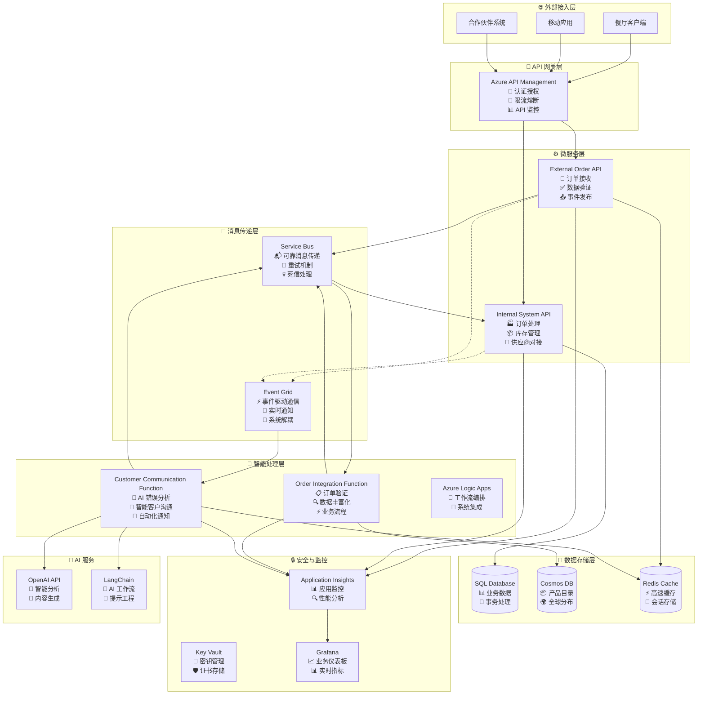
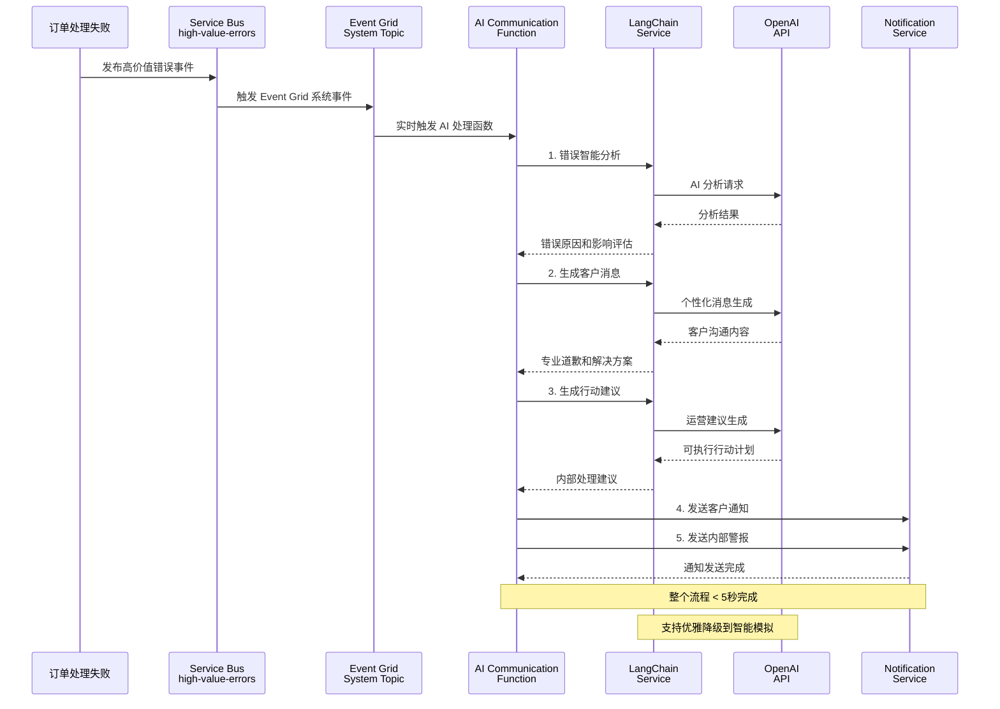
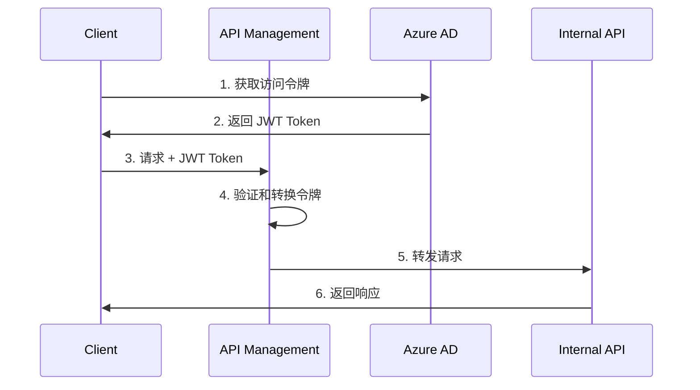

# BidOne Integration Platform - 系统架构文档

## 🎯 架构概述

BidOne Integration Platform 是一个展示**现代云原生架构与 AI 智能集成**的企业级订单处理系统，核心理念是 **"Never Lose an Order"** + **"AI-Powered Customer Experience"**。

## 🏛️ 设计原则

### 核心原则
1. **🛡️ 可靠性优先**: 确保订单处理的高可用性和数据一致性
2. **🔄 事件驱动**: 异步消息传递和松耦合设计
3. **🤖 AI 增强**: 智能错误处理和客户沟通自动化
4. **📊 可观察性**: 全面的监控、日志和业务洞察
5. **🔒 安全第一**: 端到端的安全防护和密钥管理
6. **⚡ 高性能**: 支持水平扩展和高并发处理

### 架构模式
- **🔗 事件驱动架构**: Service Bus + Event Grid 异步通信
- **🏗️ 微服务架构**: 服务解耦和独立部署  
- **🧠 AI 集成模式**: LangChain + OpenAI 智能处理
- **📦 容器化部署**: Docker + Azure Container Apps
- **🔄 CQRS + 事件溯源**: 命令查询分离和事件存储

## 🏗️ 系统架构图

### 整体架构


### AI 智能沟通架构详图


## 核心组件详细设计

### 1. External Order API

**职责**: 接收外部订单请求，进行基础验证和格式化

**技术栈**:
- ASP.NET Core 8.0
- Entity Framework Core
- FluentValidation
- Serilog

**核心功能**:
```csharp
// 订单接收端点
[HttpPost("orders")]
public async Task<IActionResult> CreateOrder([FromBody] CreateOrderRequest request)
{
    // 1. 请求验证
    var validationResult = await _validator.ValidateAsync(request);
    if (!validationResult.IsValid)
        return BadRequest(validationResult.Errors);
    
    // 2. 转换为领域模型
    var order = _mapper.Map<Order>(request);
    
    // 3. 发送到消息队列
    await _serviceBusPublisher.PublishAsync(order);
    
    // 4. 返回确认
    return Accepted(new { OrderId = order.Id, Status = "Received" });
}
```

**关键设计决策**:
- **快速响应**: 立即返回确认，异步处理降低响应时间
- **幂等性**: 支持重复提交检测
- **限流保护**: 集成 API Management 限流策略

### 2. Azure Logic Apps 工作流

**职责**: 业务流程编排和路由决策

**工作流设计**:
```json
{
    "definition": {
        "triggers": {
            "when_message_received": {
                "type": "ServiceBus",
                "inputs": {
                    "queueName": "order-received",
                    "subscriptionName": "order-processor"
                }
            }
        },
        "actions": {
            "validate_order": {
                "type": "Function",
                "inputs": {
                    "functionName": "ValidateOrder"
                }
            },
            "enrich_order_data": {
                "type": "Function",
                "inputs": {
                    "functionName": "EnrichOrderData"
                }
            },
            "route_to_internal_system": {
                "type": "Http",
                "inputs": {
                    "method": "POST",
                    "uri": "@{parameters('internalApiEndpoint')}/orders"
                }
            }
        }
    }
}
```

### 3. Azure Functions

**职责**: 复杂业务逻辑处理和数据转换

**关键函数**:

#### OrderValidationFunction
```csharp
[FunctionName("ValidateOrder")]
public async Task<IActionResult> ValidateOrder(
    [HttpTrigger(AuthorizationLevel.Function, "post")] HttpRequest req,
    [ServiceBus("validation-results", Connection = "ServiceBusConnection")] IAsyncCollector<ValidationResult> outputQueue)
{
    // 业务规则验证
    // 库存检查
    // 供应商能力验证
}
```

#### OrderEnrichmentFunction
```csharp
[FunctionName("EnrichOrderData")]
public async Task<IActionResult> EnrichOrderData(
    [ServiceBusTrigger("enrichment-queue")] Order order,
    [CosmosDB("BidOneDB", "Products", Connection = "CosmosDBConnection")] IDocumentClient documentClient)
{
    // 商品信息补全
    // 价格计算
    // 配送信息enrichment
}
```

### 4. Internal System API

**职责**: 内部系统集成和订单状态管理

**核心实现**:
```csharp
[HttpPost("orders")]
[Authorize]
public async Task<IActionResult> ProcessOrder([FromBody] ProcessOrderRequest request)
{
    using var transaction = await _dbContext.Database.BeginTransactionAsync();
    try
    {
        // 1. 保存订单到数据库
        var order = await _orderService.CreateOrderAsync(request);
        
        // 2. 更新库存
        await _inventoryService.ReserveItemsAsync(order.Items);
        
        // 3. 发送确认事件
        await _eventPublisher.PublishOrderConfirmedAsync(order);
        
        await transaction.CommitAsync();
        return Ok(new { OrderId = order.Id, Status = "Confirmed" });
    }
    catch (Exception ex)
    {
        await transaction.RollbackAsync();
        throw;
    }
}
```

## 数据架构设计

### 数据模型

#### 订单聚合根 (Order Aggregate)
```csharp
public class Order : AggregateRoot
{
    public OrderId Id { get; private set; }
    public CustomerId CustomerId { get; private set; }
    public SupplierId SupplierId { get; private set; }
    public List<OrderItem> Items { get; private set; }
    public OrderStatus Status { get; private set; }
    public DateTime CreatedAt { get; private set; }
    public DateTime? ConfirmedAt { get; private set; }
    
    // 业务方法
    public void Confirm() { /* ... */ }
    public void Cancel() { /* ... */ }
    public void AddItem(OrderItem item) { /* ... */ }
}
```

### 数据存储策略

| 数据类型 | 存储方案 | 原因 |
|----------|----------|------|
| 订单事务数据 | Azure SQL Database | ACID特性，强一致性 |
| 产品目录 | Azure Cosmos DB | 高读取性能，全局分发 |
| 用户会话 | Redis Cache | 快速访问，自动过期 |
| 审计日志 | Azure Storage | 长期存储，成本优化 |

## 消息架构设计

### 消息流设计

```
OrderReceived -> OrderValidation -> OrderEnrichment -> OrderConfirmation
     ↓               ↓                  ↓                ↓
  [Service Bus]  [Service Bus]    [Service Bus]    [Event Grid]
```

### 消息类型定义

#### OrderReceivedEvent
```csharp
public record OrderReceivedEvent(
    string OrderId,
    string CustomerId,
    List<OrderItem> Items,
    DateTime ReceivedAt
) : IIntegrationEvent;
```

#### OrderConfirmedEvent
```csharp
public record OrderConfirmedEvent(
    string OrderId,
    string ConfirmationId,
    DateTime ConfirmedAt,
    decimal TotalAmount
) : IIntegrationEvent;
```

## 安全架构

### 认证授权流程



### 安全策略

1. **API级安全**:
   - OAuth 2.0 / OpenID Connect
   - JWT Token 验证
   - API Key 管理
   - 请求签名验证

2. **网络安全**:
   - VNet 网络隔离
   - NSG 网络安全组
   - WAF Web应用防火墙
   - DDoS 保护

3. **数据安全**:
   - TDE 透明数据加密
   - Column级加密
   - Azure Key Vault 密钥管理
   - RBAC 访问控制

## 可观测性架构

### 监控策略

#### 三大支柱

1. **Metrics (指标)**:
   ```csharp
   // 自定义指标示例
   _telemetryClient.TrackMetric("OrderProcessingTime", processingTime);
   _telemetryClient.TrackMetric("OrdersPerMinute", ordersPerMinute);
   ```

2. **Logs (日志)**:
   ```csharp
   // 结构化日志
   _logger.LogInformation("Order {OrderId} processed successfully for customer {CustomerId}", 
       order.Id, order.CustomerId);
   ```

3. **Traces (链路追踪)**:
   ```csharp
   // 分布式追踪
   using var activity = _activitySource.StartActivity("ProcessOrder");
   activity?.SetTag("order.id", orderId);
   activity?.SetTag("customer.id", customerId);
   ```

### 关键性能指标 (KPIs)

| 指标 | 目标值 | 告警阈值 |
|------|--------|----------|
| 订单处理成功率 | >99.9% | <99.5% |
| 端到端延迟 | <2s | >5s |
| API可用性 | >99.95% | <99.9% |
| 消息处理延迟 | <1s | >3s |

## 容灾和高可用

### 高可用设计

1. **多区域部署**: 
   - 主区域: East US
   - 灾备区域: West US 2

2. **数据复制策略**:
   - SQL Database: 地理复制
   - Cosmos DB: 多区域写入
   - Storage: GRS 地理冗余

3. **故障切换**:
   - 自动故障检测
   - DNS流量管理器
   - 应用层重试机制

### 灾难恢复

- **RTO (Recovery Time Objective)**: 15分钟
- **RPO (Recovery Point Objective)**: 1分钟
- **备份策略**: 
  - 数据库每小时增量备份
  - 每日完整备份
  - 跨区域备份复制

## 性能优化策略

### 缓存策略

1. **L1缓存**: 应用内存缓存
2. **L2缓存**: Redis分布式缓存  
3. **CDN**: 静态资源缓存

### 数据库优化

1. **读写分离**: 读副本分流查询
2. **分区策略**: 按时间和地理位置分区
3. **索引优化**: 覆盖索引和复合索引

### API优化

1. **分页**: 大数据集分页返回
2. **压缩**: Gzip响应压缩
3. **并发控制**: 合理的连接池配置

## 部署架构

### 环境策略

| 环境 | 用途 | 配置 |
|------|------|------|
| Development | 开发测试 | 单实例，共享资源 |
| Staging | 预生产验证 | 生产级配置 |
| Production | 生产环境 | 高可用，多实例 |

### CI/CD 流水线

```yaml
# 简化的流水线配置
stages:
  - build
  - test
  - security-scan
  - deploy-staging
  - integration-test
  - deploy-production
```

## 成本优化

### 资源优化策略

1. **自动扩缩容**: 根据负载自动调整实例数
2. **预留实例**: 生产环境使用预留实例
3. **存储分层**: 冷数据迁移到低成本存储
4. **监控告警**: 成本异常告警

### 成本预估

| 组件 | 月成本(USD) | 说明 |
|------|-------------|------|
| Container Apps | $200 | 3实例标准配置 |
| Azure SQL Database | $300 | S2标准层 |
| Service Bus | $50 | 标准层 |
| Application Insights | $100 | 基础监控 |
| **总计** | **$650** | 预估月成本 |

---

本架构文档将随着项目发展持续更新和完善。