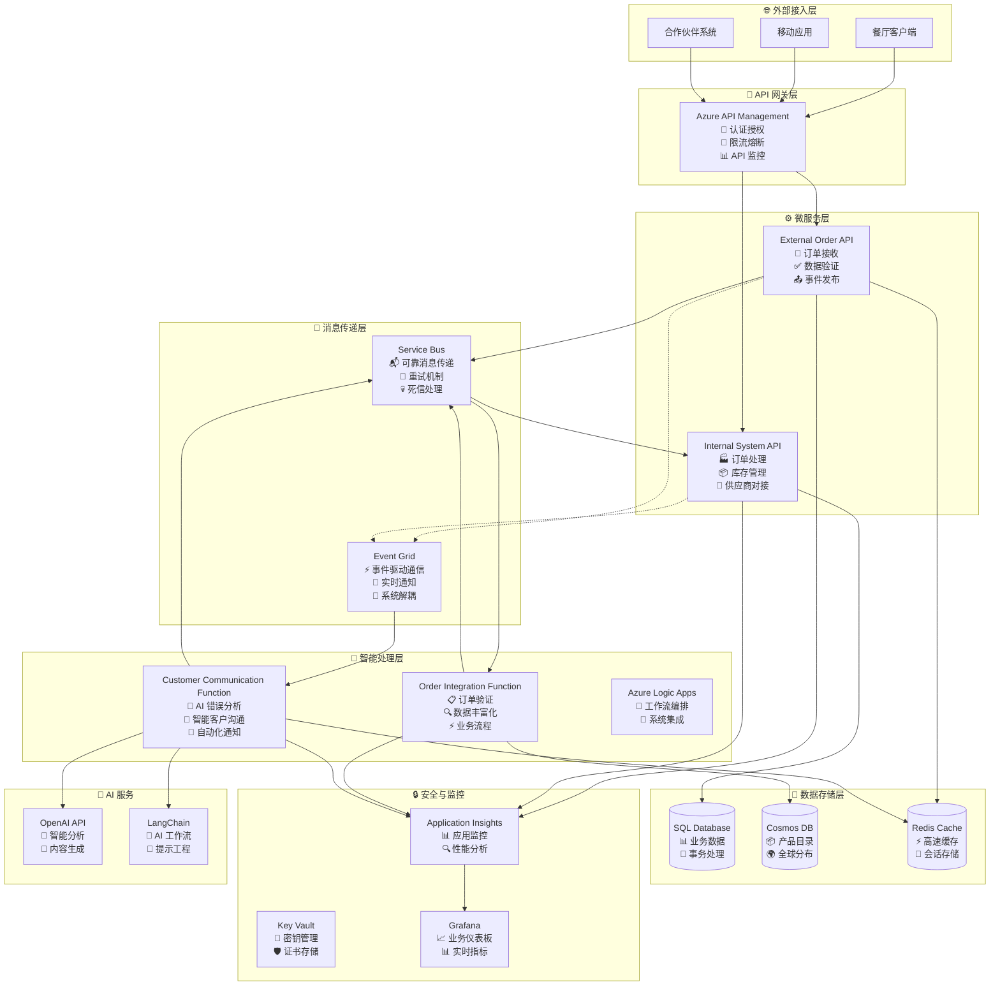
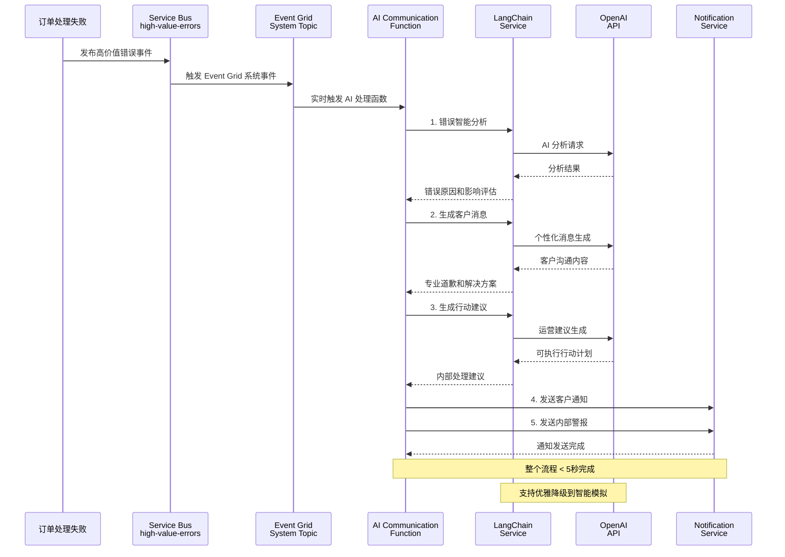
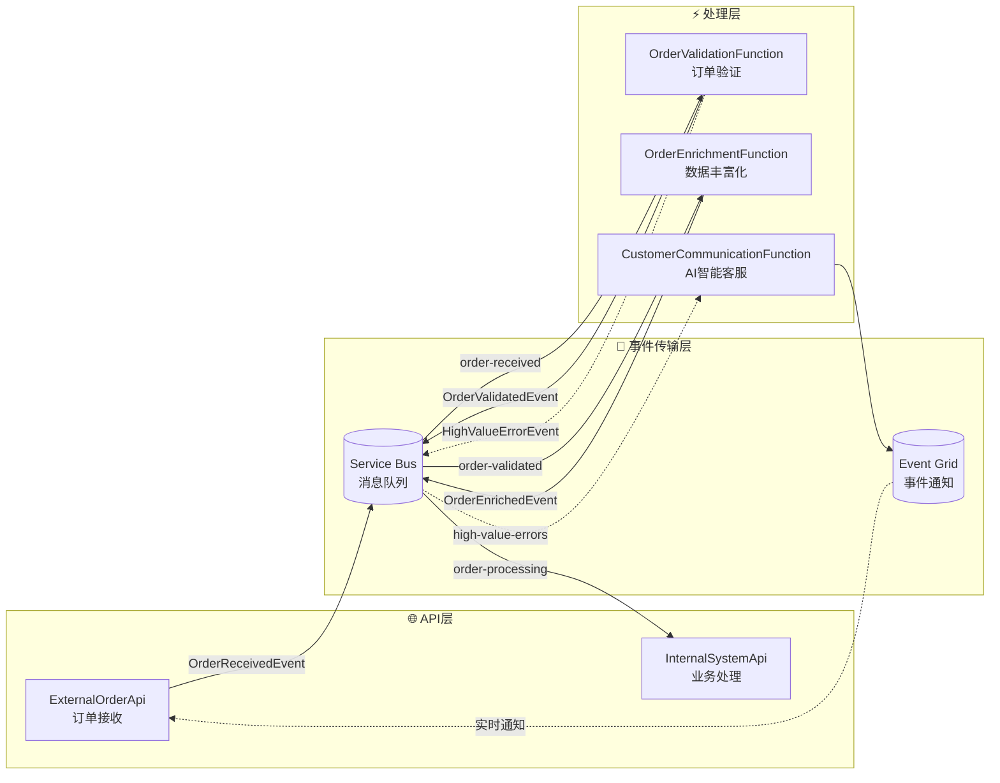
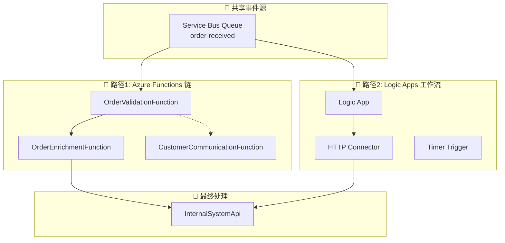
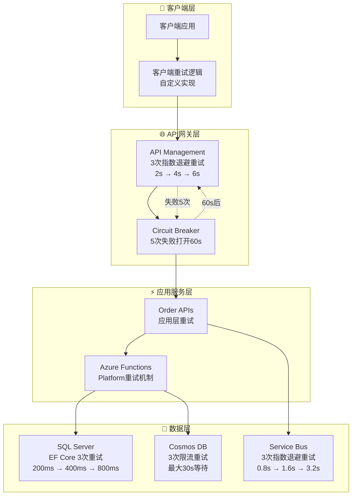
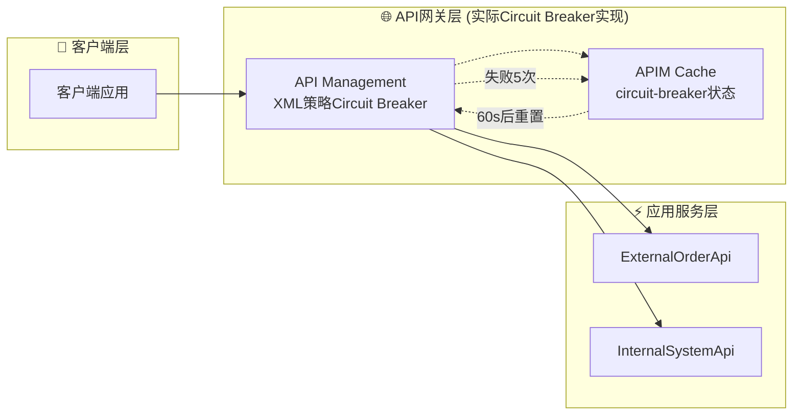
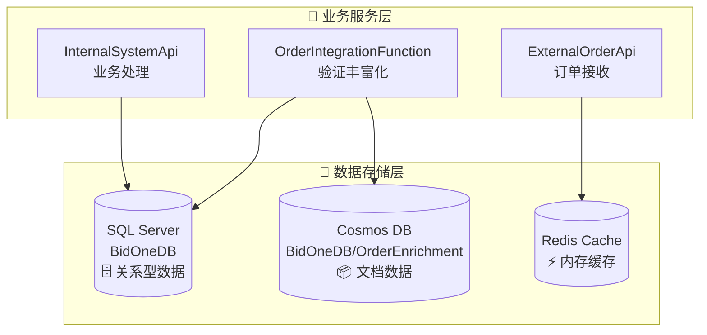
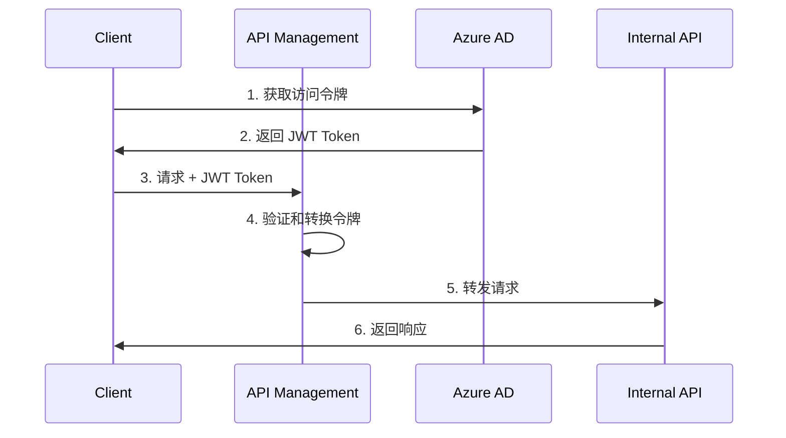

# BidOne Integration Platform - 系统架构文档

## 🎯 架构概述

BidOne Integration Platform 是一个展示**现代云原生架构与 AI 智能集成**的企业级订单处理系统，核心理念是 **"Never Lose an Order"** + **"AI-Powered Customer Experience"**。

### 🔄 双处理架构设计说明

**重要说明**: 本项目包含两条并行的订单处理路径，这是为了技术能力演示而设计的架构：

#### 处理路径 1: Azure Functions 链式处理 (推荐开发模式)
```
订单接收 → [order-received 队列] → OrderValidationFunction → [order-validated 队列] → OrderEnrichmentFunction → [order-processing 队列] → InternalSystemApi
```

#### 处理路径 2: Azure Logic Apps 工作流编排 (可选生产模式)  
```
订单接收 → [order-received 队列] → Logic App 工作流 → HTTP 调用 Functions → InternalSystemApi → [order-confirmed 队列]
```

**设计意图**:
- **技术展示**: 演示 Azure 生态中不同的集成模式和最佳实践
- **灵活选择**: 开发团队可根据具体需求选择合适的处理模式
- **学习目的**: 对比无服务器函数 vs 可视化工作流的优劣势

**使用建议**:
- **本地开发**: 优先使用 Functions 路径 (调试简单，启动快速)
- **生产环境**: 可根据团队技术栈和企业需求选择 Logic Apps 路径
- **监控支持**: 两条路径都有完整的监控和追踪能力

## 🏛️ 设计原则

### 核心原则
1. **🛡️ 可靠性优先**: 确保订单处理的高可用性和数据一致性
2. **🔄 事件驱动**: 异步消息传递和松耦合设计
3. **🤖 AI 增强**: 智能错误处理和客户沟通自动化
4. **📊 可观察性**: 全面的监控、日志和业务洞察
5. **🔒 安全第一**: 端到端的安全防护和密钥管理
6. **⚡ 高性能**: 支持水平扩展和高并发处理

### 架构模式
- **🔗 事件驱动架构**: Service Bus + Event Grid 异步通信
- **🏗️ 微服务架构**: 服务解耦和独立部署  
- **🧠 AI 集成模式**: LangChain + OpenAI 智能处理
- **📦 容器化部署**: Docker + Azure Container Apps
- **🎯 领域驱动设计 (DDD)**: 富领域模型 + 聚合根 + 值对象
- **📋 领域事件**: 业务事件驱动的松耦合通信
- **🔄 CQRS + 事件溯源**: 命令查询分离和事件存储

## 🏗️ 系统架构图

### 整体架构


### AI 智能沟通架构详图


## 核心组件详细设计

### 1. External Order API

**职责**: 接收外部订单请求，进行基础验证和格式化

**技术栈**:
- ASP.NET Core 8.0
- Entity Framework Core
- FluentValidation
- Serilog

**核心功能**:
```csharp
// 订单接收端点
[HttpPost("orders")]
public async Task<IActionResult> CreateOrder([FromBody] CreateOrderRequest request)
{
    // 1. 请求验证
    var validationResult = await _validator.ValidateAsync(request);
    if (!validationResult.IsValid)
        return BadRequest(validationResult.Errors);
    
    // 2. 使用领域模型工厂方法创建订单
    var order = Order.Create(CustomerId.Create(request.CustomerId));
    
    // 3. 使用领域方法添加订单项
    foreach (var item in request.Items)
    {
        var productInfo = ProductInfo.Create(item.ProductId, item.ProductId);
        var quantity = Quantity.Create(item.Quantity);
        var unitPrice = Money.Create(item.UnitPrice);
        
        order.AddItem(productInfo, quantity, unitPrice);
    }
    
    // 4. 设置配送信息
    order.UpdateDeliveryInfo(request.DeliveryDate, null);
    order.SetNotes(request.Notes);
    
    // 5. 发送到消息队列 (领域事件会自动生成)
    await _serviceBusPublisher.PublishAsync(order);
    
    // 6. 返回确认
    return Accepted(new { OrderId = order.Id.Value, Status = order.Status });
}
```

**关键设计决策**:
- **快速响应**: 立即返回确认，异步处理降低响应时间
- **领域驱动**: 使用富领域模型封装业务逻辑和规则
- **类型安全**: 强类型值对象防止原始类型混淆
- **事件驱动**: 领域事件自动记录业务活动
- **幂等性**: 支持重复提交检测
- **限流保护**: 集成 API Management 限流策略

### 2. Azure Logic Apps 工作流

**职责**: 业务流程编排和路由决策

**工作流设计**:
```json
{
    "definition": {
        "triggers": {
            "when_message_received": {
                "type": "ServiceBus",
                "inputs": {
                    "queueName": "order-received",
                    "subscriptionName": "order-processor"
                }
            }
        },
        "actions": {
            "validate_order": {
                "type": "Function",
                "inputs": {
                    "functionName": "ValidateOrder"
                }
            },
            "enrich_order_data": {
                "type": "Function",
                "inputs": {
                    "functionName": "EnrichOrderData"
                }
            },
            "route_to_internal_system": {
                "type": "Http",
                "inputs": {
                    "method": "POST",
                    "uri": "@{parameters('internalApiEndpoint')}/orders"
                }
            }
        }
    }
}
```

### 3. Azure Functions

**职责**: 复杂业务逻辑处理和数据转换

**关键函数**:

#### OrderValidationFunction
```csharp
[FunctionName("ValidateOrder")]
public async Task<IActionResult> ValidateOrder(
    [HttpTrigger(AuthorizationLevel.Function, "post")] HttpRequest req,
    [ServiceBus("validation-results", Connection = "ServiceBusConnection")] IAsyncCollector<ValidationResult> outputQueue)
{
    // 业务规则验证
    // 库存检查
    // 供应商能力验证
}
```

#### OrderEnrichmentFunction
```csharp
[FunctionName("EnrichOrderData")]
public async Task<IActionResult> EnrichOrderData(
    [ServiceBusTrigger("enrichment-queue")] Order order,
    [CosmosDB("BidOneDB", "Products", Connection = "CosmosDBConnection")] IDocumentClient documentClient)
{
    // 商品信息补全
    // 价格计算
    // 配送信息enrichment
}
```

### 4. OrderIntegrationFunction - 订单处理中间件

**职责**: 订单验证、数据丰富化和业务流程编排

**技术栈**:
- Azure Functions v4 (.NET 8.0)
- Service Bus Triggers
- Event Grid Triggers
- Entity Framework Core (验证数据库)
- Cosmos DB (产品目录)

**核心组件**:

#### OrderValidationFunction
```csharp
[Function("ValidateOrderFromServiceBus")]
[ServiceBusOutput("order-validated", Connection = "ServiceBusConnection")]
public async Task<string> ValidateOrderFromServiceBus(
    [ServiceBusTrigger("order-received", Connection = "ServiceBusConnection")] string orderMessage)
{
    // 1. 基础数据验证
    var validationResult = await _validationService.ValidateOrderAsync(order);
    
    // 2. 高价值错误检测
    if (!validationResult.IsValid && IsHighValueError(order, validationResult))
    {
        await PublishHighValueErrorEvent(order, validationResult);
    }
    
    // 3. 发送到下一阶段
    return JsonSerializer.Serialize(response);
}
```

#### OrderEnrichmentFunction
```csharp
[Function("EnrichOrderData")]
[ServiceBusOutput("order-processing", Connection = "ServiceBusConnection")]
public async Task<string> EnrichOrderData(
    [ServiceBusTrigger("order-validated", Connection = "ServiceBusConnection")] string orderMessage)
{
    // 1. 产品信息丰富化
    await _enrichmentService.EnrichProductInformation(order);
    
    // 2. 价格计算和折扣应用
    await _enrichmentService.CalculatePricing(order);
    
    // 3. 供应商分配
    await _enrichmentService.AssignSupplier(order);
    
    return JsonSerializer.Serialize(enrichedOrder);
}
```

#### DashboardMetricsProcessor
```csharp
[Function("DashboardMetricsProcessor")]
public async Task ProcessDashboardEvents(
    [EventGridTrigger] EventGridEvent eventGridEvent)
{
    // 实时业务指标更新
    await UpdateDashboardMetrics(eventGridEvent);
}
```

**关键设计决策**:
- **异步处理**: 提高系统吞吐量和响应速度
- **职责分离**: 验证、丰富化、指标处理各自独立
- **错误隔离**: 每个 Function 独立扩缩容和故障恢复
- **智能检测**: 自动识别高价值订单错误并触发 AI 沟通
- **实时监控**: 通过 Event Grid 实现实时业务指标更新

### 5. BidOne.Shared - 共享基础设施

**职责**: 为整个平台提供统一的领域模型、DDD 基础设施和跨领域关注点

**技术栈**:
- .NET 8.0 Class Library
- FluentValidation (数据验证)
- Prometheus.NET (指标收集)
- Azure.Messaging.EventGrid (事件发布)
- System.Text.Json (序列化)

**核心架构**:

#### 领域驱动设计 (DDD) 基础设施

**AggregateRoot - 聚合根基类**
```csharp
public abstract class AggregateRoot : Entity
{
    private readonly List<IDomainEvent> _domainEvents = new();
    
    [NotMapped]
    public IReadOnlyCollection<IDomainEvent> DomainEvents => _domainEvents.AsReadOnly();
    
    protected void AddDomainEvent(IDomainEvent domainEvent)
    {
        _domainEvents.Add(domainEvent);
    }
    
    public void MarkEventsAsCommitted()
    {
        _domainEvents.Clear();
    }
}
```

**ValueObject - 值对象基类**
```csharp
// 强类型订单标识符
public sealed class OrderId : ValueObject
{
    public string Value { get; }
    
    public static OrderId CreateNew() => 
        new($"ORD-{DateTime.UtcNow:yyyyMMdd}-{Guid.NewGuid().ToString("N")[..8].ToUpper()}");
    
    public static implicit operator string(OrderId orderId) => orderId.Value;
    public static implicit operator OrderId(string value) => Create(value);
}

// 金额值对象，支持币种和运算
public sealed class Money : ValueObject
{
    public decimal Amount { get; }
    public string Currency { get; }
    
    public Money Add(Money other) => new(Amount + other.Amount, Currency);
    public Money Multiply(decimal multiplier) => new(Amount * multiplier, Currency);
    public bool IsGreaterThan(Money other) => Amount > other.Amount;
}
```

#### 订单聚合根设计

**完整的业务逻辑封装**
```csharp
public class Order : AggregateRoot
{
    public OrderId Id { get; set; }
    public CustomerId CustomerId { get; set; }
    public List<OrderItem> Items { get; set; } = new();
    public OrderStatus Status { get; set; }
    public Money TotalAmount { get; private set; } = Money.Zero();
    public Dictionary<string, object> Metadata { get; private set; } = new();
    
    // 工厂方法
    public static Order Create(CustomerId customerId)
    {
        var order = new Order(OrderId.CreateNew(), customerId);
        order.AddDomainEvent(new OrderCreatedEvent(order.Id, customerId));
        return order;
    }
    
    // 业务方法 - 添加订单项
    public void AddItem(ProductInfo productInfo, Quantity quantity, Money unitPrice)
    {
        if (Status != OrderStatus.Received)
            throw new InvalidOperationException($"Cannot add items to order in status {Status}");
        
        var orderItem = OrderItem.Create(productInfo, quantity, unitPrice);
        Items.Add(orderItem);
        RecalculateTotalAmount();
        UpdateTimestamp();
    }
    
    // 业务方法 - 订单验证
    public void Validate()
    {
        if (Status != OrderStatus.Received)
            throw new InvalidOperationException($"Cannot validate order in status {Status}");
        
        if (!Items.Any())
            throw new InvalidOperationException("Cannot validate order without items");
        
        Status = OrderStatus.Validating;
        UpdateTimestamp();
        AddDomainEvent(new OrderValidationStartedEvent(Id));
    }
    
    // 业务方法 - 订单确认
    public void Confirm(string supplierId)
    {
        if (Status != OrderStatus.Processing)
            throw new InvalidOperationException($"Cannot confirm order from status {Status}");
        
        SupplierId = supplierId;
        Status = OrderStatus.Confirmed;
        ConfirmedAt = DateTime.UtcNow;
        UpdateTimestamp();
        AddDomainEvent(new OrderConfirmedEvent(Id, SupplierId, TotalAmount));
    }
    
    // 业务规则查询
    public bool CanBeCancelled()
    {
        return Status is OrderStatus.Received or OrderStatus.Validating or OrderStatus.Validated;
    }
    
    public bool IsHighValue(decimal threshold = 1000m)
    {
        return TotalAmount.Amount > threshold;
    }
    
    private void RecalculateTotalAmount()
    {
        TotalAmount = Items.Aggregate(Money.Zero(), (total, item) => total.Add(item.GetTotalPrice()));
    }
}
```

#### 事件驱动架构支持

**集成事件基类**
```csharp
public abstract class IntegrationEvent
{
    public string Id { get; } = Guid.NewGuid().ToString();
    public DateTime CreatedAt { get; } = DateTime.UtcNow;
    public string EventType { get; protected set; } = string.Empty;
    public string Source { get; set; } = string.Empty;
    public string CorrelationId { get; set; } = string.Empty;
    public Dictionary<string, object> Metadata { get; set; } = new();
}
```

**具体业务事件**
```csharp
// 订单接收事件
public class OrderReceivedEvent : IntegrationEvent
{
    public string OrderId { get; set; } = string.Empty;
    public string CustomerId { get; set; } = string.Empty;
    public DateTime ReceivedAt { get; set; }
    public string SourceSystem { get; set; } = string.Empty;
}

// 高价值错误事件 (触发 AI 智能沟通)
public class HighValueErrorEvent : IntegrationEvent
{
    public string OrderId { get; set; } = string.Empty;
    public string CustomerId { get; set; } = string.Empty;
    public string ErrorCategory { get; set; } = string.Empty;
    public string ErrorMessage { get; set; } = string.Empty;
    public decimal OrderValue { get; set; }
    public string CustomerTier { get; set; } = string.Empty;
    public DateTime ErrorOccurredAt { get; set; }
    public Dictionary<string, object> ContextData { get; set; } = new();
}
```

#### 监控指标系统

**Prometheus 业务指标**
```csharp
public static class BusinessMetrics
{
    // 订单处理总数计数器
    public static readonly Counter OrdersProcessed = Prometheus.Metrics
        .CreateCounter("bidone_orders_processed_total", "订单处理总数",
            new[] { "status", "service" });
    
    // 订单处理时间直方图
    public static readonly Histogram OrderProcessingTime = Prometheus.Metrics
        .CreateHistogram("bidone_order_processing_seconds", "订单处理时间(秒)",
            new HistogramConfiguration
            {
                Buckets = Histogram.LinearBuckets(0.01, 0.05, 20),
                LabelNames = new[] { "service", "operation" }
            });
    
    // 当前待处理订单数量计量器
    public static readonly Gauge PendingOrders = Prometheus.Metrics
        .CreateGauge("bidone_pending_orders_count", "当前待处理订单数量",
            new[] { "service" });
    
    // API 请求响应时间直方图
    public static readonly Histogram ApiRequestDuration = Prometheus.Metrics
        .CreateHistogram("bidone_api_request_duration_seconds", "API请求响应时间(秒)",
            new HistogramConfiguration
            {
                Buckets = Histogram.ExponentialBuckets(0.001, 2, 15),
                LabelNames = new[] { "method", "endpoint", "status" }
            });
}
```

#### 服务抽象接口

**消息发布接口**
```csharp
public interface IMessagePublisher
{
    // 发布消息到指定队列
    Task PublishAsync<T>(T message, string queueName, CancellationToken cancellationToken = default) 
        where T : class;
    
    // 发布集成事件
    Task PublishEventAsync<T>(T integrationEvent, CancellationToken cancellationToken = default) 
        where T : IntegrationEvent;
    
    // 批量消息发布
    Task PublishBatchAsync<T>(IEnumerable<T> messages, string queueName, CancellationToken cancellationToken = default) 
        where T : class;
}

// 事件处理接口
public interface IEventHandler<in T> where T : IntegrationEvent
{
    Task HandleAsync(T integrationEvent, CancellationToken cancellationToken = default);
}
```

**关键设计决策**:
- **统一业务模型**: 所有服务使用相同的 Order 聚合根，确保业务逻辑一致性
- **强类型安全**: 值对象防止原始类型混淆，编译时捕获错误
- **事件驱动解耦**: 通过集成事件实现服务间松耦合通信
- **业务规则封装**: 领域方法封装复杂业务逻辑，避免贫血模型
- **可观测性内置**: 监控指标嵌入到共享基础设施中
- **向后兼容**: 保留原有属性访问器，支持渐进式重构

### 6. Internal System API

**职责**: 内部系统集成和订单状态管理

**核心实现**:
```csharp
[HttpPost("orders")]
[Authorize]
public async Task<IActionResult> ProcessOrder([FromBody] ProcessOrderRequest request)
{
    using var transaction = await _dbContext.Database.BeginTransactionAsync();
    try
    {
        // 1. 保存订单到数据库
        var order = await _orderService.CreateOrderAsync(request);
        
        // 2. 更新库存
        await _inventoryService.ReserveItemsAsync(order.Items);
        
        // 3. 发送确认事件
        await _eventPublisher.PublishOrderConfirmedAsync(order);
        
        await transaction.CommitAsync();
        return Ok(new { OrderId = order.Id, Status = "Confirmed" });
    }
    catch (Exception ex)
    {
        await transaction.RollbackAsync();
        throw;
    }
}
```

## 数据架构设计

### 数据模型

#### 订单聚合根 (Order Aggregate)
```csharp
public class Order : AggregateRoot
{
    public OrderId Id { get; set; }
    public CustomerId CustomerId { get; set; }
    public string CustomerEmail { get; set; }
    public string CustomerPhone { get; set; }
    public string SupplierId { get; private set; }
    public List<OrderItem> Items { get; set; }
    public OrderStatus Status { get; set; }
    public DateTime? ConfirmedAt { get; set; }
    public DateTime? DeliveryDate { get; set; }
    public string? DeliveryAddress { get; set; }
    public string? SpecialInstructions { get; set; }
    public Money TotalAmount { get; private set; }
    public string? Notes { get; private set; }
    public Dictionary<string, object> Metadata { get; private set; }

    // 工厂方法
    public static Order Create(OrderId id, CustomerId customerId) { /* ... */ }
    public static Order Create(CustomerId customerId) { /* ... */ }
    
    // 业务方法
    public void AddItem(ProductInfo productInfo, Quantity quantity, Money unitPrice) { /* ... */ }
    public void RemoveItem(string productId) { /* ... */ }
    public void UpdateDeliveryInfo(DateTime? deliveryDate, string? deliveryAddress) { /* ... */ }
    public void SetSpecialInstructions(string? instructions) { /* ... */ }
    public void Validate() { /* ... */ }
    public void MarkAsValidated() { /* ... */ }
    public void StartEnrichment() { /* ... */ }
    public void CompleteEnrichment(Dictionary<string, object> enrichmentData) { /* ... */ }
    public void StartProcessing() { /* ... */ }
    public void Confirm(string supplierId) { /* ... */ }
    public void Cancel(string reason) { /* ... */ }
    public void MarkAsFailed(string reason) { /* ... */ }
    public void MarkAsDelivered() { /* ... */ }
    
    // 业务规则查询
    public bool CanBeCancelled() { /* ... */ }
    public bool IsHighValue(decimal threshold = 1000m) { /* ... */ }
}

public class OrderItem : Entity
{
    public ProductInfo ProductInfo { get; set; }
    public Quantity Quantity { get; set; }
    public Money UnitPrice { get; set; }
    public Dictionary<string, object> Properties { get; private set; }

    // 工厂方法
    public static OrderItem Create(ProductInfo productInfo, Quantity quantity, Money unitPrice) { /* ... */ }
    
    // 业务方法
    public Money GetTotalPrice() { /* ... */ }
    public void UpdateQuantity(Quantity newQuantity) { /* ... */ }
    public void UpdateUnitPrice(Money newUnitPrice) { /* ... */ }
    
    // 向后兼容属性
    public string ProductId { get; set; }
    public string ProductName { get; set; }
    public string? Category { get; set; }
    public decimal TotalPrice => GetTotalPrice().Amount;
}
```

### DDD 实现架构

#### 领域基础设施

**AggregateRoot (聚合根)**
```csharp
public abstract class AggregateRoot : Entity
{
    private readonly List<IDomainEvent> _domainEvents = new();
    public IReadOnlyCollection<IDomainEvent> DomainEvents => _domainEvents.AsReadOnly();
    
    protected void AddDomainEvent(IDomainEvent domainEvent) { /* ... */ }
    public void MarkEventsAsCommitted() { /* ... */ }
    public void ClearDomainEvents() { /* ... */ }
}
```

**Entity (实体基类)**
```csharp
public abstract class Entity
{
    public DateTime CreatedAt { get; set; }
    public DateTime UpdatedAt { get; set; }
    public string CreatedBy { get; set; }
    public string UpdatedBy { get; set; }
    
    protected void UpdateTimestamp(string updatedBy = "System") { /* ... */ }
    // 相等性比较实现...
}
```

#### 值对象 (Value Objects)

**OrderId** - 强类型订单标识符
```csharp
public sealed class OrderId : ValueObject
{
    public string Value { get; }
    public static OrderId CreateNew() => new($"ORD-{DateTime.UtcNow:yyyyMMdd}-{Guid.NewGuid().ToString("N")[..8].ToUpper()}");
    public static implicit operator string(OrderId orderId) => orderId.Value;
}
```

**Money** - 金额值对象，支持币种和运算
```csharp
public sealed class Money : ValueObject
{
    public decimal Amount { get; }
    public string Currency { get; }
    
    public Money Add(Money other) { /* 币种一致性检查 */ }
    public Money Multiply(decimal multiplier) { /* ... */ }
    public bool IsGreaterThan(Money other) { /* ... */ }
}
```

**ProductInfo** - 产品信息封装
```csharp
public sealed class ProductInfo : ValueObject
{
    public string ProductId { get; }
    public string ProductName { get; }
    public string? Category { get; }
    
    public static ProductInfo Create(string productId, string productName, string? category = null) { /* ... */ }
}
```

**Quantity** - 数量值对象，确保正数约束
```csharp
public sealed class Quantity : ValueObject
{
    public int Value { get; }
    
    private Quantity(int value)
    {
        if (value <= 0) throw new ArgumentException("Quantity must be greater than zero");
        Value = value;
    }
}
```

#### 领域事件 (Domain Events)

```csharp
// 订单生命周期事件
public class OrderCreatedEvent : DomainEvent
{
    public OrderId OrderId { get; }
    public CustomerId CustomerId { get; }
}

public class OrderConfirmedEvent : DomainEvent
{
    public OrderId OrderId { get; }
    public string SupplierId { get; }
    public Money TotalAmount { get; }
}

public class OrderCancelledEvent : DomainEvent
{
    public OrderId OrderId { get; }
    public string Reason { get; }
}

// 更多事件: OrderValidatedEvent, OrderFailedEvent, OrderDeliveredEvent...
```

#### 业务规则实现

**订单状态转换规则**
```csharp
public void Validate()
{
    if (Status != OrderStatus.Received)
        throw new InvalidOperationException($"Cannot validate order in status {Status}");
    
    if (!Items.Any())
        throw new InvalidOperationException("Cannot validate order without items");
        
    Status = OrderStatus.Validating;
    AddDomainEvent(new OrderValidationStartedEvent(Id));
}

public void Confirm(string supplierId)
{
    if (Status != OrderStatus.Processing)
        throw new InvalidOperationException($"Cannot confirm order from status {Status}");
        
    SupplierId = supplierId;
    Status = OrderStatus.Confirmed;
    ConfirmedAt = DateTime.UtcNow;
    AddDomainEvent(new OrderConfirmedEvent(Id, SupplierId, TotalAmount));
}

public bool CanBeCancelled()
{
    return Status is OrderStatus.Received or OrderStatus.Validating or OrderStatus.Validated;
}
```

**金额计算规则**
```csharp
private void RecalculateTotalAmount()
{
    TotalAmount = Items.Aggregate(Money.Zero(), (total, item) => total.Add(item.GetTotalPrice()));
}

public bool IsHighValue(decimal threshold = 1000m)
{
    return TotalAmount.Amount > threshold;
}
```

#### 向后兼容性设计

为了保持与现有代码的兼容性，我们实现了以下策略：

1. **公共构造函数**: 保留无参构造函数用于序列化和现有代码
2. **属性访问器**: 提供向后兼容的属性 getter/setter
3. **隐式转换**: 值对象支持与原始类型的隐式转换
4. **适配器属性**: OrderItem 提供 ProductId, ProductName 等便捷访问

```csharp
// OrderItem 向后兼容属性
public string ProductId 
{ 
    get => ProductInfo.ProductId;
    set => ProductInfo = ProductInfo.Create(value, ProductInfo.ProductName, ProductInfo.Category);
}
public decimal TotalPrice => GetTotalPrice().Amount;
```

## 6. 集成事件 (IntegrationEvents) 完整流程分析

### 6.1 事件架构概览

集成事件是整个平台**事件驱动架构**的核心，实现了服务间的松耦合通信。以下是完整的事件流转架构：



### 6.2 事件生命周期详解

#### 阶段1: 事件发布 (Event Publishing)

**位置**: `src/ExternalOrderApi/Services/OrderService.cs:82`
```csharp
// 发布 OrderReceivedEvent 集成事件
await _messagePublisher.PublishEventAsync(orderReceivedEvent, cancellationToken);
```

**技术实现**: `ServiceBusMessagePublisher.cs`
```csharp
public async Task PublishEventAsync<T>(T integrationEvent, CancellationToken cancellationToken = default) 
    where T : IntegrationEvent
{
    var queueName = GetEventQueueName(typeof(T));  // 自动路由到对应队列
    await PublishAsync(integrationEvent, queueName, cancellationToken);
}
```

**关键特性**:
- **自动队列路由**: 根据事件类型自动确定目标队列
- **消息持久化**: Service Bus 确保消息不丢失
- **批量支持**: 支持批量事件发布提高性能
- **重试机制**: 内置指数退避重试策略

#### 阶段2: 事件消费 (Event Consumption)

**Service Bus Trigger 自动触发**:
```csharp
[Function("ValidateOrderFromServiceBus")]
[ServiceBusOutput("order-validated", Connection = "ServiceBusConnection")]
public async Task<string> ValidateOrderFromServiceBus(
    [ServiceBusTrigger("order-received", Connection = "ServiceBusConnection")] string orderMessage)
```

**处理流程**:
1. **自动反序列化**: JSON → 强类型对象
2. **业务逻辑处理**: 订单验证、数据丰富化
3. **条件事件发布**: 根据业务规则决定下游事件
4. **输出绑定**: 自动发送结果到下游队列

#### 阶段3: 高价值错误智能处理

**错误检测逻辑** (`OrderValidationFunction.cs:152`):
```csharp
private static bool IsHighValueError(Order order, ValidationResult validationResult)
{
    // 高价值订单: 金额 > $1000
    var orderValue = order.Items.Sum(i => i.TotalPrice);
    var isHighValueOrder = orderValue > 1000m;
    
    // 关键错误类型
    var criticalErrors = new[] { 
        "CUSTOMER_NOT_FOUND", "PRODUCT_NOT_FOUND", 
        "PRICE_MISMATCH", "ORDER_VALUE_EXCEEDED" 
    };
    var hasCriticalError = validationResult.Errors.Any(e => criticalErrors.Contains(e.Code));
    
    return isHighValueOrder || hasCriticalError;
}
```

**AI处理流程** (`CustomerCommunicationFunction`):
```csharp
[ServiceBusTrigger("high-value-errors", Connection = "ServiceBusConnection")]
public async Task ProcessHighValueErrorFromServiceBus(string errorMessage)
{
    var errorEvent = JsonSerializer.Deserialize<HighValueErrorEvent>(errorMessage);
    await _communicationService.ProcessHighValueErrorAsync(errorEvent);
}
```

### 6.3 事件类型与队列映射

| 集成事件 | 队列名称 | 生产者 | 消费者 | 触发条件 | 业务意义 |
|---------|---------|--------|--------|----------|----------|
| `OrderReceivedEvent` | `order-received` | ExternalOrderApi | OrderValidationFunction | 订单提交成功 | 启动订单处理流程 |
| `OrderValidatedEvent` | `order-validated` | OrderValidationFunction | OrderEnrichmentFunction | 验证通过 | 进入数据丰富化阶段 |
| `OrderEnrichedEvent` | `order-enriched` | OrderEnrichmentFunction | InternalSystemApi | 丰富化完成 | 进入最终处理阶段 |
| `HighValueErrorEvent` | `high-value-errors` | OrderValidationFunction | CustomerCommunicationFunction | 高价值错误 | 触发AI智能客服 |
| `OrderConfirmedEvent` | `order-confirmed` | InternalSystemApi | - | 订单确认 | 通知外部系统 |
| `OrderFailedEvent` | `order-failed` | InternalSystemApi | - | 处理失败 | 错误通知和补偿 |

### 6.4 技术实现细节

#### 消息发布机制

**队列自动管理**:
```csharp
private async Task EnsureQueueExistsAsync(string queueName)
{
    // 开发环境: 使用预配置队列
    if (IsEmulatorEnvironment())
    {
        _logger.LogDebug("Service Bus Emulator: Using pre-configured queue '{QueueName}'", queueName);
        return;
    }
    
    // 生产环境: 动态创建队列
    if (!await _adminClient.QueueExistsAsync(queueName))
    {
        await _adminClient.CreateQueueAsync(queueName);
        _logger.LogInformation("✅ Successfully created Service Bus queue: {QueueName}", queueName);
    }
}
```

**消息属性增强**:
```csharp
var serviceBusMessage = new ServiceBusMessage(messageBody)
{
    ContentType = "application/json",
    MessageId = Guid.NewGuid().ToString(),
    CorrelationId = ExtractCorrelationId(message),  // 端到端追踪
    TimeToLive = TimeSpan.FromHours(24)             // 消息过期时间
};

// 自定义属性用于路由和过滤
serviceBusMessage.ApplicationProperties.Add("MessageType", typeof(T).Name);
serviceBusMessage.ApplicationProperties.Add("CreatedAt", DateTime.UtcNow);
serviceBusMessage.ApplicationProperties.Add("Source", "ExternalOrderApi");
```

#### 错误处理和重试策略

**死信队列 (Dead Letter Queue)**:
- 消息处理失败自动进入死信队列
- 支持人工审查和重新处理
- 防止坏消息阻塞整个处理管道

**指数退避重试**:
```csharp
// Azure Functions 自动重试配置
{
  "version": "2.0",
  "extensions": {
    "serviceBus": {
      "messageHandlerOptions": {
        "maxConcurrentCalls": 32,
        "maxAutoRenewDuration": "00:05:00"
      }
    }
  }
}
```

### 6.5 AI智能处理流程深度解析

#### 高价值错误事件结构

```csharp
public class HighValueErrorEvent : IntegrationEvent
{
    public string OrderId { get; set; } = string.Empty;
    public string CustomerId { get; set; } = string.Empty;
    public string CustomerEmail { get; set; } = string.Empty;
    public string ErrorCategory { get; set; } = string.Empty;      // Customer/Product/Pricing/Delivery
    public string ErrorMessage { get; set; } = string.Empty;
    public decimal OrderValue { get; set; }
    public string CustomerTier { get; set; } = string.Empty;       // Premium/Gold/Silver/Standard
    public string ProcessingStage { get; set; } = string.Empty;    // Validation/Enrichment/Processing
    public Dictionary<string, object> ContextData { get; set; } = new();
}
```

#### LangChain + OpenAI 智能分析

**错误根因分析**:
```csharp
public async Task<string> AnalyzeErrorAsync(HighValueErrorEvent errorEvent, CancellationToken cancellationToken = default)
{
    var prompt = $@"
作为资深的客户服务专家，请分析以下订单错误:
- 订单ID: {errorEvent.OrderId}
- 客户等级: {errorEvent.CustomerTier}
- 订单金额: ${errorEvent.OrderValue:N2}
- 错误类别: {errorEvent.ErrorCategory}
- 错误详情: {errorEvent.ErrorMessage}
- 处理阶段: {errorEvent.ProcessingStage}

请提供:
1. 错误根本原因分析
2. 对客户业务影响评估
3. 建议的补救措施
4. 预防类似问题的长期策略
";

    return await _openAIService.GenerateCompletionAsync(prompt, cancellationToken);
}
```

**个性化客户消息生成**:
```csharp
public async Task<string> GenerateCustomerMessageAsync(HighValueErrorEvent errorEvent, string analysis, CancellationToken cancellationToken = default)
{
    var compensationLevel = errorEvent.CustomerTier switch
    {
        "Premium" => "20% 折扣 + 免费快递升级 + 专属客服支持",
        "Gold" => "15% 折扣 + 免费快递",
        "Silver" => "10% 折扣",
        _ => "优惠券补偿"
    };

    var prompt = $@"
作为专业的客户沟通专家，为以下客户生成个性化的道歉和补偿邮件:

客户信息:
- 等级: {errorEvent.CustomerTier}
- 订单金额: ${errorEvent.OrderValue:N2}
- 建议补偿: {compensationLevel}

错误分析:
{analysis}

请生成正式但友好的邮件，包含:
1. 真诚的道歉
2. 问题解释 (非技术性语言)
3. 具体的补偿方案
4. 后续跟进承诺
";

    return await _openAIService.GenerateCompletionAsync(prompt, cancellationToken);
}
```

#### 智能操作建议

**为内部团队生成处理建议**:
```csharp
public async Task<List<string>> GenerateSuggestedActionsAsync(HighValueErrorEvent errorEvent, string analysis, CancellationToken cancellationToken = default)
{
    // AI 生成的智能建议示例:
    return new List<string>
    {
        $"🔥 立即处理: 联系客户 {errorEvent.CustomerEmail} (VIP客户)",
        $"💰 授权补偿: 订单金额 ${errorEvent.OrderValue:N2} 的15%折扣",
        $"📞 升级处理: 安排高级客服专员跟进",
        $"🔍 根因分析: 检查 {errorEvent.ErrorCategory} 相关业务流程",
        $"📊 监控设置: 为类似错误设置实时监控告警",
        $"🔄 流程优化: 在 {errorEvent.ProcessingStage} 阶段增加额外验证"
    };
}
```

### 6.6 监控与可观测性

#### 业务指标收集

```csharp
// 订单处理成功率
BusinessMetrics.OrdersProcessed
    .WithLabels(order.Status.ToString(), "OrderValidationFunction")
    .Inc();

// 高价值错误率
BusinessMetrics.OrdersProcessed
    .WithLabels("HighValueError", errorEvent.ErrorCategory)
    .Inc();

// AI处理时间
using (BusinessMetrics.OrderProcessingTime
    .WithLabels("CustomerCommunication", "AIAnalysis")
    .NewTimer())
{
    await _langChainService.AnalyzeErrorAsync(errorEvent);
}
```

#### 端到端追踪

**CorrelationId 传递**:
```csharp
// 事件发布时设置 CorrelationId
var orderReceivedEvent = new OrderReceivedEvent
{
    OrderId = order.Id,
    CorrelationId = correlationId,  // 贯穿整个处理流程
    Source = "ExternalOrderApi"
};

// 所有后续事件继承相同的 CorrelationId
var errorEvent = new HighValueErrorEvent
{
    CorrelationId = order.Metadata.GetValueOrDefault("CorrelationId", string.Empty).ToString(),
    // ... 其他属性
};
```

**结构化日志**:
```csharp
_logger.LogInformation("🚨 High-value error event published for order {OrderId}, " +
                      "value ${OrderValue:N2}, customer {CustomerTier}, " +
                      "correlation {CorrelationId}",
    order.Id, errorEvent.OrderValue, errorEvent.CustomerTier, errorEvent.CorrelationId);
```

### 6.7 双处理路径架构设计

#### 设计理念

项目实现了**两条并行处理路径**，用于展示不同的 Azure 集成模式：



#### 路径特性对比

| 特性 | Functions 路径 | Logic Apps 路径 |
|------|----------------|-----------------|
| **触发方式** | Service Bus Trigger | HTTP Polling |
| **开发体验** | 代码优先 | 可视化设计器 |
| **性能** | 毫秒级启动 | 秒级启动 |
| **扩缩容** | 自动扩缩容 | 手动配置 |
| **监控** | Application Insights | Logic Apps 监控 |
| **成本** | 按执行计费 | 按动作计费 |
| **适用场景** | 高频、低延迟 | 复杂工作流 |

#### 技术选型指导

**选择 Functions 路径的场景**:
- 高性能要求 (毫秒级响应)
- 复杂业务逻辑
- 需要细粒度控制
- 开发团队熟悉代码开发

**选择 Logic Apps 路径的场景**:
- 复杂的工作流编排
- 需要可视化设计
- 集成多个 SaaS 服务
- 业务人员参与设计

### 6.8 生产环境最佳实践

#### 消息处理优化

**并发控制**:
```csharp
// host.json 配置
{
  "extensions": {
    "serviceBus": {
      "messageHandlerOptions": {
        "maxConcurrentCalls": 32,        // 并发处理数量
        "maxAutoRenewDuration": "00:05:00"  // 消息锁定时间
      }
    }
  }
}
```

**批量处理**:
```csharp
// 批量发布提高吞吐量
await _messagePublisher.PublishBatchAsync(events, "order-events", cancellationToken);
```

#### 错误处理策略

**优雅降级**:
```csharp
public async Task<string> AnalyzeErrorAsync(HighValueErrorEvent errorEvent, CancellationToken cancellationToken = default)
{
    try
    {
        // 优先使用 OpenAI API
        return await CallOpenAIAsync(errorEvent, cancellationToken);
    }
    catch (Exception ex)
    {
        _logger.LogWarning(ex, "OpenAI API unavailable, falling back to intelligent simulation");
        // 降级到智能模拟分析
        return GenerateIntelligentAnalysis(errorEvent);
    }
}
```

#### 指数退避重试机制详解

系统在多个层面实现了完整的指数退避重试策略，确保高可用性和容错能力：

**1. API Management 指数退避重试** (主要配置)

**位置**: `infra/policies/external-api-policy.xml:74-76`
```xml
<!-- 指数退避重试策略 -->
<retry condition="@(context.Response.StatusCode >= 500)" 
       count="3" 
       interval="2" 
       max-interval="10" 
       delta="2">
    <forward-request buffer-request-body="true" />
</retry>
```

**参数说明**:
- `count="3"` - 最大重试次数: 3次
- `interval="2"` - 初始重试间隔: 2秒  
- `max-interval="10"` - 最大重试间隔: 10秒
- `delta="2"` - 指数退避增量: 每次重试间隔增加2秒

**重试时间序列**:
- 初次请求失败 → 立即返回错误
- 第1次重试: 2秒后执行
- 第2次重试: 4秒后执行 (2 + 2)  
- 第3次重试: 6秒后执行 (4 + 2)
- 最终失败: 总计用时约12秒

**2. Entity Framework Core 数据库重试**

**位置**: `src/InternalSystemApi/Program.cs:81`
```csharp
// SQL Server 连接重试配置
options.UseSqlServer(connectionString, sqlOptions =>
{
    sqlOptions.EnableRetryOnFailure(
        maxRetryCount: 3,                    // 最大重试次数
        maxRetryDelay: TimeSpan.FromSeconds(10),  // 最大延迟时间
        errorNumbersToAdd: null              // 额外的错误代码
    );
    sqlOptions.CommandTimeout(30);          // 命令超时30秒
});
```

**EF Core 内置退避策略**:
- 使用指数退避算法: `Math.Min(maxRetryDelay, TimeSpan.FromMilliseconds(Math.Pow(2, attemptCount) * 100))`
- 第1次重试: ~200ms
- 第2次重试: ~400ms  
- 第3次重试: ~800ms
- 包含随机抖动避免雷群效应

**3. Azure Functions 重试配置**

**Event Grid 重试** (`src/CustomerCommunicationFunction/host.json:27-31`):
```json
{
  "extensions": {
    "eventGrid": {
      "maxEventsPerBatch": 1,
      "preferredBatchSizeInKilobytes": 64,
      "maxDeliveryRetryAttempts": 3        // 最大重试次数
    }
  }
}
```

**Service Bus 消息处理** (`src/CustomerCommunicationFunction/host.json:13-19`):
```json
{
  "extensions": {
    "serviceBus": {
      "prefetchCount": 100,
      "messageHandlerOptions": {
        "autoComplete": false,
        "maxConcurrentCalls": 32,           // 最大并发处理数
        "maxAutoRenewDuration": "00:30:00"  // 消息锁定续期时间
      }
    }
  }
}
```

**4. Event Grid 基础设施重试**

**位置**: `infra/main.bicep:581-584`
```bicep
// Event Grid 订阅重试策略
resource eventGridSubscription 'Microsoft.EventGrid/eventSubscriptions@2022-06-15' = {
  properties: {
    retryPolicy: {
      maxDeliveryAttempts: 3              // 最大投递重试次数
      eventTimeToLiveInMinutes: 60        // 事件存活时间60分钟
    }
    deadLetterDestination: {              // 死信队列配置
      endpointType: 'StorageBlob'
      properties: {
        resourceId: storageAccount.id
        blobContainerName: 'event-deadletter'
      }
    }
  }
}
```

**5. Cosmos DB 客户端重试**

**位置**: 数据访问层配置示例
```csharp
// Cosmos DB 客户端重试策略
var cosmosClientOptions = new CosmosClientOptions
{
    ConsistencyLevel = ConsistencyLevel.Session,
    MaxRetryAttemptsOnRateLimitedRequests = 3,        // 限流重试次数
    MaxRetryWaitTimeOnRateLimitedRequests = TimeSpan.FromSeconds(30),  // 最大等待时间
    
    // 请求超时配置
    RequestTimeout = TimeSpan.FromSeconds(60),
    OpenTcpConnectionTimeout = TimeSpan.FromSeconds(10),
    
    // 启用自动备份
    EnableContentResponseOnWrite = false,  // 减少网络流量
    AllowBulkExecution = true             // 启用批量执行优化
};
```

**Cosmos DB 内置重试策略**:
- 429 (请求速率过大): 自动指数退避
- 503 (服务不可用): 立即重试
- 网络错误: 指数退避重试

**6. Service Bus 内置重试机制**

Azure Service Bus SDK 具有内置的指数退避重试：

```csharp
// Service Bus 客户端自动重试配置
var serviceBusClientOptions = new ServiceBusClientOptions
{
    RetryOptions = new ServiceBusRetryOptions
    {
        Mode = ServiceBusRetryMode.Exponential,    // 指数退避模式
        MaxRetries = 3,                            // 最大重试次数
        Delay = TimeSpan.FromSeconds(0.8),         // 基础延迟
        MaxDelay = TimeSpan.FromSeconds(60),       // 最大延迟
        TryTimeout = TimeSpan.FromSeconds(120)     // 单次操作超时
    }
};
```

**Service Bus 重试时间序列**:
- 第1次重试: ~0.8秒
- 第2次重试: ~1.6秒  
- 第3次重试: ~3.2秒
- 包含±20%随机抖动

**7. Circuit Breaker + 重试组合模式**

**位置**: `infra/policies/external-api-policy.xml:58-70`
```xml
<!-- Circuit Breaker 实现 -->
<cache-lookup-value key="external-api-circuit-breaker" variable-name="circuitBreakerState" />
<choose>
    <when condition="@(context.Variables.GetValueOrDefault("circuitBreakerState", "closed") == "open")">
        <return-response>
            <set-status code="503" reason="Service Temporarily Unavailable" />
            <set-header name="Retry-After" exists-action="override">
                <value>60</value>  <!-- 熔断器打开后建议60秒后重试 -->
            </set-header>
            <set-body>{"error": {"code": "ServiceUnavailable", "message": "Service is temporarily unavailable. Please try again later."}}</set-body>
        </return-response>
    </when>
</choose>
```

**Circuit Breaker 状态管理** (`infra/policies/external-api-policy.xml:82-101`):
```xml
<!-- 错误计数和熔断器状态管理 -->
<choose>
    <when condition="@(context.Response.StatusCode >= 500)">
        <!-- 累计失败次数 -->
        <cache-lookup-value key="external-api-failures" variable-name="failureCount" />
        <set-variable name="newFailureCount" value="@(int.Parse(context.Variables.GetValueOrDefault("failureCount", "0").ToString()) + 1)" />
        <cache-store-value key="external-api-failures" value="@(context.Variables["newFailureCount"])" duration="300" />
        
        <!-- 失败次数达到阈值时打开熔断器 -->
        <choose>
            <when condition="@(int.Parse(context.Variables["newFailureCount"].ToString()) >= 5)">
                <cache-store-value key="external-api-circuit-breaker" value="open" duration="60" />
            </when>
        </choose>
    </when>
    <otherwise>
        <!-- 成功时重置计数器 -->
        <cache-remove-value key="external-api-failures" />
        <cache-remove-value key="external-api-circuit-breaker" />
    </otherwise>
</choose>
```

**8. 多层重试策略总览**



**9. 重试机制最佳实践建议**

**配置原则**:
```csharp
// 推荐的重试配置模板
public static class RetryPolicyConfig
{
    // API Gateway 层: 快速重试
    public static readonly RetryConfig ApiGateway = new()
    {
        MaxAttempts = 3,
        BaseDelay = TimeSpan.FromSeconds(2),
        MaxDelay = TimeSpan.FromSeconds(10),
        Multiplier = 1.5,
        Jitter = true  // 添加随机抖动
    };
    
    // 数据库层: 中等重试间隔
    public static readonly RetryConfig Database = new()
    {
        MaxAttempts = 3,
        BaseDelay = TimeSpan.FromMilliseconds(200),
        MaxDelay = TimeSpan.FromSeconds(10),
        Multiplier = 2.0,
        Jitter = true
    };
    
    // 外部服务层: 较长重试间隔
    public static readonly RetryConfig ExternalService = new()
    {
        MaxAttempts = 5,
        BaseDelay = TimeSpan.FromSeconds(1),
        MaxDelay = TimeSpan.FromSeconds(60),
        Multiplier = 2.0,
        Jitter = true
    };
}
```

**监控指标**:
```csharp
// 重试成功率监控
BusinessMetrics.RetryAttempts
    .WithLabels("external-api", "success")
    .Inc();

// 重试失败率监控  
BusinessMetrics.RetryAttempts
    .WithLabels("external-api", "exhausted")
    .Inc();

// 平均重试次数
BusinessMetrics.AverageRetryCount
    .WithLabels("database", "sql-server")
    .Observe(retryCount);
```

### 10. Circuit Breaker 实现分析

#### 10.1 实际使用的 Circuit Breaker 实现

**⚠️ 重要说明**: 项目中的Circuit Breaker有两种实现方式：

1. **实际生产使用**: API Management基础设施实现 (XML策略)
2. **理论参考示例**: 应用层C#代码实现 (仅作为最佳实践展示)

**项目中并未真正使用CircuitBreakerService类**，该类仅作为文档中的理论示例，展示如何在应用层实现Circuit Breaker模式。真正的Circuit Breaker功能由API Management的XML策略提供。

#### 实际实现架构



#### 真正的Circuit Breaker配置

**1. API Management XML策略实现** (`infra/policies/external-api-policy.xml:58-70`)
```xml
<!-- 实际使用的Circuit Breaker实现 -->
<cache-lookup-value key="external-api-circuit-breaker" variable-name="circuitBreakerState" />
<choose>
    <when condition="@(context.Variables.GetValueOrDefault("circuitBreakerState", "closed") == "open")">
        <return-response>
            <set-status code="503" reason="Service Temporarily Unavailable" />
            <set-header name="Retry-After" exists-action="override">
                <value>60</value>  <!-- 60秒后建议重试 -->
            </set-header>
            <set-body>{"error": {"code": "ServiceUnavailable", "message": "Service is temporarily unavailable. Please try again later."}}</set-body>
        </return-response>
    </when>
</choose>
```

**2. 失败计数和状态管理** (`infra/policies/external-api-policy.xml:82-101`)
```xml
<!-- Circuit Breaker状态自动管理 -->
<choose>
    <when condition="@(context.Response.StatusCode >= 500)">
        <!-- 累计失败次数 -->
        <cache-lookup-value key="external-api-failures" variable-name="failureCount" />
        <set-variable name="newFailureCount" value="@(int.Parse(context.Variables.GetValueOrDefault("failureCount", "0").ToString()) + 1)" />
        <cache-store-value key="external-api-failures" value="@(context.Variables["newFailureCount"])" duration="300" />
        
        <!-- 失败5次时打开熔断器 -->
        <choose>
            <when condition="@(int.Parse(context.Variables["newFailureCount"].ToString()) >= 5)">
                <cache-store-value key="external-api-circuit-breaker" value="open" duration="60" />
            </when>
        </choose>
    </when>
    <otherwise>
        <!-- 成功时重置所有计数器 -->
        <cache-remove-value key="external-api-failures" />
        <cache-remove-value key="external-api-circuit-breaker" />
    </otherwise>
</choose>
```

**3. Bicep基础设施配置** (`infra/apim-config.bicep:36-51`)
```bicep
// API Management原生Circuit Breaker配置
circuitBreaker: {
  rules: [
    {
      conditions: {
        errorTypes: [
          'backend'      // 后端服务错误
          'timeout'      // 超时错误
        ]
      }
      name: 'external-api-circuit-breaker'
      tripDuration: 'PT60S'    // 熔断器打开60秒
    }
  ]
}
```

#### 实际Circuit Breaker工作流程

1. **正常状态** (Closed): 所有请求正常转发到后端服务
2. **错误累积**: API Management统计HTTP 5xx错误次数
3. **熔断触发**: 连续5次失败后自动打开熔断器
4. **熔断状态** (Open): 60秒内直接返回503，不调用后端
5. **自动恢复**: 60秒后自动尝试半开状态
6. **状态重置**: 成功请求后重置为关闭状态

#### 10.2 应用层Circuit Breaker模式 (可选实现)

**⚠️ 以下代码为推荐的应用层实现方式，当前项目中未实际使用**:

```csharp
// 可选的应用层Circuit Breaker实现 (仅为最佳实践示例)
public class CircuitBreakerService
{
    private int _failureCount = 0;
    private DateTime _lastFailureTime = DateTime.MinValue;
    private readonly int _threshold = 5;
    private readonly TimeSpan _timeout = TimeSpan.FromMinutes(1);

    public async Task<T> ExecuteAsync<T>(Func<Task<T>> operation)
    {
        if (_failureCount >= _threshold && 
            DateTime.UtcNow - _lastFailureTime < _timeout)
        {
            throw new CircuitBreakerOpenException();
        }
        
        try
        {
            var result = await operation();
            _failureCount = 0;  // 重置计数器
            return result;
        }
        catch
        {
            _failureCount++;
            _lastFailureTime = DateTime.UtcNow;
            throw;
        }
    }
}
```

#### 10.3 两种实现方式对比

| 特性 | API Management Circuit Breaker | 应用层 Circuit Breaker |
|------|--------------------------------|------------------------|
| **实现位置** | 基础设施层 (网关) | 应用代码层 |
| **配置方式** | XML策略 + Bicep | C# 代码 |
| **性能影响** | 无应用性能影响 | 轻微内存和CPU开销 |
| **故障隔离** | 完全隔离后端服务 | 服务内部隔离 |
| **监控可见性** | API Management监控 | 应用日志和指标 |
| **配置灵活性** | 策略驱动，可动态更新 | 代码驱动，需重新部署 |
| **适用场景** | 外部服务调用保护 | 内部组件调用保护 |
| **当前项目状态** | ✅ **正在使用** | ❌ **未实现** |

#### 10.4 Circuit Breaker监控

**API Management Circuit Breaker监控指标**:
```bash
# 熔断器状态监控
az monitor metrics list \
  --resource "/subscriptions/{subscription}/resourceGroups/{rg}/providers/Microsoft.ApiManagement/service/{apim}" \
  --metric "Requests" \
  --filter "ResponseCode eq '503'"

# 失败率监控  
az monitor metrics list \
  --resource "/subscriptions/{subscription}/resourceGroups/{rg}/providers/Microsoft.ApiManagement/service/{apim}" \
  --metric "FailedRequests"
```

**业务指标集成**:
```csharp
// Circuit Breaker状态指标 (如果需要应用层监控)
public static readonly Gauge CircuitBreakerState = Prometheus.Metrics
    .CreateGauge("bidone_circuit_breaker_state", "Circuit breaker state (0=closed, 1=open)",
        new[] { "service", "endpoint" });

// 熔断事件计数
public static readonly Counter CircuitBreakerTrips = Prometheus.Metrics
    .CreateCounter("bidone_circuit_breaker_trips_total", "Total circuit breaker trips",
        new[] { "service", "reason" });
```

#### 10.5 最佳实践建议

**当前架构优势**:
- ✅ **零代码实现**: 无需在应用中编写熔断逻辑
- ✅ **基础设施管理**: 通过Bicep模板统一管理
- ✅ **性能优化**: 在网关层直接拦截，避免后端压力
- ✅ **集中配置**: 所有API的熔断策略统一管理

**建议的补充实现**:
```csharp
// 可以添加应用层监控来增强可观测性
public class CircuitBreakerMetrics
{
    public static void RecordCircuitBreakerEvent(string service, string state)
    {
        CircuitBreakerState.WithLabels(service, "api-gateway").Set(state == "open" ? 1 : 0);
        
        if (state == "open")
        {
            CircuitBreakerTrips.WithLabels(service, "failure-threshold-exceeded").Inc();
        }
    }
}
```

**使用建议**:
1. **继续使用API Management Circuit Breaker**作为主要实现
2. **考虑添加应用层Circuit Breaker**用于内部服务调用保护
3. **增强监控和告警**，及时发现熔断事件
4. **定期评估熔断阈值**，确保最优的用户体验

## 7. 项目开发详细指南

### 7.1 ExternalOrderApi - 外部订单接收服务

**技术栈**: ASP.NET Core 8.0 Web API + Service Bus + Redis + Prometheus

#### 项目结构与职责

```
ExternalOrderApi/
├── 📁 Controllers/           # API 控制器层
│   └── OrdersController.cs   # 订单相关端点
├── 📁 Services/             # 业务服务层
│   ├── IOrderService.cs     # 订单服务接口
│   ├── OrderService.cs      # 订单业务逻辑
│   ├── ServiceBusMessagePublisher.cs  # Service Bus 消息发布
│   └── ConsoleMessagePublisher.cs     # 开发环境控制台输出
├── 📁 Validators/           # 请求验证器
│   └── CreateOrderRequestValidator.cs # 订单创建验证
├── Program.cs               # 应用启动和配置
└── Dockerfile              # 容器化配置
```

#### 核心功能实现

**1. 订单接收与验证**
```csharp
[HttpPost]
[ProducesResponseType(typeof(OrderResponse), StatusCodes.Status202Accepted)]
public async Task<ActionResult<OrderResponse>> CreateOrder(
    [FromBody] CreateOrderRequest request,
    CancellationToken cancellationToken = default)
{
    // 1. FluentValidation 自动验证请求
    // 2. 业务逻辑处理
    var response = await _orderService.CreateOrderAsync(request, cancellationToken);
    
    // 3. 返回 202 Accepted (异步处理)
    return Accepted(response);
}
```

**2. 事件驱动消息发布**
```csharp
public async Task<OrderResponse> CreateOrderAsync(CreateOrderRequest request, CancellationToken cancellationToken)
{
    // 创建订单聚合根
    var order = Order.Create(OrderId.CreateNew(), CustomerId.Create(request.CustomerId));
    
    // 添加订单项
    foreach (var item in request.Items)
    {
        order.AddItem(ProductInfo.Create(item.ProductId, item.ProductName), 
                     Quantity.Create(item.Quantity), 
                     Money.Create(item.UnitPrice));
    }
    
    // 🚀 双路径架构: 同时发布到队列和事件
    await _messagePublisher.PublishAsync(order, "order-received", cancellationToken);
    await _messagePublisher.PublishEventAsync(orderReceivedEvent, cancellationToken);
    
    return new OrderResponse { OrderId = order.Id, Status = "Received" };
}
```

**3. Service Bus 集成**
```csharp
public class ServiceBusMessagePublisher : IMessagePublisher
{
    // 自动队列管理
    private async Task EnsureQueueExistsAsync(string queueName)
    {
        if (IsEmulatorEnvironment()) return; // 开发环境跳过
        
        if (!await _adminClient.QueueExistsAsync(queueName))
        {
            await _adminClient.CreateQueueAsync(queueName);
        }
    }
    
    // 消息发布增强
    public async Task PublishAsync<T>(T message, string queueName, CancellationToken cancellationToken)
    {
        var serviceBusMessage = new ServiceBusMessage(JsonSerializer.Serialize(message))
        {
            ContentType = "application/json",
            CorrelationId = ExtractCorrelationId(message),  // 端到端追踪
            TimeToLive = TimeSpan.FromHours(24)
        };
        
        await sender.SendMessageAsync(serviceBusMessage, cancellationToken);
    }
}
```

#### 技术特性

**依赖注入配置**:
```csharp
// Program.cs 关键配置
builder.Services.AddControllers()
    .AddFluentValidation(fv => fv.RegisterValidatorsFromAssemblyContaining<CreateOrderRequestValidator>());

// Service Bus 环境适配
if (!string.IsNullOrEmpty(serviceBusConnectionString))
{
    builder.Services.AddSingleton<ServiceBusClient>(provider =>
        new ServiceBusClient(serviceBusConnectionString));
    builder.Services.AddScoped<IMessagePublisher, ServiceBusMessagePublisher>();
}
else
{
    builder.Services.AddScoped<IMessagePublisher, ConsoleMessagePublisher>(); // 开发模式
}

// Redis 缓存 (可选)
builder.Services.AddStackExchangeRedisCache(options =>
{
    options.Configuration = redisConnectionString;
});

// Prometheus 监控
builder.Services.AddSingleton<MetricServer>();
```

**健康检查**:
```csharp
builder.Services.AddHealthChecks()
    .AddAzureServiceBusQueue(serviceBusConnectionString, "order-received")
    .AddRedis(redisConnectionString);
```

### 7.2 InternalSystemApi - 内部业务处理服务

**技术栈**: ASP.NET Core 8.0 + Entity Framework Core + SQL Server + AutoMapper

#### 项目结构与特点

```
InternalSystemApi/
├── 📁 Controllers/              # API 控制器
│   ├── OrdersController.cs      # 订单处理端点
│   └── InventoryController.cs   # 库存管理端点
├── 📁 Data/                     # 数据访问层
│   ├── BidOneDbContext.cs       # EF Core 上下文
│   └── 📁 Entities/             # 数据库实体
│       ├── OrderEntity.cs       # 订单实体
│       ├── CustomerEntity.cs    # 客户实体
│       ├── ProductEntity.cs     # 产品实体
│       └── InventoryEntity.cs   # 库存实体
├── 📁 Services/                 # 业务服务层
│   ├── OrderProcessingService.cs   # 订单处理核心逻辑
│   ├── InventoryService.cs         # 库存管理服务
│   └── SupplierNotificationService.cs # 供应商通知
├── 📁 Mappings/                 # AutoMapper 配置
│   └── MappingProfile.cs        # 实体-模型映射
└── 📁 Migrations/               # EF Core 迁移文件
```

#### 核心业务逻辑

**1. 订单处理工作流**
```csharp
public class OrderProcessingService : IOrderProcessingService
{
    public async Task<OrderResponse> ProcessOrderAsync(Order order, CancellationToken cancellationToken)
    {
        using var transaction = await _dbContext.Database.BeginTransactionAsync(cancellationToken);
        
        try
        {
            // 1. 转换聚合根到实体
            var orderEntity = _mapper.Map<OrderEntity>(order);
            
            // 2. 库存验证和预留
            var inventoryResult = await _inventoryService.ReserveInventoryAsync(
                order.Items.ToList(), cancellationToken);
            
            if (!inventoryResult.IsSuccessful)
            {
                await PublishHighValueProcessingError(orderEntity, "Inventory", 
                    "Insufficient inventory", cancellationToken);
                throw new InvalidOperationException("Inventory reservation failed");
            }
            
            // 3. 供应商分配
            var supplierAssignment = await AssignSupplierAsync(orderEntity, cancellationToken);
            if (supplierAssignment.IsSuccessful)
            {
                orderEntity.SupplierId = supplierAssignment.SupplierId;
                orderEntity.Status = OrderStatus.Confirmed;
            }
            
            // 4. 数据库持久化
            await _dbContext.SaveChangesAsync(cancellationToken);
            await transaction.CommitAsync(cancellationToken);
            
            // 5. 发布成功事件
            await PublishOrderConfirmedEvent(orderEntity, cancellationToken);
            
            return _mapper.Map<OrderResponse>(orderEntity);
        }
        catch (Exception)
        {
            await transaction.RollbackAsync(cancellationToken);
            throw;
        }
    }
}
```

**2. 高价值错误处理**
```csharp
private async Task PublishHighValueProcessingError(OrderEntity orderEntity, 
    string category, string errorMessage, CancellationToken cancellationToken)
{
    var errorEvent = new HighValueErrorEvent
    {
        OrderId = orderEntity.Id,
        CustomerId = orderEntity.CustomerId,
        CustomerEmail = orderEntity.CustomerEmail ?? "unknown@example.com",
        ErrorCategory = category,
        ErrorMessage = errorMessage,
        OrderValue = orderEntity.TotalAmount,
        CustomerTier = DetermineCustomerTier(orderEntity.TotalAmount),
        ProcessingStage = "Processing",
        Source = "InternalSystemApi"
    };
    
    await _messagePublisher.PublishAsync(errorEvent, "high-value-errors", cancellationToken);
}
```

**3. Entity Framework 配置**
```csharp
public class BidOneDbContext : DbContext
{
    public DbSet<OrderEntity> Orders { get; set; }
    public DbSet<CustomerEntity> Customers { get; set; }
    public DbSet<ProductEntity> Products { get; set; }
    public DbSet<InventoryEntity> Inventory { get; set; }
    
    // 自动审计日志
    public override async Task<int> SaveChangesAsync(CancellationToken cancellationToken = default)
    {
        await AddAuditLogs();
        return await base.SaveChangesAsync(cancellationToken);
    }
    
    protected override void OnModelCreating(ModelBuilder modelBuilder)
    {
        // 实体配置
        modelBuilder.Entity<OrderEntity>(entity =>
        {
            entity.HasKey(e => e.Id);
            entity.Property(e => e.TotalAmount).HasColumnType("decimal(18,2)");
            entity.HasMany(e => e.Items).WithOne().HasForeignKey("OrderId");
        });
        
        // 种子数据
        modelBuilder.Entity<CustomerEntity>().HasData(
            new CustomerEntity { Id = "customer-001", Name = "Test Customer", Email = "test@example.com" }
        );
    }
}
```

#### 技术特性

**AutoMapper 配置**:
```csharp
public class MappingProfile : Profile
{
    public MappingProfile()
    {
        // 聚合根 -> 实体映射
        CreateMap<Order, OrderEntity>()
            .ForMember(dest => dest.Id, opt => opt.MapFrom(src => src.Id.Value))
            .ForMember(dest => dest.CustomerId, opt => opt.MapFrom(src => src.CustomerId.Value))
            .ForMember(dest => dest.TotalAmount, opt => opt.MapFrom(src => src.GetTotalAmount().Amount));
            
        // 实体 -> 响应模型映射
        CreateMap<OrderEntity, OrderResponse>();
    }
}
```

### 7.3 OrderIntegrationFunction - 订单集成处理引擎

**技术栈**: Azure Functions v4 + .NET 8.0 + Service Bus + SQL Server + Cosmos DB

#### 项目结构与架构

```
OrderIntegrationFunction/
├── 📁 Functions/                    # Azure Functions 入口点
│   ├── OrderValidationFunction.cs   # 订单验证处理
│   ├── OrderEnrichmentFunction.cs   # 数据丰富化处理
│   └── DashboardMetricsProcessor.cs # 实时指标处理
├── 📁 Services/                     # 业务服务层
│   ├── OrderValidationService.cs    # 验证逻辑实现
│   ├── OrderEnrichmentService.cs    # 丰富化逻辑实现
│   └── ExternalDataService.cs       # 外部数据源集成
├── 📁 Data/                         # 数据访问层
│   ├── OrderValidationDbContext.cs  # SQL Server 验证上下文
│   └── ProductEnrichmentDbContext.cs # Cosmos DB 丰富化上下文
└── host.json                        # Functions 运行时配置
```

#### 核心处理函数

**1. 订单验证函数**
```csharp
[Function("ValidateOrderFromServiceBus")]
[ServiceBusOutput("order-validated", Connection = "ServiceBusConnection")]
public async Task<string> ValidateOrderFromServiceBus(
    [ServiceBusTrigger("order-received", Connection = "ServiceBusConnection")] string orderMessage)
{
    var order = JsonSerializer.Deserialize<Order>(orderMessage);
    
    // 多层验证逻辑
    var validationResult = await _validationService.ValidateOrderAsync(order);
    
    // 🚨 高价值错误智能检测
    if (!validationResult.IsValid && IsHighValueError(order, validationResult))
    {
        await PublishHighValueErrorEvent(order, validationResult);
    }
    
    // 创建验证响应
    var response = new OrderValidationResponse
    {
        Order = order,
        ValidationResult = validationResult,
        ProcessedAt = DateTime.UtcNow
    };
    
    return JsonSerializer.Serialize(response);
}
```

**2. 数据丰富化函数**
```csharp
[Function("EnrichOrderFromServiceBus")]
[ServiceBusOutput("order-processing", Connection = "ServiceBusConnection")]
public async Task<string> EnrichOrderFromServiceBus(
    [ServiceBusTrigger("order-validated", Connection = "ServiceBusConnection")] string validatedOrderMessage)
{
    var validationResponse = JsonSerializer.Deserialize<OrderValidationResponse>(validatedOrderMessage);
    
    if (!validationResponse.ValidationResult.IsValid)
    {
        throw new InvalidOperationException("Cannot enrich invalid order");
    }
    
    // Cosmos DB 产品数据丰富化
    var enrichmentResult = await _enrichmentService.EnrichOrderDataAsync(
        validationResponse.Order, CancellationToken.None);
    
    var enrichedResponse = new OrderEnrichmentResponse
    {
        Order = validationResponse.Order,
        EnrichmentData = enrichmentResult.EnrichmentData,
        ProcessedAt = DateTime.UtcNow
    };
    
    return JsonSerializer.Serialize(enrichedResponse);
}
```

**3. 实时指标处理**
```csharp
[Function("ProcessDashboardMetrics")]
public async Task ProcessDashboardMetrics(
    [EventGridTrigger] EventGridEvent eventGridEvent)
{
    if (eventGridEvent.EventType == "Microsoft.ServiceBus.ActiveMessagesAvailableWithNoListeners")
    {
        var eventData = JsonSerializer.Deserialize<ServiceBusEventData>(eventGridEvent.Data.GetRawText());
        
        // 更新 Prometheus 指标
        BusinessMetrics.PendingOrders
            .WithLabels("OrderValidation")
            .Set(eventData?.MessageCount ?? 0);
            
        // 发布到实时仪表板
        await _dashboardEventPublisher.PublishEventAsync("metrics/queue-depth", 
            "orders", new { QueueDepth = eventData?.MessageCount }, CancellationToken.None);
    }
}
```

#### 多数据库架构实现

**SQL Server 验证上下文**:
```csharp
public class OrderValidationDbContext : DbContext
{
    public DbSet<CustomerEntity> Customers { get; set; }
    public DbSet<ProductEntity> Products { get; set; }
    
    protected override void OnConfiguring(DbContextOptionsBuilder optionsBuilder)
    {
        optionsBuilder.UseSqlServer(_connectionString);
    }
}
```

**Cosmos DB 丰富化上下文**:
```csharp
public class ProductEnrichmentDbContext : DbContext
{
    public DbSet<ProductEnrichmentData> ProductEnrichmentData { get; set; }
    public DbSet<CustomerEnrichmentData> CustomerEnrichmentData { get; set; }
    
    protected override void OnConfiguring(DbContextOptionsBuilder optionsBuilder)
    {
        optionsBuilder.UseCosmos(_connectionString, _databaseName);
    }
}
```

#### 高价值错误智能检测

```csharp
private static bool IsHighValueError(Order order, ValidationResult validationResult)
{
    // 高价值订单判断: 金额 > $1000
    var orderValue = order.Items.Sum(i => i.TotalPrice);
    var isHighValueOrder = orderValue > 1000m;
    
    // 关键错误类型识别
    var criticalErrors = new[] { 
        "CUSTOMER_NOT_FOUND", "PRODUCT_NOT_FOUND", 
        "PRICE_MISMATCH", "ORDER_VALUE_EXCEEDED" 
    };
    var hasCriticalError = validationResult.Errors.Any(e => criticalErrors.Contains(e.Code));
    
    return isHighValueOrder || hasCriticalError;
}

private async Task PublishHighValueErrorEvent(Order order, ValidationResult validationResult)
{
    var errorEvent = new HighValueErrorEvent
    {
        OrderId = order.Id,
        CustomerId = order.CustomerId,
        CustomerEmail = order.CustomerEmail ?? "unknown@example.com",
        ErrorCategory = GetErrorCategory(validationResult.Errors),
        TechnicalDetails = JsonSerializer.Serialize(validationResult.Errors),
        OrderValue = order.Items.Sum(i => i.TotalPrice),
        CustomerTier = GetCustomerTier(order),
        ProcessingStage = "Validation",
        ContextData = new Dictionary<string, object>
        {
            ["OrderItemCount"] = order.Items.Count,
            ["ValidationErrorCount"] = validationResult.Errors.Count
        }
    };
    
    await _messagePublisher.PublishAsync(errorEvent, "high-value-errors", CancellationToken.None);
}
```

### 7.4 CustomerCommunicationFunction - AI智能客服系统

**技术栈**: Azure Functions v4 + LangChain + OpenAI + Service Bus + Event Grid

#### 项目结构与AI集成

```
CustomerCommunicationFunction/
├── 📁 Functions/                        # Azure Functions 入口
│   └── CustomerCommunicationProcessor.cs # 事件处理入口
├── 📁 Services/                         # AI服务层
│   ├── ICustomerCommunicationService.cs # 客户沟通接口
│   ├── CustomerCommunicationService.cs  # 业务编排服务
│   ├── ILangChainService.cs             # AI分析接口
│   ├── LangChainService.cs              # LangChain + OpenAI 实现
│   └── NotificationService.cs           # 通知发送服务
└── host.json                            # Functions 配置
```

#### AI处理核心流程

**1. 高价值错误处理编排**
```csharp
[Function("ProcessHighValueErrorFromServiceBus")]
public async Task ProcessHighValueErrorFromServiceBus(
    [ServiceBusTrigger("high-value-errors", Connection = "ServiceBusConnection")] string errorMessage)
{
    var errorEvent = JsonSerializer.Deserialize<HighValueErrorEvent>(errorMessage);
    
    await _communicationService.ProcessHighValueErrorAsync(errorEvent);
}

public async Task ProcessHighValueErrorAsync(HighValueErrorEvent errorEvent, CancellationToken cancellationToken = default)
{
    var stopwatch = System.Diagnostics.Stopwatch.StartNew();
    
    try
    {
        // 1. AI 错误分析
        var analysis = await _langChainService.AnalyzeErrorAsync(errorEvent, cancellationToken);
        
        // 2. 个性化客户消息生成
        var customerMessage = await _langChainService.GenerateCustomerMessageAsync(
            errorEvent, analysis, cancellationToken);
        
        // 3. 智能操作建议生成
        var suggestedActions = await _langChainService.GenerateSuggestedActionsAsync(
            errorEvent, analysis, cancellationToken);
        
        // 4. 发送客户通知
        await _notificationService.SendCustomerNotificationAsync(
            errorEvent.CustomerEmail, customerMessage, cancellationToken);
        
        // 5. 发送内部团队通知
        await _notificationService.SendInternalNotificationAsync(
            suggestedActions, errorEvent, cancellationToken);
        
        LogProcessingMetrics(errorEvent, true, stopwatch.Elapsed);
    }
    catch (Exception ex)
    {
        _logger.LogError(ex, "Failed to process high-value error for order {OrderId}", errorEvent.OrderId);
        LogProcessingMetrics(errorEvent, false, stopwatch.Elapsed);
        throw;
    }
}
```

**2. LangChain + OpenAI 智能分析**
```csharp
public class LangChainService : ILangChainService
{
    private readonly IChatModel _chatModel;
    private readonly ILogger<LangChainService> _logger;
    
    public async Task<string> AnalyzeErrorAsync(HighValueErrorEvent errorEvent, CancellationToken cancellationToken = default)
    {
        try
        {
            var prompt = $@"
作为资深的客户服务专家，请分析以下订单错误:

📋 订单信息:
- 订单ID: {errorEvent.OrderId}
- 客户等级: {errorEvent.CustomerTier}
- 订单金额: ${errorEvent.OrderValue:N2}
- 错误类别: {errorEvent.ErrorCategory}
- 错误详情: {errorEvent.ErrorMessage}
- 处理阶段: {errorEvent.ProcessingStage}

🎯 分析要求:
1. 错误根本原因分析
2. 对客户业务影响评估 (高/中/低)
3. 建议的补救措施 (具体、可执行)
4. 预防类似问题的长期策略

请用专业但易懂的语言回答，避免技术术语。";

            var result = await _chatModel.GenerateAsync(prompt, cancellationToken: cancellationToken);
            return result.Messages.LastOrDefault()?.Content ?? "分析暂时不可用";
        }
        catch (Exception ex)
        {
            _logger.LogWarning(ex, "OpenAI API unavailable, using intelligent fallback");
            return GenerateIntelligentAnalysis(errorEvent);
        }
    }
    
    public async Task<string> GenerateCustomerMessageAsync(HighValueErrorEvent errorEvent, string analysis, CancellationToken cancellationToken = default)
    {
        var compensationLevel = errorEvent.CustomerTier switch
        {
            "Premium" => "20% 折扣 + 免费快递升级 + 专属客服支持",
            "Gold" => "15% 折扣 + 免费快递",
            "Silver" => "10% 折扣",
            _ => "优惠券补偿"
        };

        var prompt = $@"
作为专业的客户沟通专家，为以下客户生成个性化的道歉和补偿邮件:

👤 客户信息:
- 等级: {errorEvent.CustomerTier}
- 订单金额: ${errorEvent.OrderValue:N2}
- 建议补偿: {compensationLevel}

🔍 错误分析:
{analysis}

✉️ 邮件要求:
- 语调: 正式但友好、真诚
- 结构: 道歉 → 解释 → 补偿 → 承诺
- 长度: 150-200字
- 避免: 技术术语、推卸责任

请生成完整的邮件内容，包含主题行。";

        try
        {
            var result = await _chatModel.GenerateAsync(prompt, cancellationToken: cancellationToken);
            return result.Messages.LastOrDefault()?.Content ?? GenerateIntelligentCustomerMessage(errorEvent, analysis);
        }
        catch (Exception ex)
        {
            _logger.LogWarning(ex, "OpenAI API unavailable, using intelligent template");
            return GenerateIntelligentCustomerMessage(errorEvent, analysis);
        }
    }
}
```

**3. 智能降级机制**
```csharp
private static string GenerateIntelligentAnalysis(HighValueErrorEvent errorEvent)
{
    var impactLevel = errorEvent.OrderValue switch
    {
        > 5000m => "高影响",
        > 2000m => "中影响", 
        _ => "低影响"
    };
    
    var urgencyLevel = errorEvent.CustomerTier switch
    {
        "Premium" => "最高优先级",
        "Gold" => "高优先级",
        _ => "标准优先级"
    };

    return $@"
🔍 智能分析结果:

📊 影响评估: {impactLevel}
- 订单价值: ${errorEvent.OrderValue:N2} ({errorEvent.CustomerTier} 客户)
- 紧急程度: {urgencyLevel}

⚠️ 错误分析:
- 类别: {errorEvent.ErrorCategory}
- 阶段: {errorEvent.ProcessingStage}
- 建议: 立即人工干预，提供{errorEvent.CustomerTier}级别补偿

🎯 推荐行动:
1. 15分钟内联系客户
2. 提供订单金额15%的补偿
3. 升级到高级客服专员处理
4. 后续48小时内跟进确认

注：此为AI智能分析（OpenAI暂时不可用时的备用方案）";
}
```

#### Event Grid 实时通知集成

```csharp
[Function("CustomerCommunicationProcessor")]
public async Task ProcessEventGridNotification(
    [EventGridTrigger] EventGridEvent eventGridEvent)
{
    if (eventGridEvent.EventType == "Microsoft.ServiceBus.ActiveMessagesAvailableWithNoListeners")
    {
        var eventData = JsonSerializer.Deserialize<ServiceBusEventData>(eventGridEvent.Data.GetRawText());
        
        // 实时仪表板更新
        _logger.LogInformation("📊 Service Bus event: Queue={QueueName}, MessageCount={MessageCount}",
            eventData?.EntityName, eventData?.MessageCount);
            
        // 可以添加额外的实时通知逻辑
        // 例如：Teams通知、Slack警报、实时仪表板更新等
    }
}
```

### 7.5 BidOne.Shared - 共享基础设施项目

**技术栈**: .NET 8.0 Class Library + Prometheus + Azure Service Bus + Event Grid

#### 项目结构与设计原则

```
Shared/
├── 📁 Domain/                    # DDD 领域层基础设施
│   ├── AggregateRoot.cs          # 聚合根基类
│   ├── Entity.cs                 # 实体基类
│   ├── ValueObject.cs            # 值对象基类
│   ├── IDomainEvent.cs           # 领域事件接口
│   ├── DomainEvent.cs            # 领域事件基类
│   ├── 📁 Events/                # 具体领域事件
│   │   └── OrderDomainEvents.cs  # 订单相关领域事件
│   └── 📁 ValueObjects/          # 强类型值对象
│       ├── OrderId.cs            # 订单ID
│       ├── CustomerId.cs         # 客户ID
│       ├── Money.cs              # 货币金额
│       ├── ProductInfo.cs        # 产品信息
│       └── Quantity.cs           # 数量
├── 📁 Events/                    # 集成事件
│   └── IntegrationEvent.cs       # 所有集成事件定义
├── 📁 Models/                    # 业务模型
│   ├── Order.cs                  # 订单聚合根
│   └── ValidationResult.cs       # 验证结果模型
├── 📁 Services/                  # 服务抽象
│   ├── IMessagePublisher.cs      # 消息发布接口
│   ├── IEventPublisher.cs        # 事件发布接口
│   └── IDashboardEventPublisher.cs # 仪表板事件接口
└── 📁 Metrics/                   # 监控指标
    └── BusinessMetrics.cs         # Prometheus 业务指标
```

#### DDD 基础设施实现

**聚合根基类**:
```csharp
public abstract class AggregateRoot : Entity
{
    private readonly List<IDomainEvent> _domainEvents = new();
    
    [NotMapped]
    public IReadOnlyCollection<IDomainEvent> DomainEvents => _domainEvents.AsReadOnly();
    
    protected void AddDomainEvent(IDomainEvent domainEvent)
    {
        _domainEvents.Add(domainEvent);
    }
    
    public void MarkEventsAsCommitted()
    {
        _domainEvents.Clear();
    }
    
    public void ClearDomainEvents()
    {
        _domainEvents.Clear();
    }
}
```

**强类型值对象示例**:
```csharp
public class OrderId : ValueObject
{
    public string Value { get; }
    
    private OrderId(string value)
    {
        if (string.IsNullOrWhiteSpace(value))
            throw new ArgumentException("OrderId cannot be null or empty", nameof(value));
        Value = value;
    }
    
    public static OrderId Create(string value) => new(value);
    
    public static OrderId CreateNew()
    {
        return new OrderId($"ORD-{DateTime.UtcNow:yyyyMMdd}-{Guid.NewGuid().ToString("N")[..8].ToUpper()}");
    }
    
    // 隐式转换支持
    public static implicit operator string(OrderId orderId) => orderId.Value;
    public static implicit operator OrderId(string value) => Create(value);
    
    protected override IEnumerable<object> GetEqualityComponents()
    {
        yield return Value;
    }
}
```

#### 业务监控指标

```csharp
public static class BusinessMetrics
{
    /// <summary>
    /// 订单处理总数计数器
    /// </summary>
    public static readonly Counter OrdersProcessed = Prometheus.Metrics
        .CreateCounter("bidone_orders_processed_total", "订单处理总数",
            new[] { "status", "service" });

    /// <summary>
    /// 订单处理时间直方图
    /// </summary>
    public static readonly Histogram OrderProcessingTime = Prometheus.Metrics
        .CreateHistogram("bidone_order_processing_seconds", "订单处理时间(秒)",
            new HistogramConfiguration
            {
                Buckets = Histogram.LinearBuckets(0.01, 0.05, 20), // 10ms 到 1s
                LabelNames = new[] { "service", "operation" }
            });

    /// <summary>
    /// 当前待处理订单数量计量器
    /// </summary>
    public static readonly Gauge PendingOrders = Prometheus.Metrics
        .CreateGauge("bidone_pending_orders_count", "当前待处理订单数量",
            new[] { "service" });

    /// <summary>
    /// API 请求响应时间直方图
    /// </summary>
    public static readonly Histogram ApiRequestDuration = Prometheus.Metrics
        .CreateHistogram("bidone_api_request_duration_seconds", "API请求响应时间(秒)",
            new HistogramConfiguration
            {
                Buckets = Histogram.ExponentialBuckets(0.001, 2, 15), // 1ms 到 16s
                LabelNames = new[] { "method", "endpoint", "status" }
            });
}
```

#### 集成事件体系

```csharp
// 基础集成事件
public abstract class IntegrationEvent
{
    public string Id { get; } = Guid.NewGuid().ToString();
    public DateTime CreatedAt { get; } = DateTime.UtcNow;
    public string EventType { get; protected set; } = string.Empty;
    public string Source { get; set; } = string.Empty;
    public string CorrelationId { get; set; } = string.Empty;
    public Dictionary<string, object> Metadata { get; set; } = new();
}

// 具体业务事件
public class HighValueErrorEvent : IntegrationEvent
{
    public HighValueErrorEvent()
    {
        EventType = nameof(HighValueErrorEvent);
    }

    public string OrderId { get; set; } = string.Empty;
    public string CustomerId { get; set; } = string.Empty;
    public string CustomerEmail { get; set; } = string.Empty;
    public string ErrorCategory { get; set; } = string.Empty;      // Customer/Product/Pricing/Delivery
    public decimal OrderValue { get; set; }
    public string CustomerTier { get; set; } = string.Empty;       // Premium/Gold/Silver/Standard
    public string ProcessingStage { get; set; } = string.Empty;    // Validation/Enrichment/Processing
    public Dictionary<string, object> ContextData { get; set; } = new();
}
```

### 7.6 开发环境配置与最佳实践

#### 本地开发环境设置

**1. 必需工具**:
- .NET 8.0 SDK
- Docker Desktop
- Azure Functions Core Tools v4
- SQL Server (LocalDB 或 Docker)
- Azure Storage Emulator 或 Azurite

**2. 配置管理**:
```json
// appsettings.Development.json 统一配置模式
{
  "ConnectionStrings": {
    "DefaultConnection": "Server=(localdb)\\mssqllocaldb;Database=BidOneDB;Trusted_Connection=true;",
    "ServiceBus": "Endpoint=sb://localhost:5672;SharedAccessKeyName=RootManageSharedAccessKey;SharedAccessKey=...",
    "Redis": "localhost:6379",
    "CosmosDb": "AccountEndpoint=https://localhost:8081/;AccountKey=..."
  },
  "Serilog": {
    "MinimumLevel": "Debug",
    "WriteTo": [
      { "Name": "Console" },
      { "Name": "ApplicationInsights" }
    ]
  }
}
```

**3. Docker 开发环境**:
```bash
# 启动完整开发环境
./docker-dev.sh start

# 仅启动基础设施 (推荐开发模式)
./docker-dev.sh infra

# 本地运行 APIs 和 Functions
dotnet run --project src/ExternalOrderApi
dotnet run --project src/InternalSystemApi
cd src/OrderIntegrationFunction && func start
cd src/CustomerCommunicationFunction && func start --port 7072
```

#### 调试与测试策略

**1. 集成测试**:
```csharp
[TestClass]
public class OrderProcessingIntegrationTests
{
    [TestMethod]
    public async Task CompleteOrderFlow_ShouldProcessSuccessfully()
    {
        // 1. 发送订单到 ExternalOrderApi
        var orderRequest = new CreateOrderRequest { /* ... */ };
        var response = await _httpClient.PostAsJsonAsync("/api/orders", orderRequest);
        
        // 2. 验证 Service Bus 消息
        await VerifyServiceBusMessage("order-received");
        
        // 3. 等待 Functions 处理
        await WaitForProcessingCompletion();
        
        // 4. 验证最终状态
        var orderStatus = await GetOrderStatus(response.OrderId);
        Assert.AreEqual("Confirmed", orderStatus.Status);
    }
}
```

**2. 性能测试**:
```csharp
// 使用 NBomber 进行负载测试
var scenario = Scenario.Create("order_creation", async context =>
{
    var order = GenerateRandomOrder();
    var response = await httpClient.PostAsJsonAsync("/api/orders", order);
    return response.IsSuccessStatusCode ? Response.Ok() : Response.Fail();
})
.WithLoadSimulations(
    Simulation.InjectPerSec(rate: 100, during: TimeSpan.FromMinutes(5))
);
```

## 💾 数据架构设计

### 多数据库架构概览

本项目采用**多数据库架构**，针对不同数据特性和访问模式进行优化：

#### 数据库系统分布



#### 数据库使用映射

| 服务 | 数据库 | DbContext | 连接字符串 | 主要用途 |
|------|--------|-----------|------------|----------|
| **InternalSystemApi** | SQL Server | BidOneDbContext | DefaultConnection | 主业务数据、事务处理 |
| **OrderIntegrationFunction** | SQL Server | OrderValidationDbContext | SqlConnectionString | 客户产品验证 |
| **OrderIntegrationFunction** | Cosmos DB | ProductEnrichmentDbContext | CosmosDbConnectionString | 产品丰富化数据 |
| **ExternalOrderApi** | Redis | - | Redis | 订单缓存、指标缓存 |

### SQL Server (BidOneDB) - 主数据库

#### InternalSystemApi 业务数据模型

**主要实体**:
```csharp
// 核心业务实体
public DbSet<OrderEntity> Orders { get; set; }           // 订单主表
public DbSet<OrderItemEntity> OrderItems { get; set; }   // 订单项
public DbSet<CustomerEntity> Customers { get; set; }     // 客户信息
public DbSet<SupplierEntity> Suppliers { get; set; }     // 供应商
public DbSet<ProductEntity> Products { get; set; }       // 产品主数据
public DbSet<InventoryEntity> Inventory { get; set; }    // 库存管理

// 系统实体
public DbSet<OrderEventEntity> OrderEvents { get; set; } // 订单事件
public DbSet<AuditLogEntity> AuditLogs { get; set; }     // 审计日志
```

**关键特性**:
- **ACID 事务**: 确保数据一致性
- **复杂关系**: 外键约束和级联操作
- **JSON 支持**: Metadata 和 Properties 列
- **自动审计**: 所有变更自动记录
- **索引优化**: 多维度查询优化

#### OrderIntegrationFunction 验证数据模型

**轻量级实体**:
```csharp
public DbSet<Customer> Customers { get; set; }  // 验证用客户信息
public DbSet<Product> Products { get; set; }    // 验证用产品信息
```

**设计目的**:
- **快速验证**: 简化模型提升查询性能
- **逻辑分离**: 验证逻辑与业务逻辑解耦
- **独立扩展**: 可后续迁移到独立数据库

### Azure Cosmos DB - 产品目录数据库

#### 数据模型设计

**容器**: OrderEnrichment

**集合结构**:
```csharp
// 产品丰富化数据 (按 ProductId 分区)
public class ProductEnrichmentData
{
    public string ProductId { get; set; }           // 分区键
    public string Name { get; set; }
    public string Category { get; set; }
    public decimal Weight { get; set; }
    public List<string> Allergens { get; set; }     // 过敏原信息
    public NutritionalInfo NutritionalInfo { get; set; } // 营养信息
}

// 客户丰富化数据 (按 CustomerId 分区)
public class CustomerEnrichmentData  
{
    public string CustomerId { get; set; }          // 分区键
    public string CustomerTier { get; set; }        // 客户等级
    public decimal CreditLimit { get; set; }        // 信用额度
    public List<string> PreferredProducts { get; set; } // 偏好产品
}

// 供应商数据 (按 Name 分区)
public class SupplierData
{
    public string Name { get; set; }                // 分区键
    public List<string> Products { get; set; }      // 供应产品列表
    public bool IsActive { get; set; }
}
```

**分区策略**:
- **ProductEnrichmentData**: 按 `ProductId` 分区，支持产品维度查询
- **CustomerEnrichmentData**: 按 `CustomerId` 分区，支持客户维度查询  
- **SupplierData**: 按 `Name` 分区，支持供应商管理

**优势特性**:
- **全球分布**: 多地域部署，就近访问
- **弹性扩展**: 自动分区和吞吐量调整
- **灵活模式**: NoSQL 文档结构，易于扩展
- **最终一致性**: 适合读多写少的场景

### Redis Cache - 高速缓存

#### 缓存数据类型

**订单状态缓存**:
```csharp
// 缓存键格式
private static string GetOrderCacheKey(string orderId) => $"order:{orderId}";

// 缓存策略
var cacheOptions = new DistributedCacheEntryOptions
{
    SlidingExpiration = TimeSpan.FromHours(24),      // 24小时滑动过期
    AbsoluteExpirationRelativeToNow = TimeSpan.FromDays(7) // 7天绝对过期
};
```

**业务指标缓存**:
```csharp
// 实时指标缓存
- "dashboard:orders:today:{yyyy-MM-dd}"     // 今日订单数
- "dashboard:orders:total"                  // 总订单数  
- "dashboard:orders:pending"                // 待处理订单数
```

**会话数据缓存**:
- 用户会话状态
- API 访问令牌
- 临时计算结果

**性能特性**:
- **亚毫秒响应**: 内存存储，极速访问
- **自动过期**: 基于时间的数据清理
- **高并发**: 支持大量并发读写
- **数据类型丰富**: String、Hash、List、Set 等

### 数据存储策略对比

| 数据类型 | 存储方案 | 访问模式 | 一致性要求 | 扩展性 |
|----------|----------|----------|------------|--------|
| **订单事务数据** | SQL Server | 读写均衡 | 强一致性 | 垂直扩展 |
| **验证数据** | SQL Server | 读多写少 | 强一致性 | 读副本扩展 |
| **产品目录** | Cosmos DB | 读多写少 | 最终一致性 | 水平扩展 |
| **缓存数据** | Redis | 读写频繁 | 无一致性要求 | 集群扩展 |

### 数据一致性策略

#### 跨数据库一致性

**1. 最终一致性模式**
```
SQL Server (主数据) → 异步同步 → Cosmos DB (副本数据)
```

**2. 缓存一致性模式**  
```
业务操作 → 更新 SQL → 失效 Redis → 懒加载重建
```

**3. 双写模式**
```
关键数据 → 同时写入 SQL + Cosmos → 异步校验一致性
```

#### 数据同步机制

**事件驱动同步**:
- Service Bus 事件触发数据同步
- 失败重试和补偿机制
- 数据变更审计和追踪

**定时同步任务**:
- 增量数据同步
- 数据一致性校验
- 孤立数据清理

## 消息架构设计

### 消息流设计

```
OrderReceived -> OrderValidation -> OrderEnrichment -> OrderConfirmation
     ↓               ↓                  ↓                ↓
  [Service Bus]  [Service Bus]    [Service Bus]    [Event Grid]
```

### 消息类型定义

#### OrderReceivedEvent
```csharp
public record OrderReceivedEvent(
    string OrderId,
    string CustomerId,
    List<OrderItem> Items,
    DateTime ReceivedAt
) : IIntegrationEvent;
```

#### OrderConfirmedEvent
```csharp
public record OrderConfirmedEvent(
    string OrderId,
    string ConfirmationId,
    DateTime ConfirmedAt,
    decimal TotalAmount
) : IIntegrationEvent;
```

## 安全架构

### 认证授权流程



### 安全策略

1. **API级安全**:
   - OAuth 2.0 / OpenID Connect
   - JWT Token 验证
   - API Key 管理
   - 请求签名验证

2. **网络安全**:
   - VNet 网络隔离
   - NSG 网络安全组
   - WAF Web应用防火墙
   - DDoS 保护

3. **数据安全**:
   - TDE 透明数据加密
   - Column级加密
   - Azure Key Vault 密钥管理
   - RBAC 访问控制

## 可观测性架构

### 监控策略

#### 三大支柱

1. **Metrics (指标)**:
   ```csharp
   // 自定义指标示例
   _telemetryClient.TrackMetric("OrderProcessingTime", processingTime);
   _telemetryClient.TrackMetric("OrdersPerMinute", ordersPerMinute);
   ```

2. **Logs (日志)**:
   ```csharp
   // 结构化日志
   _logger.LogInformation("Order {OrderId} processed successfully for customer {CustomerId}", 
       order.Id, order.CustomerId);
   ```

3. **Traces (链路追踪)**:
   ```csharp
   // 分布式追踪
   using var activity = _activitySource.StartActivity("ProcessOrder");
   activity?.SetTag("order.id", orderId);
   activity?.SetTag("customer.id", customerId);
   ```

### 关键性能指标 (KPIs)

| 指标 | 目标值 | 告警阈值 |
|------|--------|----------|
| 订单处理成功率 | >99.9% | <99.5% |
| 端到端延迟 | <2s | >5s |
| API可用性 | >99.95% | <99.9% |
| 消息处理延迟 | <1s | >3s |

## 容灾和高可用

### 高可用设计

1. **多区域部署**: 
   - 主区域: East US
   - 灾备区域: West US 2

2. **数据复制策略**:
   - SQL Database: 地理复制
   - Cosmos DB: 多区域写入
   - Storage: GRS 地理冗余

3. **故障切换**:
   - 自动故障检测
   - DNS流量管理器
   - 应用层重试机制

### 灾难恢复

- **RTO (Recovery Time Objective)**: 15分钟
- **RPO (Recovery Point Objective)**: 1分钟
- **备份策略**: 
  - 数据库每小时增量备份
  - 每日完整备份
  - 跨区域备份复制

## 性能优化策略

### 缓存策略

1. **L1缓存**: 应用内存缓存
2. **L2缓存**: Redis分布式缓存  
3. **CDN**: 静态资源缓存

### 数据库优化

1. **读写分离**: 读副本分流查询
2. **分区策略**: 按时间和地理位置分区
3. **索引优化**: 覆盖索引和复合索引

### API优化

1. **分页**: 大数据集分页返回
2. **压缩**: Gzip响应压缩
3. **并发控制**: 合理的连接池配置

## 部署架构

### 环境策略

| 环境 | 用途 | 配置 |
|------|------|------|
| Development | 开发测试 | 单实例，共享资源 |
| Staging | 预生产验证 | 生产级配置 |
| Production | 生产环境 | 高可用，多实例 |

### CI/CD 流水线

```yaml
# 简化的流水线配置
stages:
  - build
  - test
  - security-scan
  - deploy-staging
  - integration-test
  - deploy-production
```

## 成本优化

### 资源优化策略

1. **自动扩缩容**: 根据负载自动调整实例数
2. **预留实例**: 生产环境使用预留实例
3. **存储分层**: 冷数据迁移到低成本存储
4. **监控告警**: 成本异常告警

### 成本预估

| 组件 | 月成本(USD) | 说明 |
|------|-------------|------|
| Container Apps | $200 | 3实例标准配置 |
| Azure SQL Database | $300 | S2标准层 |
| Service Bus | $50 | 标准层 |
| Application Insights | $100 | 基础监控 |
| **总计** | **$650** | 预估月成本 |

## 📝 更新历史

### 2025-01-18 - DDD 重构完成
- ✅ **完成领域驱动设计 (DDD) 重构**
  - 实现 AggregateRoot, Entity, ValueObject 基础设施
  - 创建强类型值对象: OrderId, CustomerId, Money, ProductInfo, Quantity
  - Order 聚合根实现丰富的业务方法和规则
  - OrderItem 实体化，支持业务操作
  - 领域事件支持业务活动追踪

- ✅ **向后兼容性保障**
  - 保留现有 API 接口不变
  - 提供属性访问器兼容现有代码
  - 隐式转换支持与原始类型的无缝集成

- ✅ **架构收益实现**
  - 业务逻辑集中到领域层
  - 强类型安全防止常见错误
  - 领域事件支持事件驱动架构
  - 丰富的业务方法便于单元测试
  - 清晰的领域模型提升可维护性

### 2025-01-17 - 微服务容器化
- ✅ **Azure Functions 容器化**: 实现 Order Integration Function 和 Customer Communication Function 的 Docker 支持
- ✅ **一键启动优化**: 更新 docker-dev.sh 支持所有 4 个微服务的统一管理
- ✅ **Service Bus 配置修复**: 解决预创建队列配置问题，确保消息传递稳定性

---

本架构文档将随着项目发展持续更新和完善。