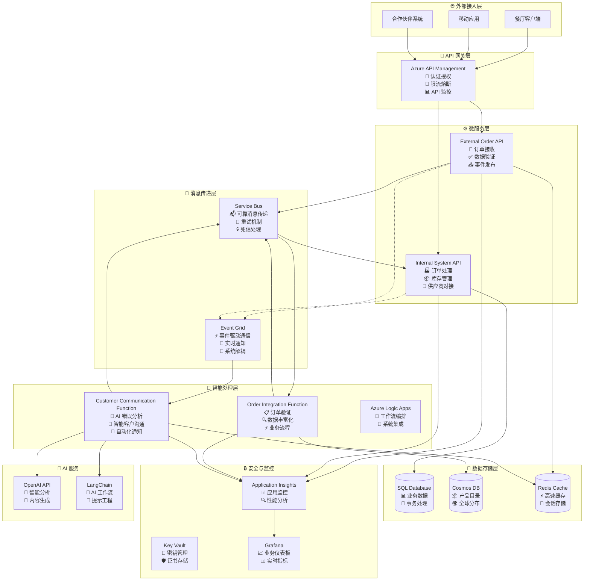
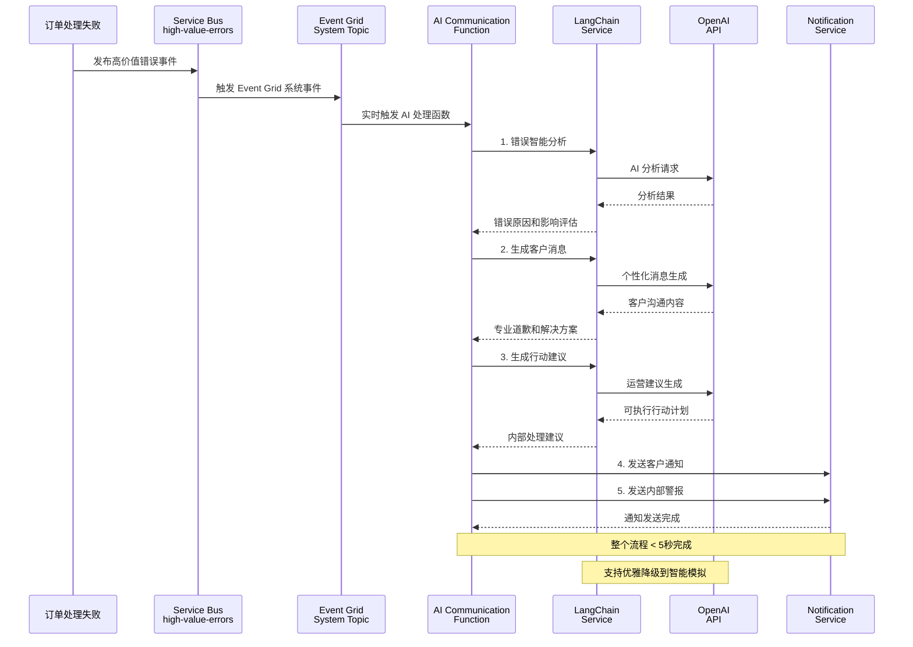
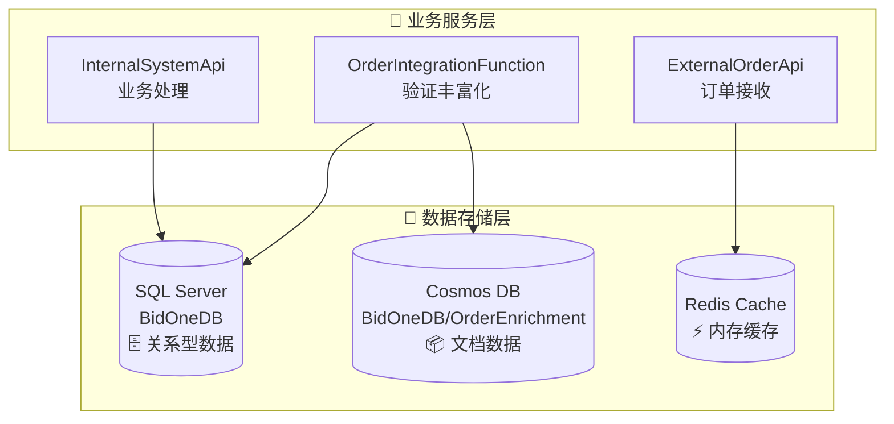
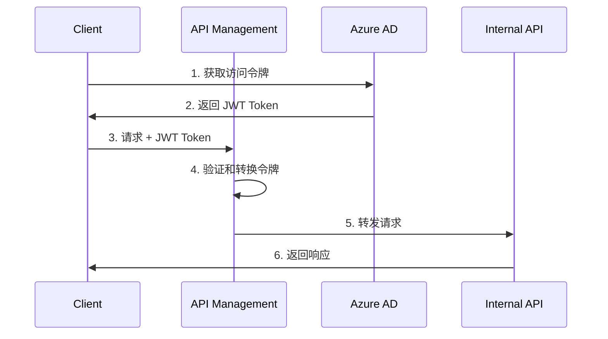

# BidOne Integration Platform - 系统架构文档

## 🎯 架构概述

BidOne Integration Platform 是一个展示**现代云原生架构与 AI 智能集成**的企业级订单处理系统，核心理念是 **"Never Lose an Order"** + **"AI-Powered Customer Experience"**。

### 🔄 双处理架构设计说明

**重要说明**: 本项目包含两条并行的订单处理路径，这是为了技术能力演示而设计的架构：

#### 处理路径 1: Azure Functions 链式处理 (推荐开发模式)
```
订单接收 → [order-received 队列] → OrderValidationFunction → [order-validated 队列] → OrderEnrichmentFunction → [order-processing 队列] → InternalSystemApi
```

#### 处理路径 2: Azure Logic Apps 工作流编排 (可选生产模式)  
```
订单接收 → [order-received 队列] → Logic App 工作流 → HTTP 调用 Functions → InternalSystemApi → [order-confirmed 队列]
```

**设计意图**:
- **技术展示**: 演示 Azure 生态中不同的集成模式和最佳实践
- **灵活选择**: 开发团队可根据具体需求选择合适的处理模式
- **学习目的**: 对比无服务器函数 vs 可视化工作流的优劣势

**使用建议**:
- **本地开发**: 优先使用 Functions 路径 (调试简单，启动快速)
- **生产环境**: 可根据团队技术栈和企业需求选择 Logic Apps 路径
- **监控支持**: 两条路径都有完整的监控和追踪能力

## 🏛️ 设计原则

### 核心原则
1. **🛡️ 可靠性优先**: 确保订单处理的高可用性和数据一致性
2. **🔄 事件驱动**: 异步消息传递和松耦合设计
3. **🤖 AI 增强**: 智能错误处理和客户沟通自动化
4. **📊 可观察性**: 全面的监控、日志和业务洞察
5. **🔒 安全第一**: 端到端的安全防护和密钥管理
6. **⚡ 高性能**: 支持水平扩展和高并发处理

### 架构模式
- **🔗 事件驱动架构**: Service Bus + Event Grid 异步通信
- **🏗️ 微服务架构**: 服务解耦和独立部署  
- **🧠 AI 集成模式**: LangChain + OpenAI 智能处理
- **📦 容器化部署**: Docker + Azure Container Apps
- **🎯 领域驱动设计 (DDD)**: 富领域模型 + 聚合根 + 值对象
- **📋 领域事件**: 业务事件驱动的松耦合通信
- **🔄 CQRS + 事件溯源**: 命令查询分离和事件存储

## 🏗️ 系统架构图

### 整体架构


### AI 智能沟通架构详图


## 核心组件详细设计

### 1. External Order API

**职责**: 接收外部订单请求，进行基础验证和格式化

**技术栈**:
- ASP.NET Core 8.0
- Entity Framework Core
- FluentValidation
- Serilog

**核心功能**:
```csharp
// 订单接收端点
[HttpPost("orders")]
public async Task<IActionResult> CreateOrder([FromBody] CreateOrderRequest request)
{
    // 1. 请求验证
    var validationResult = await _validator.ValidateAsync(request);
    if (!validationResult.IsValid)
        return BadRequest(validationResult.Errors);
    
    // 2. 使用领域模型工厂方法创建订单
    var order = Order.Create(CustomerId.Create(request.CustomerId));
    
    // 3. 使用领域方法添加订单项
    foreach (var item in request.Items)
    {
        var productInfo = ProductInfo.Create(item.ProductId, item.ProductId);
        var quantity = Quantity.Create(item.Quantity);
        var unitPrice = Money.Create(item.UnitPrice);
        
        order.AddItem(productInfo, quantity, unitPrice);
    }
    
    // 4. 设置配送信息
    order.UpdateDeliveryInfo(request.DeliveryDate, null);
    order.SetNotes(request.Notes);
    
    // 5. 发送到消息队列 (领域事件会自动生成)
    await _serviceBusPublisher.PublishAsync(order);
    
    // 6. 返回确认
    return Accepted(new { OrderId = order.Id.Value, Status = order.Status });
}
```

**关键设计决策**:
- **快速响应**: 立即返回确认，异步处理降低响应时间
- **领域驱动**: 使用富领域模型封装业务逻辑和规则
- **类型安全**: 强类型值对象防止原始类型混淆
- **事件驱动**: 领域事件自动记录业务活动
- **幂等性**: 支持重复提交检测
- **限流保护**: 集成 API Management 限流策略

### 2. Azure Logic Apps 工作流

**职责**: 业务流程编排和路由决策

**工作流设计**:
```json
{
    "definition": {
        "triggers": {
            "when_message_received": {
                "type": "ServiceBus",
                "inputs": {
                    "queueName": "order-received",
                    "subscriptionName": "order-processor"
                }
            }
        },
        "actions": {
            "validate_order": {
                "type": "Function",
                "inputs": {
                    "functionName": "ValidateOrder"
                }
            },
            "enrich_order_data": {
                "type": "Function",
                "inputs": {
                    "functionName": "EnrichOrderData"
                }
            },
            "route_to_internal_system": {
                "type": "Http",
                "inputs": {
                    "method": "POST",
                    "uri": "@{parameters('internalApiEndpoint')}/orders"
                }
            }
        }
    }
}
```

### 3. Azure Functions

**职责**: 复杂业务逻辑处理和数据转换

**关键函数**:

#### OrderValidationFunction
```csharp
[FunctionName("ValidateOrder")]
public async Task<IActionResult> ValidateOrder(
    [HttpTrigger(AuthorizationLevel.Function, "post")] HttpRequest req,
    [ServiceBus("validation-results", Connection = "ServiceBusConnection")] IAsyncCollector<ValidationResult> outputQueue)
{
    // 业务规则验证
    // 库存检查
    // 供应商能力验证
}
```

#### OrderEnrichmentFunction
```csharp
[FunctionName("EnrichOrderData")]
public async Task<IActionResult> EnrichOrderData(
    [ServiceBusTrigger("enrichment-queue")] Order order,
    [CosmosDB("BidOneDB", "Products", Connection = "CosmosDBConnection")] IDocumentClient documentClient)
{
    // 商品信息补全
    // 价格计算
    // 配送信息enrichment
}
```

### 4. OrderIntegrationFunction - 订单处理中间件

**职责**: 订单验证、数据丰富化和业务流程编排

**技术栈**:
- Azure Functions v4 (.NET 8.0)
- Service Bus Triggers
- Event Grid Triggers
- Entity Framework Core (验证数据库)
- Cosmos DB (产品目录)

**核心组件**:

#### OrderValidationFunction
```csharp
[Function("ValidateOrderFromServiceBus")]
[ServiceBusOutput("order-validated", Connection = "ServiceBusConnection")]
public async Task<string> ValidateOrderFromServiceBus(
    [ServiceBusTrigger("order-received", Connection = "ServiceBusConnection")] string orderMessage)
{
    // 1. 基础数据验证
    var validationResult = await _validationService.ValidateOrderAsync(order);
    
    // 2. 高价值错误检测
    if (!validationResult.IsValid && IsHighValueError(order, validationResult))
    {
        await PublishHighValueErrorEvent(order, validationResult);
    }
    
    // 3. 发送到下一阶段
    return JsonSerializer.Serialize(response);
}
```

#### OrderEnrichmentFunction
```csharp
[Function("EnrichOrderData")]
[ServiceBusOutput("order-processing", Connection = "ServiceBusConnection")]
public async Task<string> EnrichOrderData(
    [ServiceBusTrigger("order-validated", Connection = "ServiceBusConnection")] string orderMessage)
{
    // 1. 产品信息丰富化
    await _enrichmentService.EnrichProductInformation(order);
    
    // 2. 价格计算和折扣应用
    await _enrichmentService.CalculatePricing(order);
    
    // 3. 供应商分配
    await _enrichmentService.AssignSupplier(order);
    
    return JsonSerializer.Serialize(enrichedOrder);
}
```

#### DashboardMetricsProcessor
```csharp
[Function("DashboardMetricsProcessor")]
public async Task ProcessDashboardEvents(
    [EventGridTrigger] EventGridEvent eventGridEvent)
{
    // 实时业务指标更新
    await UpdateDashboardMetrics(eventGridEvent);
}
```

**关键设计决策**:
- **异步处理**: 提高系统吞吐量和响应速度
- **职责分离**: 验证、丰富化、指标处理各自独立
- **错误隔离**: 每个 Function 独立扩缩容和故障恢复
- **智能检测**: 自动识别高价值订单错误并触发 AI 沟通
- **实时监控**: 通过 Event Grid 实现实时业务指标更新

### 5. BidOne.Shared - 共享基础设施

**职责**: 为整个平台提供统一的领域模型、DDD 基础设施和跨领域关注点

**技术栈**:
- .NET 8.0 Class Library
- FluentValidation (数据验证)
- Prometheus.NET (指标收集)
- Azure.Messaging.EventGrid (事件发布)
- System.Text.Json (序列化)

**核心架构**:

#### 领域驱动设计 (DDD) 基础设施

**AggregateRoot - 聚合根基类**
```csharp
public abstract class AggregateRoot : Entity
{
    private readonly List<IDomainEvent> _domainEvents = new();
    
    [NotMapped]
    public IReadOnlyCollection<IDomainEvent> DomainEvents => _domainEvents.AsReadOnly();
    
    protected void AddDomainEvent(IDomainEvent domainEvent)
    {
        _domainEvents.Add(domainEvent);
    }
    
    public void MarkEventsAsCommitted()
    {
        _domainEvents.Clear();
    }
}
```

**ValueObject - 值对象基类**
```csharp
// 强类型订单标识符
public sealed class OrderId : ValueObject
{
    public string Value { get; }
    
    public static OrderId CreateNew() => 
        new($"ORD-{DateTime.UtcNow:yyyyMMdd}-{Guid.NewGuid().ToString("N")[..8].ToUpper()}");
    
    public static implicit operator string(OrderId orderId) => orderId.Value;
    public static implicit operator OrderId(string value) => Create(value);
}

// 金额值对象，支持币种和运算
public sealed class Money : ValueObject
{
    public decimal Amount { get; }
    public string Currency { get; }
    
    public Money Add(Money other) => new(Amount + other.Amount, Currency);
    public Money Multiply(decimal multiplier) => new(Amount * multiplier, Currency);
    public bool IsGreaterThan(Money other) => Amount > other.Amount;
}
```

#### 订单聚合根设计

**完整的业务逻辑封装**
```csharp
public class Order : AggregateRoot
{
    public OrderId Id { get; set; }
    public CustomerId CustomerId { get; set; }
    public List<OrderItem> Items { get; set; } = new();
    public OrderStatus Status { get; set; }
    public Money TotalAmount { get; private set; } = Money.Zero();
    public Dictionary<string, object> Metadata { get; private set; } = new();
    
    // 工厂方法
    public static Order Create(CustomerId customerId)
    {
        var order = new Order(OrderId.CreateNew(), customerId);
        order.AddDomainEvent(new OrderCreatedEvent(order.Id, customerId));
        return order;
    }
    
    // 业务方法 - 添加订单项
    public void AddItem(ProductInfo productInfo, Quantity quantity, Money unitPrice)
    {
        if (Status != OrderStatus.Received)
            throw new InvalidOperationException($"Cannot add items to order in status {Status}");
        
        var orderItem = OrderItem.Create(productInfo, quantity, unitPrice);
        Items.Add(orderItem);
        RecalculateTotalAmount();
        UpdateTimestamp();
    }
    
    // 业务方法 - 订单验证
    public void Validate()
    {
        if (Status != OrderStatus.Received)
            throw new InvalidOperationException($"Cannot validate order in status {Status}");
        
        if (!Items.Any())
            throw new InvalidOperationException("Cannot validate order without items");
        
        Status = OrderStatus.Validating;
        UpdateTimestamp();
        AddDomainEvent(new OrderValidationStartedEvent(Id));
    }
    
    // 业务方法 - 订单确认
    public void Confirm(string supplierId)
    {
        if (Status != OrderStatus.Processing)
            throw new InvalidOperationException($"Cannot confirm order from status {Status}");
        
        SupplierId = supplierId;
        Status = OrderStatus.Confirmed;
        ConfirmedAt = DateTime.UtcNow;
        UpdateTimestamp();
        AddDomainEvent(new OrderConfirmedEvent(Id, SupplierId, TotalAmount));
    }
    
    // 业务规则查询
    public bool CanBeCancelled()
    {
        return Status is OrderStatus.Received or OrderStatus.Validating or OrderStatus.Validated;
    }
    
    public bool IsHighValue(decimal threshold = 1000m)
    {
        return TotalAmount.Amount > threshold;
    }
    
    private void RecalculateTotalAmount()
    {
        TotalAmount = Items.Aggregate(Money.Zero(), (total, item) => total.Add(item.GetTotalPrice()));
    }
}
```

#### 事件驱动架构支持

**集成事件基类**
```csharp
public abstract class IntegrationEvent
{
    public string Id { get; } = Guid.NewGuid().ToString();
    public DateTime CreatedAt { get; } = DateTime.UtcNow;
    public string EventType { get; protected set; } = string.Empty;
    public string Source { get; set; } = string.Empty;
    public string CorrelationId { get; set; } = string.Empty;
    public Dictionary<string, object> Metadata { get; set; } = new();
}
```

**具体业务事件**
```csharp
// 订单接收事件
public class OrderReceivedEvent : IntegrationEvent
{
    public string OrderId { get; set; } = string.Empty;
    public string CustomerId { get; set; } = string.Empty;
    public DateTime ReceivedAt { get; set; }
    public string SourceSystem { get; set; } = string.Empty;
}

// 高价值错误事件 (触发 AI 智能沟通)
public class HighValueErrorEvent : IntegrationEvent
{
    public string OrderId { get; set; } = string.Empty;
    public string CustomerId { get; set; } = string.Empty;
    public string ErrorCategory { get; set; } = string.Empty;
    public string ErrorMessage { get; set; } = string.Empty;
    public decimal OrderValue { get; set; }
    public string CustomerTier { get; set; } = string.Empty;
    public DateTime ErrorOccurredAt { get; set; }
    public Dictionary<string, object> ContextData { get; set; } = new();
}
```

#### 监控指标系统

**Prometheus 业务指标**
```csharp
public static class BusinessMetrics
{
    // 订单处理总数计数器
    public static readonly Counter OrdersProcessed = Prometheus.Metrics
        .CreateCounter("bidone_orders_processed_total", "订单处理总数",
            new[] { "status", "service" });
    
    // 订单处理时间直方图
    public static readonly Histogram OrderProcessingTime = Prometheus.Metrics
        .CreateHistogram("bidone_order_processing_seconds", "订单处理时间(秒)",
            new HistogramConfiguration
            {
                Buckets = Histogram.LinearBuckets(0.01, 0.05, 20),
                LabelNames = new[] { "service", "operation" }
            });
    
    // 当前待处理订单数量计量器
    public static readonly Gauge PendingOrders = Prometheus.Metrics
        .CreateGauge("bidone_pending_orders_count", "当前待处理订单数量",
            new[] { "service" });
    
    // API 请求响应时间直方图
    public static readonly Histogram ApiRequestDuration = Prometheus.Metrics
        .CreateHistogram("bidone_api_request_duration_seconds", "API请求响应时间(秒)",
            new HistogramConfiguration
            {
                Buckets = Histogram.ExponentialBuckets(0.001, 2, 15),
                LabelNames = new[] { "method", "endpoint", "status" }
            });
}
```

#### 服务抽象接口

**消息发布接口**
```csharp
public interface IMessagePublisher
{
    // 发布消息到指定队列
    Task PublishAsync<T>(T message, string queueName, CancellationToken cancellationToken = default) 
        where T : class;
    
    // 发布集成事件
    Task PublishEventAsync<T>(T integrationEvent, CancellationToken cancellationToken = default) 
        where T : IntegrationEvent;
    
    // 批量消息发布
    Task PublishBatchAsync<T>(IEnumerable<T> messages, string queueName, CancellationToken cancellationToken = default) 
        where T : class;
}

// 事件处理接口
public interface IEventHandler<in T> where T : IntegrationEvent
{
    Task HandleAsync(T integrationEvent, CancellationToken cancellationToken = default);
}
```

**关键设计决策**:
- **统一业务模型**: 所有服务使用相同的 Order 聚合根，确保业务逻辑一致性
- **强类型安全**: 值对象防止原始类型混淆，编译时捕获错误
- **事件驱动解耦**: 通过集成事件实现服务间松耦合通信
- **业务规则封装**: 领域方法封装复杂业务逻辑，避免贫血模型
- **可观测性内置**: 监控指标嵌入到共享基础设施中
- **向后兼容**: 保留原有属性访问器，支持渐进式重构

### 6. Internal System API

**职责**: 内部系统集成和订单状态管理

**核心实现**:
```csharp
[HttpPost("orders")]
[Authorize]
public async Task<IActionResult> ProcessOrder([FromBody] ProcessOrderRequest request)
{
    using var transaction = await _dbContext.Database.BeginTransactionAsync();
    try
    {
        // 1. 保存订单到数据库
        var order = await _orderService.CreateOrderAsync(request);
        
        // 2. 更新库存
        await _inventoryService.ReserveItemsAsync(order.Items);
        
        // 3. 发送确认事件
        await _eventPublisher.PublishOrderConfirmedAsync(order);
        
        await transaction.CommitAsync();
        return Ok(new { OrderId = order.Id, Status = "Confirmed" });
    }
    catch (Exception ex)
    {
        await transaction.RollbackAsync();
        throw;
    }
}
```

## 数据架构设计

### 数据模型

#### 订单聚合根 (Order Aggregate)
```csharp
public class Order : AggregateRoot
{
    public OrderId Id { get; set; }
    public CustomerId CustomerId { get; set; }
    public string CustomerEmail { get; set; }
    public string CustomerPhone { get; set; }
    public string SupplierId { get; private set; }
    public List<OrderItem> Items { get; set; }
    public OrderStatus Status { get; set; }
    public DateTime? ConfirmedAt { get; set; }
    public DateTime? DeliveryDate { get; set; }
    public string? DeliveryAddress { get; set; }
    public string? SpecialInstructions { get; set; }
    public Money TotalAmount { get; private set; }
    public string? Notes { get; private set; }
    public Dictionary<string, object> Metadata { get; private set; }

    // 工厂方法
    public static Order Create(OrderId id, CustomerId customerId) { /* ... */ }
    public static Order Create(CustomerId customerId) { /* ... */ }
    
    // 业务方法
    public void AddItem(ProductInfo productInfo, Quantity quantity, Money unitPrice) { /* ... */ }
    public void RemoveItem(string productId) { /* ... */ }
    public void UpdateDeliveryInfo(DateTime? deliveryDate, string? deliveryAddress) { /* ... */ }
    public void SetSpecialInstructions(string? instructions) { /* ... */ }
    public void Validate() { /* ... */ }
    public void MarkAsValidated() { /* ... */ }
    public void StartEnrichment() { /* ... */ }
    public void CompleteEnrichment(Dictionary<string, object> enrichmentData) { /* ... */ }
    public void StartProcessing() { /* ... */ }
    public void Confirm(string supplierId) { /* ... */ }
    public void Cancel(string reason) { /* ... */ }
    public void MarkAsFailed(string reason) { /* ... */ }
    public void MarkAsDelivered() { /* ... */ }
    
    // 业务规则查询
    public bool CanBeCancelled() { /* ... */ }
    public bool IsHighValue(decimal threshold = 1000m) { /* ... */ }
}

public class OrderItem : Entity
{
    public ProductInfo ProductInfo { get; set; }
    public Quantity Quantity { get; set; }
    public Money UnitPrice { get; set; }
    public Dictionary<string, object> Properties { get; private set; }

    // 工厂方法
    public static OrderItem Create(ProductInfo productInfo, Quantity quantity, Money unitPrice) { /* ... */ }
    
    // 业务方法
    public Money GetTotalPrice() { /* ... */ }
    public void UpdateQuantity(Quantity newQuantity) { /* ... */ }
    public void UpdateUnitPrice(Money newUnitPrice) { /* ... */ }
    
    // 向后兼容属性
    public string ProductId { get; set; }
    public string ProductName { get; set; }
    public string? Category { get; set; }
    public decimal TotalPrice => GetTotalPrice().Amount;
}
```

### DDD 实现架构

#### 领域基础设施

**AggregateRoot (聚合根)**
```csharp
public abstract class AggregateRoot : Entity
{
    private readonly List<IDomainEvent> _domainEvents = new();
    public IReadOnlyCollection<IDomainEvent> DomainEvents => _domainEvents.AsReadOnly();
    
    protected void AddDomainEvent(IDomainEvent domainEvent) { /* ... */ }
    public void MarkEventsAsCommitted() { /* ... */ }
    public void ClearDomainEvents() { /* ... */ }
}
```

**Entity (实体基类)**
```csharp
public abstract class Entity
{
    public DateTime CreatedAt { get; set; }
    public DateTime UpdatedAt { get; set; }
    public string CreatedBy { get; set; }
    public string UpdatedBy { get; set; }
    
    protected void UpdateTimestamp(string updatedBy = "System") { /* ... */ }
    // 相等性比较实现...
}
```

#### 值对象 (Value Objects)

**OrderId** - 强类型订单标识符
```csharp
public sealed class OrderId : ValueObject
{
    public string Value { get; }
    public static OrderId CreateNew() => new($"ORD-{DateTime.UtcNow:yyyyMMdd}-{Guid.NewGuid().ToString("N")[..8].ToUpper()}");
    public static implicit operator string(OrderId orderId) => orderId.Value;
}
```

**Money** - 金额值对象，支持币种和运算
```csharp
public sealed class Money : ValueObject
{
    public decimal Amount { get; }
    public string Currency { get; }
    
    public Money Add(Money other) { /* 币种一致性检查 */ }
    public Money Multiply(decimal multiplier) { /* ... */ }
    public bool IsGreaterThan(Money other) { /* ... */ }
}
```

**ProductInfo** - 产品信息封装
```csharp
public sealed class ProductInfo : ValueObject
{
    public string ProductId { get; }
    public string ProductName { get; }
    public string? Category { get; }
    
    public static ProductInfo Create(string productId, string productName, string? category = null) { /* ... */ }
}
```

**Quantity** - 数量值对象，确保正数约束
```csharp
public sealed class Quantity : ValueObject
{
    public int Value { get; }
    
    private Quantity(int value)
    {
        if (value <= 0) throw new ArgumentException("Quantity must be greater than zero");
        Value = value;
    }
}
```

#### 领域事件 (Domain Events)

```csharp
// 订单生命周期事件
public class OrderCreatedEvent : DomainEvent
{
    public OrderId OrderId { get; }
    public CustomerId CustomerId { get; }
}

public class OrderConfirmedEvent : DomainEvent
{
    public OrderId OrderId { get; }
    public string SupplierId { get; }
    public Money TotalAmount { get; }
}

public class OrderCancelledEvent : DomainEvent
{
    public OrderId OrderId { get; }
    public string Reason { get; }
}

// 更多事件: OrderValidatedEvent, OrderFailedEvent, OrderDeliveredEvent...
```

#### 业务规则实现

**订单状态转换规则**
```csharp
public void Validate()
{
    if (Status != OrderStatus.Received)
        throw new InvalidOperationException($"Cannot validate order in status {Status}");
    
    if (!Items.Any())
        throw new InvalidOperationException("Cannot validate order without items");
        
    Status = OrderStatus.Validating;
    AddDomainEvent(new OrderValidationStartedEvent(Id));
}

public void Confirm(string supplierId)
{
    if (Status != OrderStatus.Processing)
        throw new InvalidOperationException($"Cannot confirm order from status {Status}");
        
    SupplierId = supplierId;
    Status = OrderStatus.Confirmed;
    ConfirmedAt = DateTime.UtcNow;
    AddDomainEvent(new OrderConfirmedEvent(Id, SupplierId, TotalAmount));
}

public bool CanBeCancelled()
{
    return Status is OrderStatus.Received or OrderStatus.Validating or OrderStatus.Validated;
}
```

**金额计算规则**
```csharp
private void RecalculateTotalAmount()
{
    TotalAmount = Items.Aggregate(Money.Zero(), (total, item) => total.Add(item.GetTotalPrice()));
}

public bool IsHighValue(decimal threshold = 1000m)
{
    return TotalAmount.Amount > threshold;
}
```

#### 向后兼容性设计

为了保持与现有代码的兼容性，我们实现了以下策略：

1. **公共构造函数**: 保留无参构造函数用于序列化和现有代码
2. **属性访问器**: 提供向后兼容的属性 getter/setter
3. **隐式转换**: 值对象支持与原始类型的隐式转换
4. **适配器属性**: OrderItem 提供 ProductId, ProductName 等便捷访问

```csharp
// OrderItem 向后兼容属性
public string ProductId 
{ 
    get => ProductInfo.ProductId;
    set => ProductInfo = ProductInfo.Create(value, ProductInfo.ProductName, ProductInfo.Category);
}
public decimal TotalPrice => GetTotalPrice().Amount;
```

## 💾 数据架构设计

### 多数据库架构概览

本项目采用**多数据库架构**，针对不同数据特性和访问模式进行优化：

#### 数据库系统分布



#### 数据库使用映射

| 服务 | 数据库 | DbContext | 连接字符串 | 主要用途 |
|------|--------|-----------|------------|----------|
| **InternalSystemApi** | SQL Server | BidOneDbContext | DefaultConnection | 主业务数据、事务处理 |
| **OrderIntegrationFunction** | SQL Server | OrderValidationDbContext | SqlConnectionString | 客户产品验证 |
| **OrderIntegrationFunction** | Cosmos DB | ProductEnrichmentDbContext | CosmosDbConnectionString | 产品丰富化数据 |
| **ExternalOrderApi** | Redis | - | Redis | 订单缓存、指标缓存 |

### SQL Server (BidOneDB) - 主数据库

#### InternalSystemApi 业务数据模型

**主要实体**:
```csharp
// 核心业务实体
public DbSet<OrderEntity> Orders { get; set; }           // 订单主表
public DbSet<OrderItemEntity> OrderItems { get; set; }   // 订单项
public DbSet<CustomerEntity> Customers { get; set; }     // 客户信息
public DbSet<SupplierEntity> Suppliers { get; set; }     // 供应商
public DbSet<ProductEntity> Products { get; set; }       // 产品主数据
public DbSet<InventoryEntity> Inventory { get; set; }    // 库存管理

// 系统实体
public DbSet<OrderEventEntity> OrderEvents { get; set; } // 订单事件
public DbSet<AuditLogEntity> AuditLogs { get; set; }     // 审计日志
```

**关键特性**:
- **ACID 事务**: 确保数据一致性
- **复杂关系**: 外键约束和级联操作
- **JSON 支持**: Metadata 和 Properties 列
- **自动审计**: 所有变更自动记录
- **索引优化**: 多维度查询优化

#### OrderIntegrationFunction 验证数据模型

**轻量级实体**:
```csharp
public DbSet<Customer> Customers { get; set; }  // 验证用客户信息
public DbSet<Product> Products { get; set; }    // 验证用产品信息
```

**设计目的**:
- **快速验证**: 简化模型提升查询性能
- **逻辑分离**: 验证逻辑与业务逻辑解耦
- **独立扩展**: 可后续迁移到独立数据库

### Azure Cosmos DB - 产品目录数据库

#### 数据模型设计

**容器**: OrderEnrichment

**集合结构**:
```csharp
// 产品丰富化数据 (按 ProductId 分区)
public class ProductEnrichmentData
{
    public string ProductId { get; set; }           // 分区键
    public string Name { get; set; }
    public string Category { get; set; }
    public decimal Weight { get; set; }
    public List<string> Allergens { get; set; }     // 过敏原信息
    public NutritionalInfo NutritionalInfo { get; set; } // 营养信息
}

// 客户丰富化数据 (按 CustomerId 分区)
public class CustomerEnrichmentData  
{
    public string CustomerId { get; set; }          // 分区键
    public string CustomerTier { get; set; }        // 客户等级
    public decimal CreditLimit { get; set; }        // 信用额度
    public List<string> PreferredProducts { get; set; } // 偏好产品
}

// 供应商数据 (按 Name 分区)
public class SupplierData
{
    public string Name { get; set; }                // 分区键
    public List<string> Products { get; set; }      // 供应产品列表
    public bool IsActive { get; set; }
}
```

**分区策略**:
- **ProductEnrichmentData**: 按 `ProductId` 分区，支持产品维度查询
- **CustomerEnrichmentData**: 按 `CustomerId` 分区，支持客户维度查询  
- **SupplierData**: 按 `Name` 分区，支持供应商管理

**优势特性**:
- **全球分布**: 多地域部署，就近访问
- **弹性扩展**: 自动分区和吞吐量调整
- **灵活模式**: NoSQL 文档结构，易于扩展
- **最终一致性**: 适合读多写少的场景

### Redis Cache - 高速缓存

#### 缓存数据类型

**订单状态缓存**:
```csharp
// 缓存键格式
private static string GetOrderCacheKey(string orderId) => $"order:{orderId}";

// 缓存策略
var cacheOptions = new DistributedCacheEntryOptions
{
    SlidingExpiration = TimeSpan.FromHours(24),      // 24小时滑动过期
    AbsoluteExpirationRelativeToNow = TimeSpan.FromDays(7) // 7天绝对过期
};
```

**业务指标缓存**:
```csharp
// 实时指标缓存
- "dashboard:orders:today:{yyyy-MM-dd}"     // 今日订单数
- "dashboard:orders:total"                  // 总订单数  
- "dashboard:orders:pending"                // 待处理订单数
```

**会话数据缓存**:
- 用户会话状态
- API 访问令牌
- 临时计算结果

**性能特性**:
- **亚毫秒响应**: 内存存储，极速访问
- **自动过期**: 基于时间的数据清理
- **高并发**: 支持大量并发读写
- **数据类型丰富**: String、Hash、List、Set 等

### 数据存储策略对比

| 数据类型 | 存储方案 | 访问模式 | 一致性要求 | 扩展性 |
|----------|----------|----------|------------|--------|
| **订单事务数据** | SQL Server | 读写均衡 | 强一致性 | 垂直扩展 |
| **验证数据** | SQL Server | 读多写少 | 强一致性 | 读副本扩展 |
| **产品目录** | Cosmos DB | 读多写少 | 最终一致性 | 水平扩展 |
| **缓存数据** | Redis | 读写频繁 | 无一致性要求 | 集群扩展 |

### 数据一致性策略

#### 跨数据库一致性

**1. 最终一致性模式**
```
SQL Server (主数据) → 异步同步 → Cosmos DB (副本数据)
```

**2. 缓存一致性模式**  
```
业务操作 → 更新 SQL → 失效 Redis → 懒加载重建
```

**3. 双写模式**
```
关键数据 → 同时写入 SQL + Cosmos → 异步校验一致性
```

#### 数据同步机制

**事件驱动同步**:
- Service Bus 事件触发数据同步
- 失败重试和补偿机制
- 数据变更审计和追踪

**定时同步任务**:
- 增量数据同步
- 数据一致性校验
- 孤立数据清理

## 消息架构设计

### 消息流设计

```
OrderReceived -> OrderValidation -> OrderEnrichment -> OrderConfirmation
     ↓               ↓                  ↓                ↓
  [Service Bus]  [Service Bus]    [Service Bus]    [Event Grid]
```

### 消息类型定义

#### OrderReceivedEvent
```csharp
public record OrderReceivedEvent(
    string OrderId,
    string CustomerId,
    List<OrderItem> Items,
    DateTime ReceivedAt
) : IIntegrationEvent;
```

#### OrderConfirmedEvent
```csharp
public record OrderConfirmedEvent(
    string OrderId,
    string ConfirmationId,
    DateTime ConfirmedAt,
    decimal TotalAmount
) : IIntegrationEvent;
```

## 安全架构

### 认证授权流程



### 安全策略

1. **API级安全**:
   - OAuth 2.0 / OpenID Connect
   - JWT Token 验证
   - API Key 管理
   - 请求签名验证

2. **网络安全**:
   - VNet 网络隔离
   - NSG 网络安全组
   - WAF Web应用防火墙
   - DDoS 保护

3. **数据安全**:
   - TDE 透明数据加密
   - Column级加密
   - Azure Key Vault 密钥管理
   - RBAC 访问控制

## 可观测性架构

### 监控策略

#### 三大支柱

1. **Metrics (指标)**:
   ```csharp
   // 自定义指标示例
   _telemetryClient.TrackMetric("OrderProcessingTime", processingTime);
   _telemetryClient.TrackMetric("OrdersPerMinute", ordersPerMinute);
   ```

2. **Logs (日志)**:
   ```csharp
   // 结构化日志
   _logger.LogInformation("Order {OrderId} processed successfully for customer {CustomerId}", 
       order.Id, order.CustomerId);
   ```

3. **Traces (链路追踪)**:
   ```csharp
   // 分布式追踪
   using var activity = _activitySource.StartActivity("ProcessOrder");
   activity?.SetTag("order.id", orderId);
   activity?.SetTag("customer.id", customerId);
   ```

### 关键性能指标 (KPIs)

| 指标 | 目标值 | 告警阈值 |
|------|--------|----------|
| 订单处理成功率 | >99.9% | <99.5% |
| 端到端延迟 | <2s | >5s |
| API可用性 | >99.95% | <99.9% |
| 消息处理延迟 | <1s | >3s |

## 容灾和高可用

### 高可用设计

1. **多区域部署**: 
   - 主区域: East US
   - 灾备区域: West US 2

2. **数据复制策略**:
   - SQL Database: 地理复制
   - Cosmos DB: 多区域写入
   - Storage: GRS 地理冗余

3. **故障切换**:
   - 自动故障检测
   - DNS流量管理器
   - 应用层重试机制

### 灾难恢复

- **RTO (Recovery Time Objective)**: 15分钟
- **RPO (Recovery Point Objective)**: 1分钟
- **备份策略**: 
  - 数据库每小时增量备份
  - 每日完整备份
  - 跨区域备份复制

## 性能优化策略

### 缓存策略

1. **L1缓存**: 应用内存缓存
2. **L2缓存**: Redis分布式缓存  
3. **CDN**: 静态资源缓存

### 数据库优化

1. **读写分离**: 读副本分流查询
2. **分区策略**: 按时间和地理位置分区
3. **索引优化**: 覆盖索引和复合索引

### API优化

1. **分页**: 大数据集分页返回
2. **压缩**: Gzip响应压缩
3. **并发控制**: 合理的连接池配置

## 部署架构

### 环境策略

| 环境 | 用途 | 配置 |
|------|------|------|
| Development | 开发测试 | 单实例，共享资源 |
| Staging | 预生产验证 | 生产级配置 |
| Production | 生产环境 | 高可用，多实例 |

### CI/CD 流水线

```yaml
# 简化的流水线配置
stages:
  - build
  - test
  - security-scan
  - deploy-staging
  - integration-test
  - deploy-production
```

## 成本优化

### 资源优化策略

1. **自动扩缩容**: 根据负载自动调整实例数
2. **预留实例**: 生产环境使用预留实例
3. **存储分层**: 冷数据迁移到低成本存储
4. **监控告警**: 成本异常告警

### 成本预估

| 组件 | 月成本(USD) | 说明 |
|------|-------------|------|
| Container Apps | $200 | 3实例标准配置 |
| Azure SQL Database | $300 | S2标准层 |
| Service Bus | $50 | 标准层 |
| Application Insights | $100 | 基础监控 |
| **总计** | **$650** | 预估月成本 |

## 📝 更新历史

### 2025-01-18 - DDD 重构完成
- ✅ **完成领域驱动设计 (DDD) 重构**
  - 实现 AggregateRoot, Entity, ValueObject 基础设施
  - 创建强类型值对象: OrderId, CustomerId, Money, ProductInfo, Quantity
  - Order 聚合根实现丰富的业务方法和规则
  - OrderItem 实体化，支持业务操作
  - 领域事件支持业务活动追踪

- ✅ **向后兼容性保障**
  - 保留现有 API 接口不变
  - 提供属性访问器兼容现有代码
  - 隐式转换支持与原始类型的无缝集成

- ✅ **架构收益实现**
  - 业务逻辑集中到领域层
  - 强类型安全防止常见错误
  - 领域事件支持事件驱动架构
  - 丰富的业务方法便于单元测试
  - 清晰的领域模型提升可维护性

### 2025-01-17 - 微服务容器化
- ✅ **Azure Functions 容器化**: 实现 Order Integration Function 和 Customer Communication Function 的 Docker 支持
- ✅ **一键启动优化**: 更新 docker-dev.sh 支持所有 4 个微服务的统一管理
- ✅ **Service Bus 配置修复**: 解决预创建队列配置问题，确保消息传递稳定性

---

本架构文档将随着项目发展持续更新和完善。