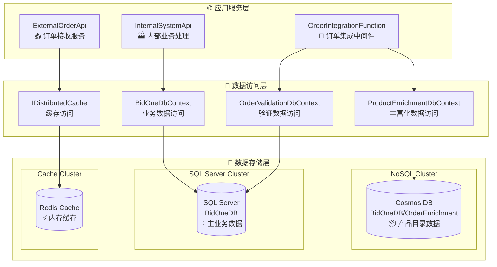

# BidOne Integration Platform - 数据库架构详细文档

## 🎯 概述

BidOne Integration Platform 采用**多数据库架构**，通过选择合适的数据库技术来优化不同类型数据的存储和访问性能。本文档详细说明了各数据库系统的设计、使用场景和最佳实践。

## 🏗️ 架构概览

### 数据库技术栈

| 数据库系统 | 技术类型 | 主要用途 | 使用服务 |
|------------|----------|----------|----------|
| **SQL Server** | 关系型数据库 | 事务数据 + 验证数据 | InternalSystemApi + OrderIntegrationFunction |
| **Azure Cosmos DB** | NoSQL 文档数据库 | 产品目录 + 丰富化数据 | OrderIntegrationFunction |
| **Redis Cache** | 内存数据库 | 高速缓存 + 会话存储 | ExternalOrderApi |

### 整体架构图



## 📊 SQL Server (BidOneDB) - 核心业务数据库

### 数据库连接配置

```json
// InternalSystemApi 连接配置
{
  "ConnectionStrings": {
    "DefaultConnection": "Server=sqlserver,1433;Database=BidOneDB;User Id=sa;Password=BidOne123!;TrustServerCertificate=true"
  }
}

// OrderIntegrationFunction 连接配置  
{
  "Values": {
    "SqlConnectionString": "Server=localhost,1433;Database=BidOneDB;User Id=sa;Password=BidOne123!;TrustServerCertificate=true;MultipleActiveResultSets=true"
  }
}
```

### InternalSystemApi - 主业务数据模型

#### 核心实体关系图

```mermaid
erDiagram
    OrderEntity ||--o{ OrderItemEntity : contains
    OrderEntity }o--|| CustomerEntity : belongsTo
    OrderEntity }o--|| SupplierEntity : assignedTo
    OrderItemEntity }o--|| ProductEntity : references
    ProductEntity ||--|| InventoryEntity : hasInventory
    ProductEntity }o--|| SupplierEntity : suppliedBy
    OrderEntity ||--o{ OrderEventEntity : hasEvents
    
    OrderEntity {
        string Id PK
        string CustomerId FK
        string SupplierId FK
        OrderStatus Status
        decimal TotalAmount
        DateTime CreatedAt
        string Metadata JSON
    }
    
    OrderItemEntity {
        Guid Id PK
        string OrderId FK
        string ProductId FK
        int Quantity
        decimal UnitPrice
        decimal TotalPrice
        string Properties JSON
    }
    
    CustomerEntity {
        string Id PK
        string Name
        string Email
        string Phone
        bool IsActive
    }
    
    ProductEntity {
        string Id PK
        string Name
        string Category
        decimal UnitPrice
        string SupplierId FK
        bool IsActive
    }
```

#### 详细实体配置

**OrderEntity - 订单主表**
```csharp
public class OrderEntity : IEntity
{
    [Key, MaxLength(50)]
    public string Id { get; set; }
    
    [Required, MaxLength(50)]
    public string CustomerId { get; set; }
    
    [MaxLength(50)]
    public string? SupplierId { get; set; }
    
    [Required]
    public OrderStatus Status { get; set; }
    
    [Precision(18, 2)]
    public decimal TotalAmount { get; set; }
    
    [Required]
    public DateTime CreatedAt { get; set; }
    
    public DateTime UpdatedAt { get; set; }
    
    [MaxLength(1000)]
    public string? Notes { get; set; }
    
    // JSON 列存储元数据
    public Dictionary<string, object> Metadata { get; set; } = new();
    
    // 导航属性
    public CustomerEntity Customer { get; set; } = null!;
    public SupplierEntity? Supplier { get; set; }
    public List<OrderItemEntity> Items { get; set; } = new();
}

// Entity Framework 配置
entity.Property(e => e.Metadata)
    .HasConversion(
        v => JsonSerializer.Serialize(v, (JsonSerializerOptions?)null),
        v => JsonSerializer.Deserialize<Dictionary<string, object>>(v, (JsonSerializerOptions?)null) ?? new())
    .HasColumnType("nvarchar(max)");
```

**InventoryEntity - 库存管理**
```csharp
public class InventoryEntity
{
    public Guid Id { get; set; }
    
    [Required, MaxLength(50)]
    public string ProductId { get; set; }
    
    public int QuantityOnHand { get; set; }      // 现有库存
    public int QuantityReserved { get; set; }    // 预留库存
    public int ReorderLevel { get; set; }        // 补货点
    
    // 计算属性
    public int AvailableQuantity => QuantityOnHand - QuantityReserved;
    public bool IsLowStock => AvailableQuantity <= ReorderLevel;
    
    public DateTime LastUpdated { get; set; }
    
    // 导航属性
    public ProductEntity Product { get; set; } = null!;
}
```

**AuditLogEntity - 审计日志**
```csharp
public class AuditLogEntity
{
    public Guid Id { get; set; }
    
    [Required, MaxLength(100)]
    public string EntityType { get; set; }
    
    [Required, MaxLength(50)]
    public string EntityId { get; set; }
    
    [Required, MaxLength(50)]
    public string Action { get; set; }  // Added, Modified, Deleted
    
    public string Changes { get; set; } = string.Empty;  // JSON 格式的变更记录
    
    [MaxLength(100)]
    public string? UserId { get; set; }
    
    public DateTime Timestamp { get; set; }
}

// 自动审计实现
public override async Task<int> SaveChangesAsync(CancellationToken cancellationToken = default)
{
    await AddAuditLogs();  // 自动记录所有变更
    return await base.SaveChangesAsync(cancellationToken);
}
```

### OrderIntegrationFunction - 验证数据模型

#### 轻量级验证实体

```csharp
// 简化的客户验证模型
public class Customer
{
    [Key, MaxLength(50)]
    public string Id { get; set; } = string.Empty;
    
    [Required, MaxLength(200)]
    public string Name { get; set; } = string.Empty;
    
    [MaxLength(100)]
    public string Email { get; set; } = string.Empty;
    
    [MaxLength(20)]
    public string Phone { get; set; } = string.Empty;
    
    public bool IsActive { get; set; } = true;
    
    public DateTime CreatedAt { get; set; } = DateTime.UtcNow;
    public DateTime? UpdatedAt { get; set; }
}

// 简化的产品验证模型
public class Product
{
    [Key, MaxLength(50)]
    public string Id { get; set; } = string.Empty;
    
    [Required, MaxLength(200)]
    public string Name { get; set; } = string.Empty;
    
    [MaxLength(1000)]
    public string Description { get; set; } = string.Empty;
    
    [MaxLength(100)]
    public string Category { get; set; } = string.Empty;
    
    [Precision(18, 2)]
    public decimal UnitPrice { get; set; }
    
    public bool IsActive { get; set; } = true;
}
```

#### 验证查询优化

```csharp
public class OrderValidationService
{
    // 高性能客户验证查询
    public async Task<bool> IsValidCustomerAsync(string customerId)
    {
        return await _dbContext.Customers
            .Where(c => c.Id == customerId && c.IsActive)
            .Select(c => c.Id)  // 只查询 ID，减少数据传输
            .AnyAsync();
    }
    
    // 批量产品验证查询
    public async Task<List<string>> GetInvalidProductIdsAsync(List<string> productIds)
    {
        var validIds = await _dbContext.Products
            .Where(p => productIds.Contains(p.Id) && p.IsActive)
            .Select(p => p.Id)
            .ToListAsync();
            
        return productIds.Except(validIds).ToList();
    }
}
```

## 🌍 Azure Cosmos DB - 产品目录数据库

### 数据库配置

```csharp
// Cosmos DB 连接配置
services.AddDbContext<ProductEnrichmentDbContext>(options =>
{
    options.UseCosmos(
        "AccountEndpoint=https://localhost:8081/;AccountKey=C2y6yDjf5/R+ob0N8A7Cgv30VRDJIWEHLM+4QDU5DE2nQ9nDuVTqobD4b8mGGyPMbIZnqyMsEcaGQy67XIw/Jw==",
        "BidOneDB");
});

// 容器配置
protected override void OnModelCreating(ModelBuilder modelBuilder)
{
    modelBuilder.HasDefaultContainer("OrderEnrichment");
    
    // 产品丰富化数据分区配置
    modelBuilder.Entity<ProductEnrichmentData>(entity =>
    {
        entity.HasPartitionKey(e => e.ProductId);  // 按产品 ID 分区
    });
}
```

### 数据模型设计

#### ProductEnrichmentData - 产品丰富化数据

```csharp
public class ProductEnrichmentData
{
    [Key, MaxLength(50)]
    public string Id { get; set; } = string.Empty;
    
    [Required, MaxLength(50)]
    public string ProductId { get; set; } = string.Empty;  // 分区键
    
    [MaxLength(200)]
    public string Name { get; set; } = string.Empty;
    
    [MaxLength(1000)]
    public string Description { get; set; } = string.Empty;
    
    [MaxLength(100)]
    public string Category { get; set; } = string.Empty;
    
    [MaxLength(100)]
    public string Supplier { get; set; } = string.Empty;
    
    [Precision(18, 3)]
    public decimal Weight { get; set; }
    
    [MaxLength(10)]
    public string WeightUnit { get; set; } = string.Empty;
    
    public int LeadTimeDays { get; set; }
    
    // 过敏原信息 (数组存储)
    public List<string> Allergens { get; set; } = new();
    
    // 营养信息 (嵌套对象)
    public NutritionalInfo NutritionalInfo { get; set; } = new();
    
    public DateTime LastUpdated { get; set; } = DateTime.UtcNow;
}

[Owned]  // EF Core 拥有类型，映射为嵌套 JSON
public class NutritionalInfo
{
    public int Calories { get; set; }
    public decimal Protein { get; set; }      // 蛋白质 (g)
    public decimal Carbohydrates { get; set; } // 碳水化合物 (g)
    public decimal Fat { get; set; }          // 脂肪 (g)
    public decimal Fiber { get; set; }        // 纤维 (g)
    public decimal Sugar { get; set; }        // 糖 (g)
    public decimal Sodium { get; set; }       // 钠 (mg)
}
```

#### CustomerEnrichmentData - 客户丰富化数据

```csharp
public class CustomerEnrichmentData
{
    [Key, MaxLength(50)]
    public string Id { get; set; } = string.Empty;
    
    [Required, MaxLength(50)]
    public string CustomerId { get; set; } = string.Empty;  // 分区键
    
    [MaxLength(200)]
    public string Name { get; set; } = string.Empty;
    
    [MaxLength(100)]
    public string Email { get; set; } = string.Empty;
    
    [MaxLength(20)]
    public string Phone { get; set; } = string.Empty;
    
    [MaxLength(50)]
    public string PreferredDeliveryMethod { get; set; } = string.Empty;
    
    [Precision(18, 2)]
    public decimal CreditLimit { get; set; }
    
    [Precision(18, 2)]
    public decimal CurrentBalance { get; set; }
    
    [MaxLength(20)]
    public string CustomerTier { get; set; } = string.Empty;  // Standard, Silver, Gold, Premium
    
    // 偏好产品列表
    public List<string> PreferredProducts { get; set; } = new();
    
    public DateTime LastUpdated { get; set; } = DateTime.UtcNow;
}
```

### 查询优化策略

#### 分区查询优化

```csharp
public class OrderEnrichmentService
{
    // 按分区键查询，性能最优
    public async Task<ProductEnrichmentData?> GetProductEnrichmentAsync(string productId)
    {
        return await _dbContext.ProductEnrichmentData
            .Where(p => p.ProductId == productId)  // 自动使用分区键
            .FirstOrDefaultAsync();
    }
    
    // 跨分区查询，需要谨慎使用
    public async Task<List<ProductEnrichmentData>> GetProductsByCategoryAsync(string category)
    {
        return await _dbContext.ProductEnrichmentData
            .Where(p => p.Category == category)
            .ToListAsync();
    }
    
    // 批量查询优化
    public async Task<Dictionary<string, ProductEnrichmentData>> GetProductEnrichmentsAsync(
        List<string> productIds)
    {
        var results = new Dictionary<string, ProductEnrichmentData>();
        
        // 并行查询多个分区
        var tasks = productIds.Select(async productId =>
        {
            var data = await GetProductEnrichmentAsync(productId);
            return new { ProductId = productId, Data = data };
        });
        
        var enrichmentResults = await Task.WhenAll(tasks);
        
        foreach (var result in enrichmentResults.Where(r => r.Data != null))
        {
            results[result.ProductId] = result.Data!;
        }
        
        return results;
    }
}
```

## ⚡ Redis Cache - 高速缓存系统

### 缓存配置

```csharp
// Redis 连接配置
if (!string.IsNullOrEmpty(redisConnectionString))
{
    builder.Services.AddStackExchangeRedisCache(options =>
    {
        options.Configuration = redisConnectionString;
        options.InstanceName = "BidOne";
    });
}
else
{
    // 开发环境使用内存缓存
    builder.Services.AddDistributedMemoryCache();
}
```

### 缓存策略设计

#### 订单状态缓存

```csharp
public class OrderService
{
    private readonly IDistributedCache _cache;
    
    // 订单缓存策略
    private async Task CacheOrderAsync(Order order, CancellationToken cancellationToken)
    {
        var cacheKey = GetOrderCacheKey(order.Id);
        var cacheOptions = new DistributedCacheEntryOptions
        {
            SlidingExpiration = TimeSpan.FromHours(24),      // 24小时滑动过期
            AbsoluteExpirationRelativeToNow = TimeSpan.FromDays(7)  // 7天绝对过期
        };
        
        var orderJson = JsonSerializer.Serialize(order, new JsonSerializerOptions
        {
            PropertyNamingPolicy = JsonNamingPolicy.CamelCase
        });
        
        await _cache.SetStringAsync(cacheKey, orderJson, cacheOptions, cancellationToken);
    }
    
    // 订单状态快速查询
    public async Task<OrderResponse?> GetOrderStatusAsync(string orderId, CancellationToken cancellationToken = default)
    {
        var cacheKey = GetOrderCacheKey(orderId);
        var cachedOrderJson = await _cache.GetStringAsync(cacheKey, cancellationToken);
        
        if (cachedOrderJson == null)
        {
            _logger.LogWarning("Order {OrderId} not found in cache", orderId);
            return null;
        }
        
        var order = JsonSerializer.Deserialize<Order>(cachedOrderJson);
        return new OrderResponse
        {
            OrderId = order.Id.Value,
            Status = order.Status,
            Message = GetStatusMessage(order.Status),
            CreatedAt = order.CreatedAt
        };
    }
    
    private static string GetOrderCacheKey(string orderId) => $"order:{orderId}";
}
```

#### 业务指标缓存

```csharp
public class DashboardMetricsService
{
    // 今日订单数缓存
    private async Task<int> GetTodayOrdersCountFromCache()
    {
        var cacheKey = $"dashboard:orders:today:{DateTime.UtcNow:yyyy-MM-dd}";
        var countStr = await _cache.GetStringAsync(cacheKey);
        
        if (int.TryParse(countStr, out var count))
        {
            count++; // 新订单加 1
            await _cache.SetStringAsync(cacheKey, count.ToString(),
                new DistributedCacheEntryOptions 
                { 
                    AbsoluteExpirationRelativeToNow = TimeSpan.FromDays(1) 
                });
            return count;
        }
        else
        {
            // 首次设置为 1
            await _cache.SetStringAsync(cacheKey, "1",
                new DistributedCacheEntryOptions 
                { 
                    AbsoluteExpirationRelativeToNow = TimeSpan.FromDays(1) 
                });
            return 1;
        }
    }
    
    // 总订单数缓存 (永久缓存，手动失效)
    private async Task<int> GetTotalOrdersCountFromCache()
    {
        var cacheKey = "dashboard:orders:total";
        var countStr = await _cache.GetStringAsync(cacheKey);
        
        if (int.TryParse(countStr, out var count))
        {
            count++;
            await _cache.SetStringAsync(cacheKey, count.ToString());
            return count;
        }
        else
        {
            await _cache.SetStringAsync(cacheKey, "1");
            return 1;
        }
    }
}
```

## 🔄 数据一致性与同步

### 跨数据库一致性策略

#### 1. 最终一致性模式

```csharp
public class DataSyncService
{
    // SQL → Cosmos 异步同步
    public async Task SyncProductToCosmosAsync(ProductEntity sqlProduct)
    {
        try
        {
            var cosmosProduct = new ProductEnrichmentData
            {
                Id = Guid.NewGuid().ToString(),
                ProductId = sqlProduct.Id,
                Name = sqlProduct.Name,
                Description = sqlProduct.Description,
                Category = sqlProduct.Category,
                Supplier = sqlProduct.SupplierId,
                LastUpdated = DateTime.UtcNow
            };
            
            await _cosmosDbContext.ProductEnrichmentData.AddAsync(cosmosProduct);
            await _cosmosDbContext.SaveChangesAsync();
            
            _logger.LogInformation("Product {ProductId} synced to Cosmos DB", sqlProduct.Id);
        }
        catch (Exception ex)
        {
            _logger.LogError(ex, "Failed to sync product {ProductId} to Cosmos DB", sqlProduct.Id);
            // 发送到重试队列
            await _retryQueue.SendAsync(new SyncRetryMessage 
            { 
                EntityType = "Product", 
                EntityId = sqlProduct.Id,
                Operation = "Sync"
            });
        }
    }
}
```

#### 2. 缓存失效策略

```csharp
public class CacheInvalidationService
{
    // 订单更新时失效相关缓存
    public async Task InvalidateOrderCacheAsync(string orderId)
    {
        var cacheKeys = new[]
        {
            $"order:{orderId}",                          // 订单详情缓存
            "dashboard:orders:total",                    // 总订单数缓存
            $"dashboard:orders:today:{DateTime.UtcNow:yyyy-MM-dd}",  // 今日订单数缓存
            "dashboard:orders:pending"                   // 待处理订单数缓存
        };
        
        var tasks = cacheKeys.Select(key => _cache.RemoveAsync(key));
        await Task.WhenAll(tasks);
        
        _logger.LogInformation("Cache invalidated for order {OrderId}", orderId);
    }
}
```

### 数据备份与恢复

#### SQL Server 备份策略

```sql
-- 完整备份 (每日)
BACKUP DATABASE BidOneDB 
TO DISK = '/var/opt/mssql/backup/BidOneDB_Full.bak'
WITH FORMAT, INIT, COMPRESSION;

-- 事务日志备份 (每小时)
BACKUP LOG BidOneDB 
TO DISK = '/var/opt/mssql/backup/BidOneDB_Log.trn'
WITH COMPRESSION;

-- 差异备份 (每6小时)
BACKUP DATABASE BidOneDB 
TO DISK = '/var/opt/mssql/backup/BidOneDB_Diff.bak'
WITH DIFFERENTIAL, COMPRESSION;
```

#### Cosmos DB 备份策略

```csharp
// Cosmos DB 自动备份配置
var cosmosClientOptions = new CosmosClientOptions
{
    ConsistencyLevel = ConsistencyLevel.Session,
    MaxRetryAttemptsOnRateLimitedRequests = 3,
    MaxRetryWaitTimeOnRateLimitedRequests = TimeSpan.FromSeconds(30),
    
    // 启用自动备份
    EnableContentResponseOnWrite = false,  // 减少网络流量
};

// 手动导出重要数据
public async Task ExportProductEnrichmentDataAsync()
{
    var allProducts = await _cosmosDbContext.ProductEnrichmentData.ToListAsync();
    var jsonData = JsonSerializer.Serialize(allProducts, new JsonSerializerOptions 
    { 
        WriteIndented = true 
    });
    
    await File.WriteAllTextAsync($"product_enrichment_backup_{DateTime.UtcNow:yyyyMMdd}.json", jsonData);
}
```

## 📊 性能监控与优化

### 数据库性能指标

```csharp
public class DatabasePerformanceMonitor
{
    // SQL Server 性能监控
    public async Task<SqlServerMetrics> GetSqlServerMetricsAsync()
    {
        var query = @"
            SELECT 
                (SELECT COUNT(*) FROM Orders WHERE CreatedAt >= DATEADD(hour, -1, GETDATE())) as OrdersLastHour,
                (SELECT AVG(DATEDIFF(ms, CreatedAt, UpdatedAt)) FROM Orders WHERE UpdatedAt >= DATEADD(hour, -1, GETDATE())) as AvgProcessingTimeMs,
                (SELECT COUNT(*) FROM AuditLogs WHERE Timestamp >= DATEADD(minute, -5, GETDATE())) as RecentAuditLogs";
                
        using var connection = new SqlConnection(_connectionString);
        var metrics = await connection.QuerySingleAsync<SqlServerMetrics>(query);
        
        // 发送到监控系统
        _telemetryClient.TrackMetric("SqlServer.OrdersPerHour", metrics.OrdersLastHour);
        _telemetryClient.TrackMetric("SqlServer.AvgProcessingTime", metrics.AvgProcessingTimeMs);
        
        return metrics;
    }
    
    // Cosmos DB 性能监控
    public async Task<CosmosMetrics> GetCosmosMetricsAsync()
    {
        var container = _cosmosClient.GetContainer("BidOneDB", "OrderEnrichment");
        
        // 查询 RU 消费
        var query = "SELECT COUNT(1) as TotalDocuments FROM c";
        var iterator = container.GetItemQueryIterator<dynamic>(query);
        var totalRU = 0.0;
        var totalDocuments = 0;
        
        while (iterator.HasMoreResults)
        {
            var response = await iterator.ReadNextAsync();
            totalRU += response.RequestCharge;
            totalDocuments = response.First().TotalDocuments;
        }
        
        _telemetryClient.TrackMetric("CosmosDB.RequestUnits", totalRU);
        _telemetryClient.TrackMetric("CosmosDB.DocumentCount", totalDocuments);
        
        return new CosmosMetrics { RequestUnits = totalRU, DocumentCount = totalDocuments };
    }
}
```

### 查询优化建议

#### SQL Server 优化

```sql
-- 创建复合索引优化订单查询
CREATE NONCLUSTERED INDEX IX_Orders_Customer_Status_Date 
ON Orders (CustomerId, Status, CreatedAt DESC)
INCLUDE (TotalAmount, SupplierId);

-- 创建过滤索引优化活跃订单查询
CREATE NONCLUSTERED INDEX IX_Orders_Active
ON Orders (Status, CreatedAt DESC)
WHERE Status IN ('Received', 'Validating', 'Processing');

-- 分区表优化大数据量查询
ALTER TABLE OrderEvents 
ADD CONSTRAINT PK_OrderEvents_Partitioned 
PRIMARY KEY (Id, CreatedAt);

CREATE PARTITION SCHEME PS_OrderEvents_ByDate
AS PARTITION PF_OrderEvents_ByDate
TO ([PRIMARY], [ARCHIVE]);
```

#### Cosmos DB 优化

```csharp
// 查询优化配置
var queryOptions = new QueryRequestOptions
{
    PartitionKey = new PartitionKey(productId),  // 指定分区键
    MaxItemCount = 100,                          // 限制返回数量
    ConsistencyLevel = ConsistencyLevel.Session  // 使用会话一致性
};

// 并行查询优化
var queryDefinition = new QueryDefinition(
    "SELECT * FROM c WHERE c.category = @category AND c.isActive = true")
    .WithParameter("@category", category);
    
var parallelQuery = container.GetItemQueryIterator<ProductEnrichmentData>(
    queryDefinition, 
    requestOptions: new QueryRequestOptions 
    { 
        MaxConcurrency = -1,  // 启用并行查询
        MaxBufferedItemCount = 1000 
    });
```

## 🚀 部署和运维

### 本地开发环境

```bash
# 启动本地数据库服务
./docker-dev.sh infra

# 数据库初始化
cd src/InternalSystemApi
dotnet ef database update

# 验证数据库连接
dotnet run --project src/InternalSystemApi
curl http://localhost:5002/health
```

### 生产环境部署

```bicep
// SQL Server 配置
resource sqlServer 'Microsoft.Sql/servers@2021-11-01' = {
  name: 'bidone-sql-${environmentName}'
  location: location
  properties: {
    administratorLogin: sqlAdminUsername
    administratorLoginPassword: sqlAdminPassword
    version: '12.0'
  }
}

resource sqlDatabase 'Microsoft.Sql/servers/databases@2021-11-01' = {
  parent: sqlServer
  name: 'BidOneDB'
  location: location
  sku: {
    name: 'S2'  // 标准层 S2
    tier: 'Standard'
  }
  properties: {
    collation: 'SQL_Latin1_General_CP1_CI_AS'
    maxSizeBytes: 268435456000  // 250 GB
  }
}

// Cosmos DB 配置
resource cosmosAccount 'Microsoft.DocumentDB/databaseAccounts@2021-10-15' = {
  name: 'bidone-cosmos-${environmentName}'
  location: location
  properties: {
    databaseAccountOfferType: 'Standard'
    consistencyPolicy: {
      defaultConsistencyLevel: 'Session'
    }
    locations: [
      {
        locationName: location
        failoverPriority: 0
      }
    ]
  }
}

// Redis Cache 配置  
resource redisCache 'Microsoft.Cache/Redis@2021-06-01' = {
  name: 'bidone-redis-${environmentName}'
  location: location
  properties: {
    sku: {
      name: 'Standard'
      family: 'C'
      capacity: 1
    }
    enableNonSslPort: false
    minimumTlsVersion: '1.2'
  }
}
```

## 📚 相关文档

- [系统架构设计](architecture.md)
- [OrderIntegrationFunction 详细文档](order-integration-function.md)
- [部署指南](deployment-guide.md)
- [故障排除](troubleshooting.md)

---

本数据库架构充分利用了不同数据库技术的优势，实现了高性能、高可用、高扩展性的现代化数据存储解决方案。