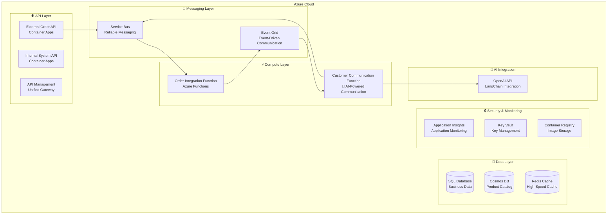

# BidOne Integration Platform - Deployment Guide

## 📋 Overview

This guide will walk you through the complete deployment of the BidOne Integration Platform, including Azure infrastructure, microservices applications, and the **AI-Powered Customer Communication System** end-to-end deployment.

## 🎯 Deployment Architecture



## 🔧 Prerequisites

### Required Tools
- **Azure CLI** 2.50+ - [Installation Guide](https://docs.microsoft.com/en-us/cli/azure/install-azure-cli)
- **.NET 8.0 SDK** - [Download](https://dotnet.microsoft.com/download)
- **Docker Desktop** - [Download](https://www.docker.com/products/docker-desktop)
- **Azure Functions Core Tools** v4 - [Installation Guide](https://docs.microsoft.com/en-us/azure/azure-functions/functions-run-local)

### Azure Permission Requirements
- Azure subscription **Owner** or **Contributor** permissions
- Ability to create resource groups and register Azure AD applications
- Service Principal creation permissions (for CI/CD)

### Optional Requirements
- **OpenAI API Key** - Enable real AI features (otherwise uses intelligent simulation)
- **GitHub Account** - Automated CI/CD deployment

## 🚀 Quick Deployment (Recommended)

### Step 1: Environment Preparation

```bash
# 1. Clone the project
git clone <repository-url>
cd FoodOrderConnect

# 2. Login to Azure
az login
az account set --subscription "<your-subscription-id>"

# 3. Set environment variables
export RESOURCE_GROUP="rg-bidone-demo"
export LOCATION="eastus"
export ENVIRONMENT="dev"
export UNIQUE_SUFFIX="$(date +%s | tail -c 4)"  # Ensure unique resource names
```

### Step 2: One-Click Infrastructure Deployment

```bash
# Create resource group
az group create --name $RESOURCE_GROUP --location $LOCATION

# Deploy complete infrastructure (including AI communication system)
az deployment group create \
  --resource-group $RESOURCE_GROUP \
  --template-file infra/main.bicep \
  --parameters environmentName=$ENVIRONMENT \
               uniqueSuffix=$UNIQUE_SUFFIX \
               sqlAdminPassword="SecurePassword123!" \
  --name "bidone-infrastructure-$(date +%Y%m%d-%H%M%S)"

# Get deployment outputs
az deployment group show \
  --resource-group $RESOURCE_GROUP \
  --name "bidone-infrastructure-$(date +%Y%m%d-%H%M%S)" \
  --query properties.outputs
```

### Step 3: Configure AI Features

```bash
# Get Key Vault name
KEY_VAULT_NAME=$(az deployment group show \
  --resource-group $RESOURCE_GROUP \
  --name "bidone-infrastructure-$(date +%Y%m%d-%H%M%S)" \
  --query properties.outputs.keyVaultName.value -o tsv)

# Configure OpenAI API Key (if available)
az keyvault secret set \
  --vault-name $KEY_VAULT_NAME \
  --name "OpenAI-ApiKey" \
  --value "your-openai-api-key-here"

# If no OpenAI API Key, system will automatically use intelligent simulation mode
echo "If no OpenAI API Key, AI features will use intelligent simulation mode"
```

### Step 4: Deploy Applications

```bash
# Get container registry information
ACR_NAME=$(az deployment group show \
  --resource-group $RESOURCE_GROUP \
  --name "bidone-infrastructure-$(date +%Y%m%d-%H%M%S)" \
  --query properties.outputs.containerRegistryName.value -o tsv)

ACR_LOGIN_SERVER=$(az acr show --name $ACR_NAME --query loginServer -o tsv)

# Login to container registry
az acr login --name $ACR_NAME

# Build and push container images
docker build -t $ACR_LOGIN_SERVER/bidone/external-order-api:latest \
  -f src/ExternalOrderApi/Dockerfile .

docker build -t $ACR_LOGIN_SERVER/bidone/internal-system-api:latest \
  -f src/InternalSystemApi/Dockerfile .

docker push $ACR_LOGIN_SERVER/bidone/external-order-api:latest
docker push $ACR_LOGIN_SERVER/bidone/internal-system-api:latest

echo "✅ Container images built and pushed successfully"
```

### Step 5: Deploy Container Apps

```bash
# Get Container Apps environment name
CONTAINER_ENV_NAME=$(az deployment group show \
  --resource-group $RESOURCE_GROUP \
  --name "bidone-infrastructure-$(date +%Y%m%d-%H%M%S)" \
  --query properties.outputs.containerAppsEnvironmentName.value -o tsv)

# Deploy External Order API
az containerapp create \
  --name external-order-api \
  --resource-group $RESOURCE_GROUP \
  --environment $CONTAINER_ENV_NAME \
  --image $ACR_LOGIN_SERVER/bidone/external-order-api:latest \
  --target-port 8080 \
  --ingress external \
  --min-replicas 1 \
  --max-replicas 10 \
  --cpu 0.5 \
  --memory 1Gi \
  --registry-server $ACR_LOGIN_SERVER \
  --env-vars \
    ASPNETCORE_ENVIRONMENT=Production \
    ServiceBus__ConnectionString=secretref:servicebus-connection

# Deploy Internal System API
az containerapp create \
  --name internal-system-api \
  --resource-group $RESOURCE_GROUP \
  --environment $CONTAINER_ENV_NAME \
  --image $ACR_LOGIN_SERVER/bidone/internal-system-api:latest \
  --target-port 8081 \
  --ingress external \
  --min-replicas 1 \
  --max-replicas 10 \
  --cpu 0.5 \
  --memory 1Gi \
  --registry-server $ACR_LOGIN_SERVER \
  --env-vars \
    ASPNETCORE_ENVIRONMENT=Production \
    ConnectionStrings__DefaultConnection=secretref:sql-connection \
    ServiceBus__ConnectionString=secretref:servicebus-connection

echo "✅ Container Apps deployment completed"
```

### Step 6: Deploy Azure Functions

```bash
# Get Function App names
ORDER_FUNC_NAME=$(az deployment group show \
  --resource-group $RESOURCE_GROUP \
  --name "bidone-infrastructure-$(date +%Y%m%d-%H%M%S)" \
  --query properties.outputs.orderFunctionAppName.value -o tsv)

AI_FUNC_NAME=$(az deployment group show \
  --resource-group $RESOURCE_GROUP \
  --name "bidone-infrastructure-$(date +%Y%m%d-%H%M%S)" \
  --query properties.outputs.aiFunctionAppName.value -o tsv)

# Deploy Order Integration Function
cd src/OrderIntegrationFunction
func azure functionapp publish $ORDER_FUNC_NAME --csharp

# Deploy Customer Communication Function (AI)
cd ../CustomerCommunicationFunction
func azure functionapp publish $AI_FUNC_NAME --csharp

cd ../../
echo "✅ Azure Functions deployment completed"
```

### Step 7: Verify Deployment

```bash
# Get API endpoints
EXTERNAL_API_URL=$(az containerapp show \
  --name external-order-api \
  --resource-group $RESOURCE_GROUP \
  --query properties.configuration.ingress.fqdn -o tsv)

INTERNAL_API_URL=$(az containerapp show \
  --name internal-system-api \
  --resource-group $RESOURCE_GROUP \
  --query properties.configuration.ingress.fqdn -o tsv)

echo "🎉 Deployment completed!"
echo "📍 External Order API: https://$EXTERNAL_API_URL"
echo "📍 Internal System API: https://$INTERNAL_API_URL"

# Test API health status
curl -f "https://$EXTERNAL_API_URL/health" && echo "✅ External API healthy"
curl -f "https://$INTERNAL_API_URL/health" && echo "✅ Internal API healthy"
```

## 📝 Detailed Deployment Steps

### 1. Infrastructure as Code (Bicep)

#### 1.1 Parameter Configuration

Create environment-specific parameter files:

```json
// infra/parameters.prod.json
{
    "$schema": "https://schema.management.azure.com/schemas/2019-04-01/deploymentParameters.json#",
    "contentVersion": "1.0.0.0",
    "parameters": {
        "environmentName": {
            "value": "prod"
        },
        "location": {
            "value": "eastus"
        },
        "uniqueSuffix": {
            "value": "001"
        },
        "sqlAdminPassword": {
            "value": "YourSecurePassword123!"
        },
        "openAiApiKey": {
            "value": ""
        }
    }
}
```

#### 1.2 Infrastructure Deployment

```bash
# Validate Bicep template
az deployment group validate \
    --resource-group $RESOURCE_GROUP \
    --template-file infra/main.bicep \
    --parameters infra/parameters.prod.json

# Preview deployment changes
az deployment group what-if \
    --resource-group $RESOURCE_GROUP \
    --template-file infra/main.bicep \
    --parameters infra/parameters.prod.json

# Execute deployment
az deployment group create \
    --resource-group $RESOURCE_GROUP \
    --template-file infra/main.bicep \
    --parameters infra/parameters.prod.json \
    --name "bidone-infra-$(date +%Y%m%d-%H%M%S)" \
    --verbose
```

### 2. Database Initialization

#### 2.1 SQL Database Initialization

```bash
# Get SQL Server connection information
SQL_SERVER_NAME=$(az deployment group show \
  --resource-group $RESOURCE_GROUP \
  --name "bidone-infra-$(date +%Y%m%d-%H%M%S)" \
  --query properties.outputs.sqlServerName.value -o tsv)

# Configure firewall rules to allow local access
CLIENT_IP=$(curl -s https://api.ipify.org)
az sql server firewall-rule create \
  --resource-group $RESOURCE_GROUP \
  --server $SQL_SERVER_NAME \
  --name "AllowLocalMachine" \
  --start-ip-address $CLIENT_IP \
  --end-ip-address $CLIENT_IP

# Run database migrations
cd src/InternalSystemApi
dotnet ef database update \
  --connection "Server=$SQL_SERVER_NAME.database.windows.net;Database=BidOneDB;User Id=sqladmin;Password=YourSecurePassword123!;Encrypt=true;TrustServerCertificate=false;"

cd ../../
echo "✅ Database initialization completed"
```

#### 2.2 Cosmos DB Initialization

```bash
# Get Cosmos DB account name
COSMOS_ACCOUNT_NAME=$(az deployment group show \
  --resource-group $RESOURCE_GROUP \
  --name "bidone-infra-$(date +%Y%m%d-%H%M%S)" \
  --query properties.outputs.cosmosDbAccountName.value -o tsv)

# Create database and containers
az cosmosdb sql database create \
    --account-name $COSMOS_ACCOUNT_NAME \
    --resource-group $RESOURCE_GROUP \
    --name BidOneDB

az cosmosdb sql container create \
    --account-name $COSMOS_ACCOUNT_NAME \
    --resource-group $RESOURCE_GROUP \
    --database-name BidOneDB \
    --name Products \
    --partition-key-path "/category" \
    --throughput 400

az cosmosdb sql container create \
    --account-name $COSMOS_ACCOUNT_NAME \
    --resource-group $RESOURCE_GROUP \
    --database-name BidOneDB \
    --name Customers \
    --partition-key-path "/customerId" \
    --throughput 400

echo "✅ Cosmos DB initialization completed"
```

### 3. Application Configuration

#### 3.1 Container Apps Environment Variables and Secrets

```bash
# Get connection strings
SQL_CONNECTION=$(az sql db show-connection-string \
  --client ado.net \
  --server $SQL_SERVER_NAME \
  --name BidOneDB \
  --output tsv | sed 's/<username>/sqladmin/g' | sed 's/<password>/YourSecurePassword123!/g')

SERVICEBUS_CONNECTION=$(az servicebus namespace authorization-rule keys list \
  --resource-group $RESOURCE_GROUP \
  --namespace-name $(az deployment group show --resource-group $RESOURCE_GROUP --name "bidone-infra-$(date +%Y%m%d-%H%M%S)" --query properties.outputs.serviceBusNamespaceName.value -o tsv) \
  --name RootManageSharedAccessKey \
  --query primaryConnectionString -o tsv)

COSMOS_CONNECTION=$(az cosmosdb keys list \
  --resource-group $RESOURCE_GROUP \
  --name $COSMOS_ACCOUNT_NAME \
  --type connection-strings \
  --query "connectionStrings[0].connectionString" -o tsv)

# Add secrets to Container Apps
az containerapp secret set \
  --name external-order-api \
  --resource-group $RESOURCE_GROUP \
  --secrets sql-connection="$SQL_CONNECTION" \
             servicebus-connection="$SERVICEBUS_CONNECTION" \
             cosmos-connection="$COSMOS_CONNECTION"

az containerapp secret set \
  --name internal-system-api \
  --resource-group $RESOURCE_GROUP \
  --secrets sql-connection="$SQL_CONNECTION" \
             servicebus-connection="$SERVICEBUS_CONNECTION" \
             cosmos-connection="$COSMOS_CONNECTION"

echo "✅ Application configuration completed"
```

#### 3.2 Function Apps Configuration

```bash
# Configure Order Integration Function
az functionapp config appsettings set \
  --name $ORDER_FUNC_NAME \
  --resource-group $RESOURCE_GROUP \
  --settings \
    SqlConnectionString="$SQL_CONNECTION" \
    ServiceBusConnection="$SERVICEBUS_CONNECTION" \
    CosmosDbConnectionString="$COSMOS_CONNECTION"

# Configure AI Communication Function
az functionapp config appsettings set \
  --name $AI_FUNC_NAME \
  --resource-group $RESOURCE_GROUP \
  --settings \
    ServiceBusConnection="$SERVICEBUS_CONNECTION" \
    OpenAI__ApiKey="@Microsoft.KeyVault(SecretUri=https://$KEY_VAULT_NAME.vault.azure.net/secrets/OpenAI-ApiKey/)"

echo "✅ Function Apps configuration completed"
```

## 🧪 Deployment Verification and Testing

### 1. Basic Health Checks

```bash
# Create deployment verification script
cat > scripts/verify-deployment.sh << 'EOF'
#!/bin/bash
set -euo pipefail

RESOURCE_GROUP="$1"
DEPLOYMENT_NAME="$2"

echo "🔍 Verifying deployment status..."

# Get resource outputs
EXTERNAL_API_URL=$(az containerapp show --name external-order-api --resource-group $RESOURCE_GROUP --query properties.configuration.ingress.fqdn -o tsv)
INTERNAL_API_URL=$(az containerapp show --name internal-system-api --resource-group $RESOURCE_GROUP --query properties.configuration.ingress.fqdn -o tsv)

# Health checks
echo "Testing External API..."
curl -f "https://$EXTERNAL_API_URL/health" || { echo "❌ External API failed"; exit 1; }

echo "Testing Internal API..."
curl -f "https://$INTERNAL_API_URL/health" || { echo "❌ Internal API failed"; exit 1; }

echo "✅ All API health checks passed"

# Test order creation
echo "🧪 Testing order creation..."
curl -X POST "https://$EXTERNAL_API_URL/orders" \
  -H "Content-Type: application/json" \
  -d '{
    "customerId": "test-customer-001",
    "items": [{"productId": "TEST-001", "quantity": 1, "unitPrice": 10.00}],
    "deliveryDate": "2024-12-20T10:00:00Z"
  }' || { echo "❌ Order creation test failed"; exit 1; }

echo "✅ Deployment verification completed!"
EOF

chmod +x scripts/verify-deployment.sh

# Run verification
./scripts/verify-deployment.sh $RESOURCE_GROUP "bidone-infra-$(date +%Y%m%d-%H%M%S)"
```

### 2. AI Functionality Testing

```bash
# Test AI intelligent error handling
echo "🤖 Testing AI functionality..."

curl -X POST "https://$EXTERNAL_API_URL/orders" \
  -H "Content-Type: application/json" \
  -d '{
    "customerId": "premium-customer-001",
    "items": [{"productId": "INVALID-PRODUCT", "quantity": 100, "unitPrice": 50.00}],
    "deliveryDate": "2024-12-20T10:00:00Z"
  }'

echo "Check AI Function logs:"
az functionapp logs tail --name $AI_FUNC_NAME --resource-group $RESOURCE_GROUP

# Local testing (development environment)
echo "🏠 Local environment testing:"
echo "Use docker-dev.sh to easily test the same functionality:"
echo "./docker-dev.sh start  # Complete containerized environment"
echo "# or ./docker-dev.sh infra  # Infrastructure only, run APIs locally"
echo "curl -X POST http://localhost:5001/orders [same-payload]"
echo "./docker-dev.sh logs customer-communication-function"
```

## 📊 Monitoring and Maintenance

### 1. Setup Alert Rules

```bash
# Create alert rules
az monitor metrics alert create \
  --name "High Error Rate" \
  --resource-group $RESOURCE_GROUP \
  --scopes "/subscriptions/$SUBSCRIPTION_ID/resourceGroups/$RESOURCE_GROUP/providers/Microsoft.App/containerApps/external-order-api" \
  --condition "avg requests/failed > 5" \
  --window-size 5m \
  --evaluation-frequency 1m \
  --action-group-ids "/subscriptions/$SUBSCRIPTION_ID/resourceGroups/$RESOURCE_GROUP/providers/microsoft.insights/actionGroups/bidone-alerts"
```

### 2. Backup Configuration

```bash
# Configure database backup
az sql db ltr-policy set \
  --resource-group $RESOURCE_GROUP \
  --server $SQL_SERVER_NAME \
  --database BidOneDB \
  --weekly-retention P4W \
  --monthly-retention P12M \
  --yearly-retention P7Y
```

## 🔒 Security Best Practices

### 1. Network Security

```bash
# Configure private endpoints
az network private-endpoint create \
  --resource-group $RESOURCE_GROUP \
  --name bidone-sql-private-endpoint \
  --vnet-name bidone-vnet \
  --subnet bidone-data-subnet \
  --private-connection-resource-id "/subscriptions/$SUBSCRIPTION_ID/resourceGroups/$RESOURCE_GROUP/providers/Microsoft.Sql/servers/$SQL_SERVER_NAME" \
  --group-ids sqlServer \
  --connection-name bidone-sql-connection
```

### 2. Key Rotation

```bash
# Regularly rotate API keys
az keyvault secret set \
  --vault-name $KEY_VAULT_NAME \
  --name "ServiceBus-ConnectionString" \
  --value "$(az servicebus namespace authorization-rule keys renew --resource-group $RESOURCE_GROUP --namespace-name $SERVICEBUS_NAMESPACE --name RootManageSharedAccessKey --key PrimaryKey --query primaryConnectionString -o tsv)"
```

## 🚨 Troubleshooting

### Common Issues and Solutions

#### 1. Container Startup Failures

```bash
# View container logs
az containerapp logs show \
  --name external-order-api \
  --resource-group $RESOURCE_GROUP \
  --follow

# Check configuration
az containerapp show \
  --name external-order-api \
  --resource-group $RESOURCE_GROUP \
  --query "properties.template.containers[0]"
```

#### 2. Function App Deployment Failures

```bash
# View deployment logs
func azure functionapp list-functions $ORDER_FUNC_NAME

# Check configuration
az functionapp config appsettings list \
  --name $ORDER_FUNC_NAME \
  --resource-group $RESOURCE_GROUP
```

#### 3. Database Connection Issues

```bash
# Test connection
az sql db show-connection-string \
  --client sqlcmd \
  --server $SQL_SERVER_NAME \
  --name BidOneDB

# Check firewall rules
az sql server firewall-rule list \
  --resource-group $RESOURCE_GROUP \
  --server $SQL_SERVER_NAME
```

## 💰 Cost Optimization

### Auto-scaling Configuration

```bash
# Configure Container Apps auto-scaling
az containerapp update \
  --name external-order-api \
  --resource-group $RESOURCE_GROUP \
  --min-replicas 0 \
  --max-replicas 10 \
  --scale-rule-name http-requests \
  --scale-rule-type http \
  --scale-rule-http-concurrent-requests 100
```

### Cost Monitoring

```bash
# Set budget alerts
az consumption budget create \
  --resource-group $RESOURCE_GROUP \
  --budget-name bidone-monthly-budget \
  --amount 500 \
  --time-grain Monthly \
  --category Cost \
  --notifications amount=400 operator=GreaterThan contact-emails="admin@company.com"
```

## 📋 Deployment Checklist

### 🏠 Local Development Environment
- [ ] Docker Desktop installed and running
- [ ] .NET 8.0 SDK installed
- [ ] Project code cloned
- [ ] `./docker-dev.sh start` executed successfully
- [ ] Service health checks passed: `./docker-dev.sh status`
- [ ] AI functionality tested normally (simulation mode or real OpenAI)

### ☁️ Pre-Azure Deployment Checks
- [ ] Azure CLI installed and logged in
- [ ] Subscription permissions confirmed (Contributor role)
- [ ] Resource group created
- [ ] Parameter files configured
- [ ] OpenAI API Key prepared (optional, otherwise uses intelligent simulation)
- [ ] Local environment verification passed

### 🚀 Deployment Process Checks
- [ ] Infrastructure deployment successful (Bicep template)
- [ ] Container images built and pushed to ACR
- [ ] Container Apps deployment successful
- [ ] Azure Functions deployment successful
- [ ] Database initialization completed
- [ ] Key Vault configuration and secret setup
- [ ] Service Bus and Event Grid configuration

### ✅ Post-Deployment Verification
- [ ] API health checks passed
- [ ] Database connections normal
- [ ] Service Bus message flow verified
- [ ] AI functionality end-to-end testing
- [ ] Application Insights monitoring data
- [ ] Log aggregation and querying normal
- [ ] Alert rule trigger testing
- [ ] Security configuration and access control confirmed

### 🔄 Development Workflow Verification
- [ ] Local development environment can reproduce production issues
- [ ] `docker-dev.sh rebuild` functionality normal
- [ ] CI/CD pipeline configured (if using GitHub Actions)
- [ ] Rollback plan prepared

## 🎯 Next Steps

After completing deployment, it's recommended to perform the following:

1. **Configure Monitoring and Alerts** - Set up monitoring and alerts for key metrics
2. **Security Hardening** - Implement network security, access control, and other security measures
3. **Performance Optimization** - Adjust resource configuration based on actual usage
4. **Backup Strategy** - Configure data backup and disaster recovery plans
5. **Documentation Updates** - Update operational documentation and troubleshooting guides

## 📞 Technical Support

For assistance, please refer to:
- **Troubleshooting Guide**: [troubleshooting.md](troubleshooting.md)
- **Developer Guide**: [developer-guide.md](developer-guide.md)
- **Project Maintainer**: guangliang.yang@hotmail.com

---

**After successful deployment, you will have a complete cloud-native AI-powered customer communication system!** 🎉