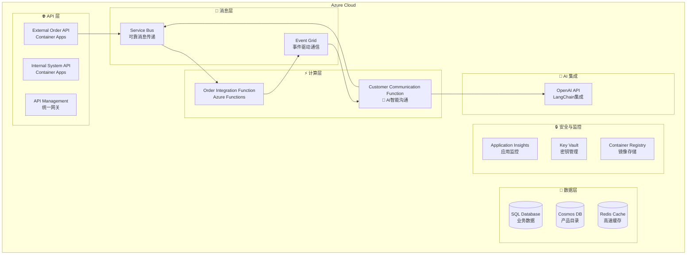

# BidOne Integration Platform - 部署指南

## 📋 概述

本指南将指导您完成 BidOne Integration Platform 的完整部署，包括 Azure 基础设施、微服务应用和 **AI 智能客户沟通系统**的端到端部署。

## 🎯 部署架构



## 🔧 前置要求

### 必需工具
- **Azure CLI** 2.50+ - [安装指南](https://docs.microsoft.com/en-us/cli/azure/install-azure-cli)
- **.NET 8.0 SDK** - [下载地址](https://dotnet.microsoft.com/download)
- **Docker Desktop** - [下载地址](https://www.docker.com/products/docker-desktop)
- **Azure Functions Core Tools** v4 - [安装指南](https://docs.microsoft.com/en-us/azure/azure-functions/functions-run-local)

### Azure 权限要求
- Azure 订阅 **所有者** 或 **贡献者** 权限
- 能够创建资源组和注册Azure AD应用程序
- Service Principal 创建权限（用于 CI/CD）

### 可选要求
- **OpenAI API Key** - 启用真实AI功能（否则使用智能模拟）
- **GitHub账号** - 自动化CI/CD部署

## 🚀 快速部署（推荐）

### 步骤 1: 环境准备

```bash
# 1. 克隆项目
git clone <repository-url>
cd FoodOrderConnect

# 2. 登录 Azure
az login
az account set --subscription "<your-subscription-id>"

# 3. 设置环境变量
export RESOURCE_GROUP="rg-bidone-demo"
export LOCATION="eastus"
export ENVIRONMENT="dev"
export UNIQUE_SUFFIX="$(date +%s | tail -c 4)"  # 确保资源名称唯一
```

### 步骤 2: 一键部署基础设施

```bash
# 创建资源组
az group create --name $RESOURCE_GROUP --location $LOCATION

# 部署完整基础设施（包含AI沟通系统）
az deployment group create \
  --resource-group $RESOURCE_GROUP \
  --template-file infra/main.bicep \
  --parameters environmentName=$ENVIRONMENT \
               uniqueSuffix=$UNIQUE_SUFFIX \
               sqlAdminPassword="SecurePassword123!" \
  --name "bidone-infrastructure-$(date +%Y%m%d-%H%M%S)"

# 获取部署输出
az deployment group show \
  --resource-group $RESOURCE_GROUP \
  --name "bidone-infrastructure-$(date +%Y%m%d-%H%M%S)" \
  --query properties.outputs
```

### 步骤 3: 配置 AI 功能

```bash
# 获取 Key Vault 名称
KEY_VAULT_NAME=$(az deployment group show \
  --resource-group $RESOURCE_GROUP \
  --name "bidone-infrastructure-$(date +%Y%m%d-%H%M%S)" \
  --query properties.outputs.keyVaultName.value -o tsv)

# 配置 OpenAI API Key（如果有）
az keyvault secret set \
  --vault-name $KEY_VAULT_NAME \
  --name "OpenAI-ApiKey" \
  --value "your-openai-api-key-here"

# 如果没有OpenAI API Key，系统将自动使用智能模拟模式
echo "如果没有OpenAI API Key，AI功能将使用智能模拟模式"
```

### 步骤 4: 部署应用程序

```bash
# 获取容器注册表信息
ACR_NAME=$(az deployment group show \
  --resource-group $RESOURCE_GROUP \
  --name "bidone-infrastructure-$(date +%Y%m%d-%H%M%S)" \
  --query properties.outputs.containerRegistryName.value -o tsv)

ACR_LOGIN_SERVER=$(az acr show --name $ACR_NAME --query loginServer -o tsv)

# 登录容器注册表
az acr login --name $ACR_NAME

# 构建并推送容器镜像
docker build -t $ACR_LOGIN_SERVER/bidone/external-order-api:latest \
  -f src/ExternalOrderApi/Dockerfile .

docker build -t $ACR_LOGIN_SERVER/bidone/internal-system-api:latest \
  -f src/InternalSystemApi/Dockerfile .

docker push $ACR_LOGIN_SERVER/bidone/external-order-api:latest
docker push $ACR_LOGIN_SERVER/bidone/internal-system-api:latest

echo "✅ 容器镜像构建并推送完成"
```

### 步骤 5: 部署 Container Apps

```bash
# 获取 Container Apps 环境名称
CONTAINER_ENV_NAME=$(az deployment group show \
  --resource-group $RESOURCE_GROUP \
  --name "bidone-infrastructure-$(date +%Y%m%d-%H%M%S)" \
  --query properties.outputs.containerAppsEnvironmentName.value -o tsv)

# 部署 External Order API
az containerapp create \
  --name external-order-api \
  --resource-group $RESOURCE_GROUP \
  --environment $CONTAINER_ENV_NAME \
  --image $ACR_LOGIN_SERVER/bidone/external-order-api:latest \
  --target-port 8080 \
  --ingress external \
  --min-replicas 1 \
  --max-replicas 10 \
  --cpu 0.5 \
  --memory 1Gi \
  --registry-server $ACR_LOGIN_SERVER \
  --env-vars \
    ASPNETCORE_ENVIRONMENT=Production \
    ServiceBus__ConnectionString=secretref:servicebus-connection

# 部署 Internal System API
az containerapp create \
  --name internal-system-api \
  --resource-group $RESOURCE_GROUP \
  --environment $CONTAINER_ENV_NAME \
  --image $ACR_LOGIN_SERVER/bidone/internal-system-api:latest \
  --target-port 8081 \
  --ingress external \
  --min-replicas 1 \
  --max-replicas 10 \
  --cpu 0.5 \
  --memory 1Gi \
  --registry-server $ACR_LOGIN_SERVER \
  --env-vars \
    ASPNETCORE_ENVIRONMENT=Production \
    ConnectionStrings__DefaultConnection=secretref:sql-connection \
    ServiceBus__ConnectionString=secretref:servicebus-connection

echo "✅ Container Apps 部署完成"
```

### 步骤 6: 部署 Azure Functions

```bash
# 获取Function App名称
ORDER_FUNC_NAME=$(az deployment group show \
  --resource-group $RESOURCE_GROUP \
  --name "bidone-infrastructure-$(date +%Y%m%d-%H%M%S)" \
  --query properties.outputs.orderFunctionAppName.value -o tsv)

AI_FUNC_NAME=$(az deployment group show \
  --resource-group $RESOURCE_GROUP \
  --name "bidone-infrastructure-$(date +%Y%m%d-%H%M%S)" \
  --query properties.outputs.aiFunctionAppName.value -o tsv)

# 部署 Order Integration Function
cd src/OrderIntegrationFunction
func azure functionapp publish $ORDER_FUNC_NAME --csharp

# 部署 Customer Communication Function (AI)
cd ../CustomerCommunicationFunction
func azure functionapp publish $AI_FUNC_NAME --csharp

cd ../../
echo "✅ Azure Functions 部署完成"
```

### 步骤 7: 验证部署

```bash
# 获取API端点
EXTERNAL_API_URL=$(az containerapp show \
  --name external-order-api \
  --resource-group $RESOURCE_GROUP \
  --query properties.configuration.ingress.fqdn -o tsv)

INTERNAL_API_URL=$(az containerapp show \
  --name internal-system-api \
  --resource-group $RESOURCE_GROUP \
  --query properties.configuration.ingress.fqdn -o tsv)

echo "🎉 部署完成！"
echo "📍 External Order API: https://$EXTERNAL_API_URL"
echo "📍 Internal System API: https://$INTERNAL_API_URL"

# 测试API健康状态
curl -f "https://$EXTERNAL_API_URL/health" && echo "✅ External API健康"
curl -f "https://$INTERNAL_API_URL/health" && echo "✅ Internal API健康"
```

## 📝 详细部署步骤

### 1. 基础设施即代码 (Bicep)

#### 1.1 参数配置

创建环境特定的参数文件：

```json
// infra/parameters.prod.json
{
    "$schema": "https://schema.management.azure.com/schemas/2019-04-01/deploymentParameters.json#",
    "contentVersion": "1.0.0.0",
    "parameters": {
        "environmentName": {
            "value": "prod"
        },
        "location": {
            "value": "eastus"
        },
        "uniqueSuffix": {
            "value": "001"
        },
        "sqlAdminPassword": {
            "value": "YourSecurePassword123!"
        },
        "openAiApiKey": {
            "value": ""
        }
    }
}
```

#### 1.2 基础设施部署

```bash
# 验证Bicep模板
az deployment group validate \
    --resource-group $RESOURCE_GROUP \
    --template-file infra/main.bicep \
    --parameters infra/parameters.prod.json

# 预览部署更改
az deployment group what-if \
    --resource-group $RESOURCE_GROUP \
    --template-file infra/main.bicep \
    --parameters infra/parameters.prod.json

# 执行部署
az deployment group create \
    --resource-group $RESOURCE_GROUP \
    --template-file infra/main.bicep \
    --parameters infra/parameters.prod.json \
    --name "bidone-infra-$(date +%Y%m%d-%H%M%S)" \
    --verbose
```

### 2. 数据库初始化

#### 2.1 SQL Database 初始化

```bash
# 获取SQL Server连接信息
SQL_SERVER_NAME=$(az deployment group show \
  --resource-group $RESOURCE_GROUP \
  --name "bidone-infra-$(date +%Y%m%d-%H%M%S)" \
  --query properties.outputs.sqlServerName.value -o tsv)

# 配置防火墙规则允许本地访问
CLIENT_IP=$(curl -s https://api.ipify.org)
az sql server firewall-rule create \
  --resource-group $RESOURCE_GROUP \
  --server $SQL_SERVER_NAME \
  --name "AllowLocalMachine" \
  --start-ip-address $CLIENT_IP \
  --end-ip-address $CLIENT_IP

# 运行数据库迁移
cd src/InternalSystemApi
dotnet ef database update \
  --connection "Server=$SQL_SERVER_NAME.database.windows.net;Database=BidOneDB;User Id=sqladmin;Password=YourSecurePassword123!;Encrypt=true;TrustServerCertificate=false;"

cd ../../
echo "✅ 数据库初始化完成"
```

#### 2.2 Cosmos DB 初始化

```bash
# 获取Cosmos DB账户名
COSMOS_ACCOUNT_NAME=$(az deployment group show \
  --resource-group $RESOURCE_GROUP \
  --name "bidone-infra-$(date +%Y%m%d-%H%M%S)" \
  --query properties.outputs.cosmosDbAccountName.value -o tsv)

# 创建数据库和容器
az cosmosdb sql database create \
    --account-name $COSMOS_ACCOUNT_NAME \
    --resource-group $RESOURCE_GROUP \
    --name BidOneDB

az cosmosdb sql container create \
    --account-name $COSMOS_ACCOUNT_NAME \
    --resource-group $RESOURCE_GROUP \
    --database-name BidOneDB \
    --name Products \
    --partition-key-path "/category" \
    --throughput 400

az cosmosdb sql container create \
    --account-name $COSMOS_ACCOUNT_NAME \
    --resource-group $RESOURCE_GROUP \
    --database-name BidOneDB \
    --name Customers \
    --partition-key-path "/customerId" \
    --throughput 400

echo "✅ Cosmos DB 初始化完成"
```

### 3. 应用程序配置

#### 3.1 Container Apps 环境变量和密钥

```bash
# 获取连接字符串
SQL_CONNECTION=$(az sql db show-connection-string \
  --client ado.net \
  --server $SQL_SERVER_NAME \
  --name BidOneDB \
  --output tsv | sed 's/<username>/sqladmin/g' | sed 's/<password>/YourSecurePassword123!/g')

SERVICEBUS_CONNECTION=$(az servicebus namespace authorization-rule keys list \
  --resource-group $RESOURCE_GROUP \
  --namespace-name $(az deployment group show --resource-group $RESOURCE_GROUP --name "bidone-infra-$(date +%Y%m%d-%H%M%S)" --query properties.outputs.serviceBusNamespaceName.value -o tsv) \
  --name RootManageSharedAccessKey \
  --query primaryConnectionString -o tsv)

COSMOS_CONNECTION=$(az cosmosdb keys list \
  --resource-group $RESOURCE_GROUP \
  --name $COSMOS_ACCOUNT_NAME \
  --type connection-strings \
  --query "connectionStrings[0].connectionString" -o tsv)

# 添加密钥到Container Apps
az containerapp secret set \
  --name external-order-api \
  --resource-group $RESOURCE_GROUP \
  --secrets sql-connection="$SQL_CONNECTION" \
             servicebus-connection="$SERVICEBUS_CONNECTION" \
             cosmos-connection="$COSMOS_CONNECTION"

az containerapp secret set \
  --name internal-system-api \
  --resource-group $RESOURCE_GROUP \
  --secrets sql-connection="$SQL_CONNECTION" \
             servicebus-connection="$SERVICEBUS_CONNECTION" \
             cosmos-connection="$COSMOS_CONNECTION"

echo "✅ 应用程序配置完成"
```

#### 3.2 Function Apps 配置

```bash
# 配置Order Integration Function
az functionapp config appsettings set \
  --name $ORDER_FUNC_NAME \
  --resource-group $RESOURCE_GROUP \
  --settings \
    SqlConnectionString="$SQL_CONNECTION" \
    ServiceBusConnection="$SERVICEBUS_CONNECTION" \
    CosmosDbConnectionString="$COSMOS_CONNECTION"

# 配置AI Communication Function
az functionapp config appsettings set \
  --name $AI_FUNC_NAME \
  --resource-group $RESOURCE_GROUP \
  --settings \
    ServiceBusConnection="$SERVICEBUS_CONNECTION" \
    OpenAI__ApiKey="@Microsoft.KeyVault(SecretUri=https://$KEY_VAULT_NAME.vault.azure.net/secrets/OpenAI-ApiKey/)"

echo "✅ Function Apps 配置完成"
```

### 4. API Management 配置

```bash
# 获取API Management实例名称
APIM_NAME=$(az deployment group show \
  --resource-group $RESOURCE_GROUP \
  --name "bidone-infra-$(date +%Y%m%d-%H%M%S)" \
  --query properties.outputs.apimServiceName.value -o tsv)

# 部署API Management配置
./scripts/deploy-apim-config.sh \
  --resource-group $RESOURCE_GROUP \
  --apim-name $APIM_NAME \
  --external-api-url "https://$EXTERNAL_API_URL" \
  --internal-api-url "https://$INTERNAL_API_URL"

echo "✅ API Management 配置完成"
```

### 5. 监控和日志配置

#### 5.1 Application Insights 配置

```bash
# 获取Application Insights连接字符串
APP_INSIGHTS_CONNECTION=$(az monitor app-insights component show \
  --app $(az deployment group show --resource-group $RESOURCE_GROUP --name "bidone-infra-$(date +%Y%m%d-%H%M%S)" --query properties.outputs.applicationInsightsName.value -o tsv) \
  --resource-group $RESOURCE_GROUP \
  --query connectionString -o tsv)

# 添加到所有应用程序
az containerapp update \
  --name external-order-api \
  --resource-group $RESOURCE_GROUP \
  --set-env-vars ApplicationInsights__ConnectionString="$APP_INSIGHTS_CONNECTION"

az containerapp update \
  --name internal-system-api \
  --resource-group $RESOURCE_GROUP \
  --set-env-vars ApplicationInsights__ConnectionString="$APP_INSIGHTS_CONNECTION"

echo "✅ 监控配置完成"
```

#### 5.2 日志分析工作区

```bash
# 启用Container Apps日志
LOG_ANALYTICS_WORKSPACE=$(az deployment group show \
  --resource-group $RESOURCE_GROUP \
  --name "bidone-infra-$(date +%Y%m%d-%H%M%S)" \
  --query properties.outputs.logAnalyticsWorkspaceName.value -o tsv)

echo "✅ 日志分析工作区已配置: $LOG_ANALYTICS_WORKSPACE"
```

## 🔄 CI/CD 自动化部署

### GitHub Actions 配置

#### 1. 创建Service Principal

```bash
# 创建用于GitHub Actions的Service Principal
SUBSCRIPTION_ID=$(az account show --query id -o tsv)

az ad sp create-for-rbac \
  --name "bidone-github-actions" \
  --role contributor \
  --scopes /subscriptions/$SUBSCRIPTION_ID/resourceGroups/$RESOURCE_GROUP \
  --sdk-auth
```

#### 2. 配置GitHub Secrets

在GitHub仓库的Settings > Secrets中添加：

```bash
# 复制上述命令输出的JSON作为 AZURE_CREDENTIALS

# 其他必需的Secrets：
AZURE_SUBSCRIPTION_ID=<your-subscription-id>
RESOURCE_GROUP=rg-bidone-demo
ACR_LOGIN_SERVER=<acr-name>.azurecr.io
SQL_ADMIN_PASSWORD=YourSecurePassword123!
OPENAI_API_KEY=<your-openai-key>  # 可选
```

#### 3. GitHub Actions Workflow

创建 `.github/workflows/deploy.yml`：

```yaml
name: Deploy to Azure

on:
  push:
    branches: [ main ]
  workflow_dispatch:

env:
  RESOURCE_GROUP: ${{ secrets.RESOURCE_GROUP }}
  ACR_LOGIN_SERVER: ${{ secrets.ACR_LOGIN_SERVER }}

jobs:
  deploy:
    runs-on: ubuntu-latest
    
    steps:
    - uses: actions/checkout@v4
    
    - name: Login to Azure
      uses: azure/login@v1
      with:
        creds: ${{ secrets.AZURE_CREDENTIALS }}
    
    - name: Login to ACR
      run: az acr login --name ${{ secrets.ACR_LOGIN_SERVER }}
    
    - name: Build and Push Images
      run: |
        docker build -t $ACR_LOGIN_SERVER/bidone/external-order-api:${{ github.sha }} \
          -f src/ExternalOrderApi/Dockerfile .
        docker push $ACR_LOGIN_SERVER/bidone/external-order-api:${{ github.sha }}
        
        docker build -t $ACR_LOGIN_SERVER/bidone/internal-system-api:${{ github.sha }} \
          -f src/InternalSystemApi/Dockerfile .
        docker push $ACR_LOGIN_SERVER/bidone/internal-system-api:${{ github.sha }}
    
    - name: Deploy to Container Apps
      run: |
        az containerapp update \
          --name external-order-api \
          --resource-group $RESOURCE_GROUP \
          --image $ACR_LOGIN_SERVER/bidone/external-order-api:${{ github.sha }}
        
        az containerapp update \
          --name internal-system-api \
          --resource-group $RESOURCE_GROUP \
          --image $ACR_LOGIN_SERVER/bidone/internal-system-api:${{ github.sha }}
```

## 🧪 部署验证和测试

### 1. 基础健康检查

```bash
# 创建部署验证脚本
cat > scripts/verify-deployment.sh << 'EOF'
#!/bin/bash
set -euo pipefail

RESOURCE_GROUP="$1"
DEPLOYMENT_NAME="$2"

echo "🔍 验证部署状态..."

# 获取资源输出
EXTERNAL_API_URL=$(az containerapp show --name external-order-api --resource-group $RESOURCE_GROUP --query properties.configuration.ingress.fqdn -o tsv)
INTERNAL_API_URL=$(az containerapp show --name internal-system-api --resource-group $RESOURCE_GROUP --query properties.configuration.ingress.fqdn -o tsv)

# 健康检查
echo "Testing External API..."
curl -f "https://$EXTERNAL_API_URL/health" || { echo "❌ External API failed"; exit 1; }

echo "Testing Internal API..."
curl -f "https://$INTERNAL_API_URL/health" || { echo "❌ Internal API failed"; exit 1; }

echo "✅ 所有API健康检查通过"

# 测试订单创建
echo "🧪 测试订单创建..."
curl -X POST "https://$EXTERNAL_API_URL/orders" \
  -H "Content-Type: application/json" \
  -d '{
    "customerId": "test-customer-001",
    "items": [{"productId": "TEST-001", "quantity": 1, "unitPrice": 10.00}],
    "deliveryDate": "2024-12-20T10:00:00Z"
  }' || { echo "❌ 订单创建测试失败"; exit 1; }

echo "✅ 部署验证完成！"
EOF

chmod +x scripts/verify-deployment.sh

# 运行验证
./scripts/verify-deployment.sh $RESOURCE_GROUP "bidone-infra-$(date +%Y%m%d-%H%M%S)"
```

### 2. AI功能测试

```bash
# 测试AI智能错误处理
echo "🤖 测试AI功能..."

curl -X POST "https://$EXTERNAL_API_URL/orders" \
  -H "Content-Type: application/json" \
  -d '{
    "customerId": "premium-customer-001",
    "items": [{"productId": "INVALID-PRODUCT", "quantity": 100, "unitPrice": 50.00}],
    "deliveryDate": "2024-12-20T10:00:00Z"
  }'

echo "检查AI Function日志："
az functionapp logs tail --name $AI_FUNC_NAME --resource-group $RESOURCE_GROUP
```

## 📊 监控和维护

### 1. 设置告警规则

```bash
# 创建告警规则
az monitor metrics alert create \
  --name "High Error Rate" \
  --resource-group $RESOURCE_GROUP \
  --scopes "/subscriptions/$SUBSCRIPTION_ID/resourceGroups/$RESOURCE_GROUP/providers/Microsoft.App/containerApps/external-order-api" \
  --condition "avg requests/failed > 5" \
  --window-size 5m \
  --evaluation-frequency 1m \
  --action-group-ids "/subscriptions/$SUBSCRIPTION_ID/resourceGroups/$RESOURCE_GROUP/providers/microsoft.insights/actionGroups/bidone-alerts"
```

### 2. 备份配置

```bash
# 配置数据库备份
az sql db ltr-policy set \
  --resource-group $RESOURCE_GROUP \
  --server $SQL_SERVER_NAME \
  --database BidOneDB \
  --weekly-retention P4W \
  --monthly-retention P12M \
  --yearly-retention P7Y
```

## 🔒 安全最佳实践

### 1. 网络安全

```bash
# 配置私有端点
az network private-endpoint create \
  --resource-group $RESOURCE_GROUP \
  --name bidone-sql-private-endpoint \
  --vnet-name bidone-vnet \
  --subnet bidone-data-subnet \
  --private-connection-resource-id "/subscriptions/$SUBSCRIPTION_ID/resourceGroups/$RESOURCE_GROUP/providers/Microsoft.Sql/servers/$SQL_SERVER_NAME" \
  --group-ids sqlServer \
  --connection-name bidone-sql-connection
```

### 2. 密钥轮换

```bash
# 定期轮换API密钥
az keyvault secret set \
  --vault-name $KEY_VAULT_NAME \
  --name "ServiceBus-ConnectionString" \
  --value "$(az servicebus namespace authorization-rule keys renew --resource-group $RESOURCE_GROUP --namespace-name $SERVICEBUS_NAMESPACE --name RootManageSharedAccessKey --key PrimaryKey --query primaryConnectionString -o tsv)"
```

## 🚨 故障排除

### 常见问题和解决方案

#### 1. 容器启动失败

```bash
# 查看容器日志
az containerapp logs show \
  --name external-order-api \
  --resource-group $RESOURCE_GROUP \
  --follow

# 检查配置
az containerapp show \
  --name external-order-api \
  --resource-group $RESOURCE_GROUP \
  --query "properties.template.containers[0]"
```

#### 2. Function App部署失败

```bash
# 查看部署日志
func azure functionapp list-functions $ORDER_FUNC_NAME

# 检查配置
az functionapp config appsettings list \
  --name $ORDER_FUNC_NAME \
  --resource-group $RESOURCE_GROUP
```

#### 3. 数据库连接问题

```bash
# 测试连接
az sql db show-connection-string \
  --client sqlcmd \
  --server $SQL_SERVER_NAME \
  --name BidOneDB

# 检查防火墙规则
az sql server firewall-rule list \
  --resource-group $RESOURCE_GROUP \
  --server $SQL_SERVER_NAME
```

## 💰 成本优化

### 自动扩缩容配置

```bash
# 配置Container Apps自动扩缩容
az containerapp update \
  --name external-order-api \
  --resource-group $RESOURCE_GROUP \
  --min-replicas 0 \
  --max-replicas 10 \
  --scale-rule-name http-requests \
  --scale-rule-type http \
  --scale-rule-http-concurrent-requests 100
```

### 成本监控

```bash
# 设置预算告警
az consumption budget create \
  --resource-group $RESOURCE_GROUP \
  --budget-name bidone-monthly-budget \
  --amount 500 \
  --time-grain Monthly \
  --category Cost \
  --notifications amount=400 operator=GreaterThan contact-emails="admin@company.com"
```

## 📋 部署检查清单

### 部署前检查
- [ ] Azure CLI已安装并登录
- [ ] 订阅权限确认
- [ ] 资源组创建
- [ ] 参数文件配置
- [ ] OpenAI API Key准备（可选）

### 部署过程检查
- [ ] 基础设施部署成功
- [ ] 容器镜像构建和推送
- [ ] Container Apps部署
- [ ] Azure Functions部署
- [ ] 数据库初始化
- [ ] 配置和密钥设置

### 部署后验证
- [ ] API健康检查通过
- [ ] 数据库连接正常
- [ ] AI功能测试
- [ ] 监控和日志配置
- [ ] 告警规则设置
- [ ] 安全配置确认

## 🎯 下一步

完成部署后，建议进行以下操作：

1. **配置监控和告警** - 设置关键指标的监控和告警
2. **安全加固** - 实施网络安全、访问控制等安全措施
3. **性能优化** - 根据实际使用情况调整资源配置
4. **备份策略** - 配置数据备份和灾难恢复计划
5. **文档更新** - 更新运维文档和故障排除指南

## 📞 技术支持

如需帮助，请参考：
- **故障排除指南**: [troubleshooting.md](troubleshooting.md)
- **开发者指南**: [developer-guide.md](developer-guide.md)
- **项目维护者**: guangliang.yang@hotmail.com

---

**部署成功后，您将拥有一个完整的云原生AI智能客户沟通系统！** 🎉