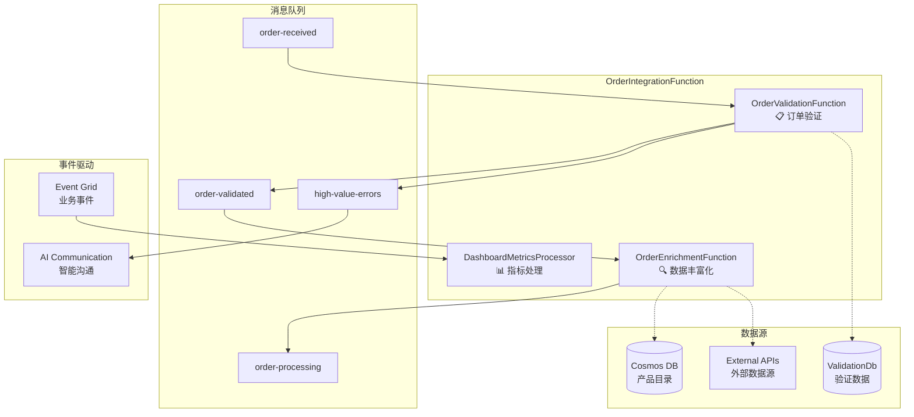

# OrderIntegrationFunction - 订单处理中间件详细文档

## 🎯 概述

OrderIntegrationFunction 是 BidOne Integration Platform 的**核心业务处理引擎**，位于订单接收和最终处理之间，负责订单验证、数据丰富化和智能错误处理。

## 🏗️ 架构设计

### 整体架构


## 🔧 核心组件详解

### 1. OrderValidationFunction

#### 功能职责
- **业务规则验证**: 订单数据完整性和合规性检查
- **客户验证**: 客户身份、信用和有效性验证
- **产品验证**: 产品存在性、价格一致性验证
- **智能错误检测**: 高价值订单错误自动识别

#### 代码实现
```csharp
public class OrderValidationFunction
{
    [Function("ValidateOrderFromServiceBus")]
    [ServiceBusOutput("order-validated", Connection = "ServiceBusConnection")]
    public async Task<string> ValidateOrderFromServiceBus(
        [ServiceBusTrigger("order-received", Connection = "ServiceBusConnection")] string orderMessage)
    {
        var order = JsonSerializer.Deserialize<Order>(orderMessage);
        var validationResult = await _validationService.ValidateOrderAsync(order);
        
        // 🚨 高价值错误检测和处理
        if (!validationResult.IsValid && IsHighValueError(order, validationResult))
        {
            await PublishHighValueErrorEvent(order, validationResult);
        }
        
        var response = new OrderValidationResponse
        {
            Order = order,
            ValidationResult = validationResult,
            ProcessedAt = DateTime.UtcNow
        };
        
        return JsonSerializer.Serialize(response);
    }
}
```

#### 验证规则
```csharp
public async Task<ValidationResult> ValidateOrderAsync(Order order)
{
    var result = new ValidationResult();
    
    // 1. 基础数据验证
    await ValidateBasicOrderData(order, result);
    
    // 2. 客户验证
    await ValidateCustomer(order, result);
    
    // 3. 订单项验证
    await ValidateOrderItems(order, result);
    
    // 4. 业务规则验证
    await ValidateBusinessRules(order, result);
    
    return result;
}
```

#### 高价值错误检测
```csharp
private static bool IsHighValueError(Order order, ValidationResult validationResult)
{
    // 高价值条件
    var orderValue = order.Items.Sum(i => i.TotalPrice);
    var isHighValueOrder = orderValue > 1000m;
    
    // 关键错误类型
    var criticalErrors = new[] { 
        "CUSTOMER_NOT_FOUND", 
        "PRODUCT_NOT_FOUND", 
        "PRICE_MISMATCH", 
        "ORDER_VALUE_EXCEEDED" 
    };
    var hasCriticalError = validationResult.Errors.Any(e => criticalErrors.Contains(e.Code));
    
    return isHighValueOrder || hasCriticalError;
}
```

### 2. OrderEnrichmentFunction

#### 功能职责
- **产品信息丰富化**: 从 Cosmos DB 获取完整产品信息
- **价格计算**: 折扣、税费、配送费用计算
- **供应商分配**: 基于库存和规则的智能供应商分配
- **元数据扩展**: 添加处理时间戳和追踪信息

#### 代码实现
```csharp
public class OrderEnrichmentFunction
{
    [Function("EnrichOrderFromServiceBus")]
    [ServiceBusOutput("order-processing", Connection = "ServiceBusConnection")]
    public async Task<string> EnrichOrderFromServiceBus(
        [ServiceBusTrigger("order-validated", Connection = "ServiceBusConnection")] string validatedOrderMessage)
    {
        var validationResponse = JsonSerializer.Deserialize<OrderValidationResponse>(validatedOrderMessage);
        var order = validationResponse.Order;
        
        // 数据丰富化处理
        var enrichmentResult = await _enrichmentService.EnrichOrderAsync(order);
        
        var response = new OrderEnrichmentResponse
        {
            Order = enrichmentResult.EnrichedOrder,
            EnrichmentData = enrichmentResult.EnrichmentData,
            ProcessedAt = DateTime.UtcNow
        };
        
        return JsonSerializer.Serialize(response);
    }
}
```

#### 丰富化服务
```csharp
public class OrderEnrichmentService : IOrderEnrichmentService
{
    public async Task<EnrichmentResult> EnrichOrderAsync(Order order)
    {
        var enrichmentData = new Dictionary<string, object>();
        
        // 1. 产品信息丰富化
        await EnrichProductInformation(order, enrichmentData);
        
        // 2. 价格计算
        await CalculatePricing(order, enrichmentData);
        
        // 3. 供应商分配
        await AssignSupplier(order, enrichmentData);
        
        // 4. 配送信息处理
        await ProcessDeliveryInformation(order, enrichmentData);
        
        return new EnrichmentResult
        {
            EnrichedOrder = order,
            EnrichmentData = enrichmentData,
            IsSuccessful = true,
            EnrichedAt = DateTime.UtcNow
        };
    }
}
```

### 3. DashboardMetricsProcessor

#### 功能职责
- **实时指标更新**: 处理业务事件并更新仪表板
- **性能监控**: 跟踪订单处理性能指标
- **业务洞察**: 生成实时业务分析数据

#### 代码实现
```csharp
public class DashboardMetricsProcessor
{
    [Function("DashboardMetricsProcessor")]
    public async Task ProcessDashboardEvents(
        [EventGridTrigger] EventGridEvent eventGridEvent)
    {
        switch (eventGridEvent.EventType)
        {
            case "OrderMetrics.Updated":
                await ProcessOrderMetricsEvent(eventGridEvent);
                break;
                
            case "SystemHealth.StatusChanged":
                await ProcessSystemHealthEvent(eventGridEvent);
                break;
                
            case "Performance.MetricsCollected":
                await ProcessPerformanceMetricsEvent(eventGridEvent);
                break;
        }
    }
    
    private async Task ProcessOrderMetricsEvent(EventGridEvent eventGridEvent)
    {
        var metricsData = JsonSerializer.Deserialize<OrderMetricsData>(eventGridEvent.Data.ToString());
        
        // 更新实时仪表板
        await _dashboardService.UpdateOrderMetricsAsync(metricsData);
        
        // 发送通知给相关团队
        await _notificationService.NotifyMetricsUpdateAsync(metricsData);
    }
}
```

## 🚀 部署和配置

### 本地开发环境

#### 1. 环境要求
```bash
# 必需组件
- .NET 8.0 SDK
- Azure Functions Core Tools v4
- Azure Storage Emulator 或 Azurite
- Service Bus Emulator
```

#### 2. 启动步骤
```bash
# 1. 启动基础设施
./docker-dev.sh infra

# 2. 启动 Functions
cd src/OrderIntegrationFunction
func start

# 3. 验证服务状态
curl http://localhost:7071/api/ValidateOrder
```

#### 3. 配置文件
```json
// local.settings.json
{
  "IsEncrypted": false,
  "Values": {
    "AzureWebJobsStorage": "UseDevelopmentStorage=true",
    "FUNCTIONS_WORKER_RUNTIME": "dotnet-isolated",
    "ServiceBusConnection": "Endpoint=sb://localhost:5672/;SharedAccessKeyName=...",
    "CosmosDBConnection": "AccountEndpoint=https://localhost:8081/;AccountKey=...",
    "ValidationDbConnection": "Server=localhost;Database=BidOneValidation;..."
  }
}
```

### Azure 生产环境

#### 1. 基础设施部署
```bash
# 使用 Bicep 模板部署
az deployment group create \
  --resource-group bidone-production-rg \
  --template-file infra/main.bicep \
  --parameters @infra/parameters.prod.json
```

#### 2. 应用配置
```bash
# 配置应用设置
az functionapp config appsettings set \
  --name bidone-order-integration-func \
  --resource-group bidone-production-rg \
  --settings @appsettings.prod.json
```

## 📊 监控和可观测性

### 关键指标

| 指标类型 | 指标名称 | 目标值 | 监控方式 |
|----------|----------|--------|----------|
| **性能** | 验证平均延迟 | < 500ms | Application Insights |
| **性能** | 丰富化平均延迟 | < 1s | Application Insights |
| **可靠性** | 验证成功率 | > 99.5% | Service Bus Metrics |
| **可靠性** | 丰富化成功率 | > 99% | Service Bus Metrics |
| **业务** | 高价值错误检测率 | 监控趋势 | Custom Metrics |
| **业务** | 订单处理吞吐量 | 监控容量 | Business Dashboard |

### 日志记录
```csharp
// 结构化日志示例
_logger.LogInformation("Order {OrderId} validation completed. IsValid: {IsValid}, ErrorCount: {ErrorCount}",
    order.Id, result.IsValid, result.Errors.Count);

_logger.LogWarning("🚨 High-value error event published for order {OrderId}, value ${OrderValue:N2}",
    order.Id, errorEvent.OrderValue);
```

### 分布式追踪
```csharp
// Activity 追踪
using var activity = ActivitySource.StartActivity("OrderValidation");
activity?.SetTag("order.id", orderId);
activity?.SetTag("customer.id", customerId);
activity?.SetTag("validation.result", validationResult.IsValid);
```

## 🛠️ 故障排除

### 常见问题

#### 1. 消息处理失败
```bash
# 检查死信队列
az servicebus queue show \
  --namespace-name your-namespace \
  --name order-received/$deadletterqueue

# 查看错误详情
func logs --follow
```

#### 2. 验证数据库连接问题
```csharp
// 连接测试
public async Task<bool> TestDatabaseConnection()
{
    try
    {
        await _dbContext.Database.CanConnectAsync();
        return true;
    }
    catch (Exception ex)
    {
        _logger.LogError(ex, "Database connection failed");
        return false;
    }
}
```

#### 3. Cosmos DB 访问问题
```bash
# 检查 Cosmos DB 连接
az cosmosdb show \
  --name your-cosmos-account \
  --resource-group your-rg
```

### 性能调优

#### 1. 并发处理优化
```json
// host.json 配置
{
  "version": "2.0",
  "extensions": {
    "serviceBus": {
      "prefetchCount": 100,
      "maxConcurrentCalls": 16,
      "autoRenewTimeout": "00:05:00"
    }
  }
}
```

#### 2. 内存使用优化
```csharp
// 使用 ObjectPool 减少内存分配
private readonly ObjectPool<StringBuilder> _stringBuilderPool;

public async Task ProcessOrder(Order order)
{
    var sb = _stringBuilderPool.Get();
    try
    {
        // 处理逻辑
    }
    finally
    {
        _stringBuilderPool.Return(sb);
    }
}
```

## 🔄 扩展和定制

### 添加新的验证规则
```csharp
public class CustomOrderValidator : IOrderValidator
{
    public async Task<ValidationResult> ValidateAsync(Order order)
    {
        // 自定义验证逻辑
        if (order.Items.Count > 100)
        {
            return ValidationResult.Fail("订单项数量超过限制");
        }
        
        return ValidationResult.Success();
    }
}

// 注册自定义验证器
services.AddScoped<IOrderValidator, CustomOrderValidator>();
```

### 添加新的丰富化步骤
```csharp
public class TaxCalculationEnrichmentStep : IEnrichmentStep
{
    public async Task<EnrichmentStepResult> ExecuteAsync(Order order, EnrichmentContext context)
    {
        // 计算税费
        var taxAmount = await _taxService.CalculateTaxAsync(order);
        
        context.AddData("TaxAmount", taxAmount);
        context.AddData("TaxCalculatedAt", DateTime.UtcNow);
        
        return EnrichmentStepResult.Success();
    }
}
```

## 📚 相关文档

- [系统架构文档](architecture.md)
- [处理模式选择指南](processing-modes-guide.md)
- [部署指南](deployment-guide.md)
- [故障排除](troubleshooting.md)

---

OrderIntegrationFunction 是整个订单处理系统的**智能核心**，通过其强大的验证、丰富化和错误处理能力，确保订单处理的质量、效率和可靠性。