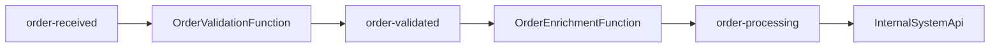
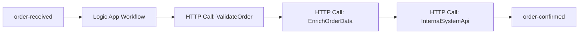

# BidOne Integration Platform - 处理模式选择指南

## 📋 概述

BidOne Integration Platform 提供两种并行的订单处理模式，这种设计是为了技术能力演示和不同场景的灵活选择。

## 🔄 双处理架构

### 处理路径对比

| 特性 | Azure Functions 链式处理 | Azure Logic Apps 工作流 |
|------|------------------------|------------------------|
| **触发方式** | Service Bus Trigger | Service Bus Polling |
| **处理模式** | 代码驱动，链式调用 | 可视化工作流编排 |
| **开发体验** | 熟悉的 C# 编程模型 | 拖拽式可视化设计 |
| **调试方式** | 本地调试，单元测试 | Logic Apps Designer |
| **扩展性** | 自动扩展，高并发 | 基于连接器扩展 |
| **成本** | 按执行次数计费 | 按工作流运行计费 |
| **监控** | Application Insights | Logic Apps 运行历史 |
| **适用场景** | 轻量级、高性能处理 | 复杂业务流程编排 |

### 处理流程图

#### 路径1: Azure Functions 链式处理


#### 路径2: Azure Logic Apps 工作流


## 🚀 使用建议

### 本地开发 (推荐: Functions 模式)

**优势**:
- 启动快速，本地调试方便
- 熟悉的 C# 开发体验
- 单元测试覆盖率高
- 资源占用少

**配置**:
```bash
# 启动 Functions 开发环境
./docker-dev.sh infra  # 只启动基础设施
dotnet run --project src/OrderIntegrationFunction
```

### 生产环境 (可选: Logic Apps 模式)

**优势**:
- 可视化流程管理
- 丰富的企业连接器
- 非开发人员可参与维护
- 内置错误处理和重试

**配置**:
```bash
# 部署包含 Logic Apps 的完整环境
az deployment group create \
  --resource-group bidone-demo-rg \
  --template-file infra/main.bicep \
  --parameters enableLogicApps=true
```

## ⚙️ 配置指导

### 开发环境配置

#### 仅启用 Functions 处理
1. 确保 `ServiceBusConnection` 配置正确
2. 启动 OrderIntegrationFunction
3. Logic Apps 可以不部署或禁用

#### 仅启用 Logic Apps 处理  
1. 部署 Logic Apps 到 Azure
2. 配置相关参数 (functionAppUrl, internalApiUrl)
3. 可以停止本地 Functions

#### 双模式并行 (演示用途)
1. 同时启动 Functions 和 Logic Apps
2. 两条路径会并行处理相同消息
3. 适用于性能对比和技术演示

### 环境变量配置

```bash
# Functions 模式
PROCESSING_MODE=functions
ENABLE_LOGIC_APPS=false

# Logic Apps 模式  
PROCESSING_MODE=logicapps
ENABLE_LOGIC_APPS=true

# 双模式 (演示)
PROCESSING_MODE=dual
ENABLE_LOGIC_APPS=true
```

## 🔧 切换指导

### 从 Functions 切换到 Logic Apps

1. **部署 Logic Apps**:
   ```bash
   az deployment group create \
     --resource-group your-rg \
     --template-file infra/main.bicep \
     --parameters enableLogicApps=true
   ```

2. **配置参数**:
   - 设置 `functionAppUrl` 
   - 设置 `internalApiUrl`
   - 配置 Service Bus 连接

3. **验证切换**:
   ```bash
   # 发送测试订单
   curl -X POST http://localhost:5001/orders -d '{...}'
   
   # 检查 Logic Apps 运行历史
   az logicapp show-run-history --name your-logic-app
   ```

### 从 Logic Apps 切换到 Functions

1. **停用 Logic Apps**:
   ```bash
   az logicapp stop --name your-logic-app --resource-group your-rg
   ```

2. **启动 Functions**:
   ```bash
   dotnet run --project src/OrderIntegrationFunction
   ```

3. **验证切换**:
   ```bash
   # 检查 Functions 日志
   func logs --follow
   ```

## 📊 监控对比

### Functions 监控
- **Application Insights**: 详细的性能指标和分布式追踪
- **Prometheus**: 自定义业务指标
- **日志**: 结构化日志，便于查询

### Logic Apps 监控
- **运行历史**: 可视化的执行流程
- **连接器监控**: 各个步骤的执行状态
- **告警**: 基于工作流状态的告警

## 🚨 注意事项

### 避免重复处理
- **正常情况**: 选择一种模式运行
- **演示情况**: 双模式会导致订单被处理两次
- **监控建议**: 使用 CorrelationId 追踪处理路径

### 性能考虑
- **Functions**: 延迟更低，吞吐量更高
- **Logic Apps**: 适合复杂流程，但延迟稍高

### 成本优化
- **开发阶段**: 使用 Functions 模式降低成本
- **生产环境**: 根据业务需求选择合适模式

## 📞 支持

如需帮助选择合适的处理模式，请参考：
- [架构文档](architecture.md)
- [部署指南](deployment-guide.md)
- [故障排除](troubleshooting.md)

---

**总结**: 双处理架构展示了 Azure 平台的灵活性，开发团队可以根据具体需求选择最适合的处理模式。